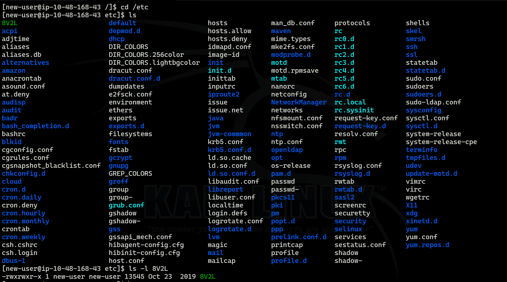
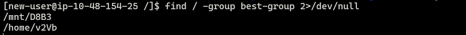
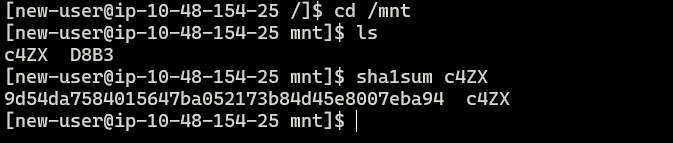
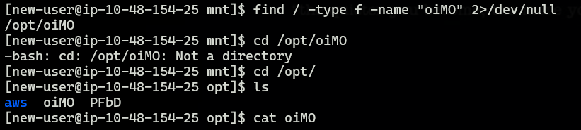
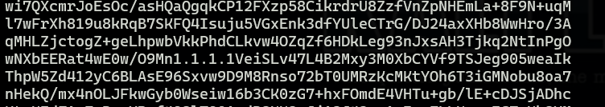

# TryHackMe - NINJA SKILLS : Linux Fundamentals Challenge

## Overview

This room focuses on developing practical Linux file enumeration skills. The objective was to locate specific files based on different attributes such as permissions, ownership, groups, hashes, and file contents by using common Linux utilities.

---

# Task 1 - Find the File Executable by Everyone

The first challenge required identifying a file under the `/etc` directory that was executable by all users.

To inspect the file permissions, I used:

```bash
ls -l /etc
```

After reviewing the permissions, I identified the file:

**Answer:** `8V2L`




---

# Task 2 - Find the File Owned by User ID 502

The next objective was to locate the file whose owner had a UID of **502**.

I searched the entire filesystem using:

```bash
find / -user 502 2>/dev/null
```

This returned:

```text
X1Uy
```

**Answer:** `X1Uy`


---

# Task 3 - Find Files Owned by the `best-group` Group

To identify files owned by the `best-group` group, I executed:

```bash
find / -group best-group 2>/dev/null
```

The command returned two files:

* `D8B3`
* `v2Vb`

Since the challenge requested the answers in alphabetical order:

**Answer:** `D8B3 v2Vb`



---

# Task 4 - Find the File with the Given SHA1 Hash

The challenge provided the following SHA1 hash:

```text
9d54da7584015647ba052173b84d45e8007eba94
```

I first located the candidate files in the `/mnt` directory and then verified their hashes using:

```bash
sha1sum /mnt/*
```

After comparing the generated hashes, I found that the file `c4ZX` matched the provided SHA1 hash.

**Answer:** `c4ZX`



---

# Task 5 - Find the File Containing an IP Address

To locate the required file, I searched for the specified filename:

```bash
find / -type f -name "oiMO" 2>/dev/null
```

The file was located at:

```text
/opt/oiMO
```

After opening the file, I discovered an embedded IP address (`1.1.1.1`) within its contents.

**Answer:** `oiMO`





---

# Task 6 - Find the File Containing 230 Lines

For the final task, I manually verified the line count of the remaining candidate files using commands such as:

```bash
wc -l <filename>
```

Surprisingly, none of the files present on the machine contained exactly **230 lines**. The closest result was **209 lines**.

After reviewing the remaining challenge files, I noticed that one expected file (`bny0`) was missing from the machine. Based on this observation, I submitted `bny0` as the answer, and the challenge was successfully completed.

**Answer:** `bny0`

> **Note:** This appeared to be an inconsistency with the room, as the expected file was not present during my attempt.

---

# Skills Practiced

* Linux file enumeration
* Understanding file permissions
* Searching files by owner and group
* Working with SHA1 hashes
* Inspecting file contents
* Using `find`, `ls`, `sha1sum`, and `wc`

---

# Commands Used

```bash
ls -l /etc
find / -user 502 2>/dev/null
find / -group best-group 2>/dev/null
sha1sum /mnt/*
find / -type f -name "oiMO" 2>/dev/null
wc -l <filename>
```

---

# Key Takeaways

This challenge reinforced several essential Linux enumeration techniques commonly used during penetration testing. Rather than relying on manual browsing, leveraging commands like `find`, `sha1sum`, and `wc` allows for efficient file discovery and verification. It also highlighted the importance of validating challenge environments, as inconsistencies may occasionally occur.
