# Operation Slither

> **Platform:** TryHackMe
> **Room:** Operation Slither
> **Difficulty:** Beginner
> **Status:** ✅ Completed

---

# Overview

**Operation Slither** is an OSINT-focused TryHackMe room that simulates an investigation into a cybercriminal group known as **Sneaky Viper**. The objective is to follow publicly available information across multiple platforms, correlate identities, and uncover operational security mistakes made by the attackers.

The room introduces several important reconnaissance techniques, including:

* Username enumeration
* Cross-platform profile correlation
* Social media investigation
* Metadata and content analysis
* Repository and commit history analysis
* Basic Base64 decoding

Throughout the investigation, we tracked down three operators involved in the campaign and recovered hidden flags from their digital footprint.

---

# Task 1: The Leader

## Objective

Follow the available leads and identify information related to the leader of the **Sneaky Viper** group.

We gained access to a hacker forum where the following post appeared:

```text
Full user database TryTelecomMe on sale!!!

As part of Operation Slither, we've been hiding for weeks in their network and have now started to exfiltrate information.
This is just the beginning. We'll be releasing more data soon. Stay tuned!

@v3n0mbyt3_
```

The room also provided the following reconnaissance guidance:

* Begin with the provided username and perform a broad search across common social platforms.
* Correlate discovered profiles to confirm ownership and authenticity.
* Review interactions, posts, and replies for potential leads.

---

## Question 1

### Aside from Twitter/X, what other platform is used by `v3n0mbyt3_`? Answer in lowercase.

```text
threads
```

### How the answer was found

The only information available was the username `v3n0mbyt3_`, so the investigation started with a simple Google search.

Google indexed an Instagram profile belonging to the same username.

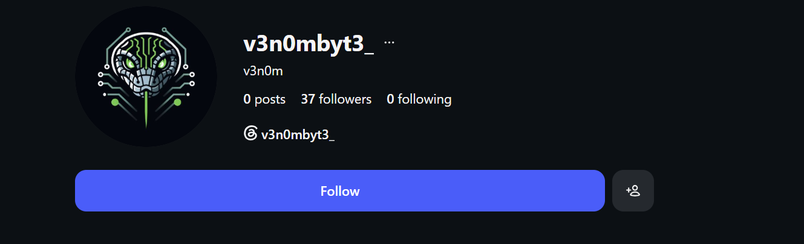

After visiting the Instagram profile, I noticed that the user had linked their **Threads** account in their profile bio. This immediately provided the answer to the first question.

---

## Question 2

### What is the value of the flag?

```text
THM{sl1th3ry_tw33tz_4nd_l34ky_r3pl13s!}
```

### How the answer was found

Since the Instagram account contained no useful posts or information, the next logical step was to investigate the Threads account.

On Threads, I reviewed all posts, replies, and interactions made by the account. During this process, I discovered a reply from another user named `_myst1cv1x3n_` containing a Base64-encoded string.

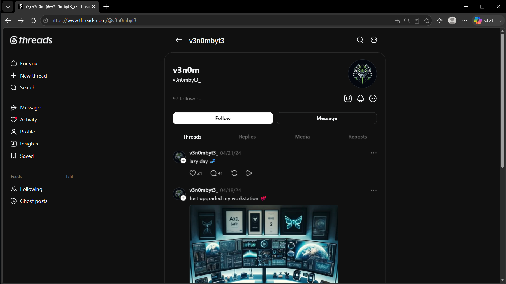

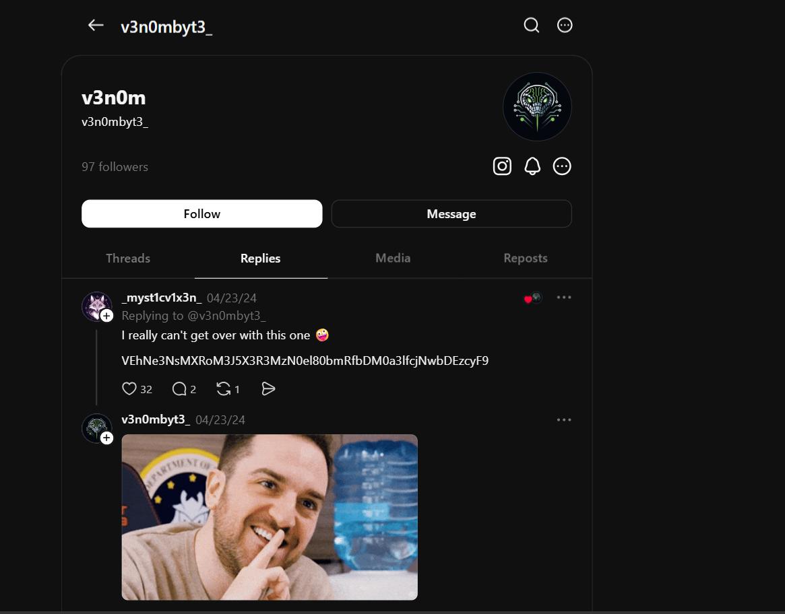

After decoding the Base64 value, the hidden flag was revealed.

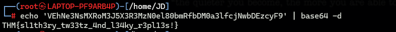

---

# Task 2: The Sidekick

## Objective

A second message had been published on the forum, but this time the operator's handle was hidden.

```text
60GB of data owned by TryTelecomMe is now up for bidding!

Number of users: 64500000
Accepting all types of crypto

For takers, send your bid on Threads via this handle:

HIDDEN CONTENT
-----------------------------------------------------------------------------------------------------
You must register or log in to view this content
```

Reconnaissance guidance:

* Use related usernames or connections identified in earlier steps to expand reconnaissance.
* Enumerate additional platforms for linked accounts and shared content.
* Follow media or resource references across platforms to trace information flow.

---

## Question 1

### What is the username of the second operator talking to `v3n0mbyt3_` from the previous platform?

```text
_myst1cv1x3n_
```

### How the answer was found

During Task 1, the account `_myst1cv1x3n_` had replied with the Base64 string containing the first flag.

Because of this interaction, the account immediately became a strong candidate for the second operator.


A quick search confirmed that this was indeed the second operator.

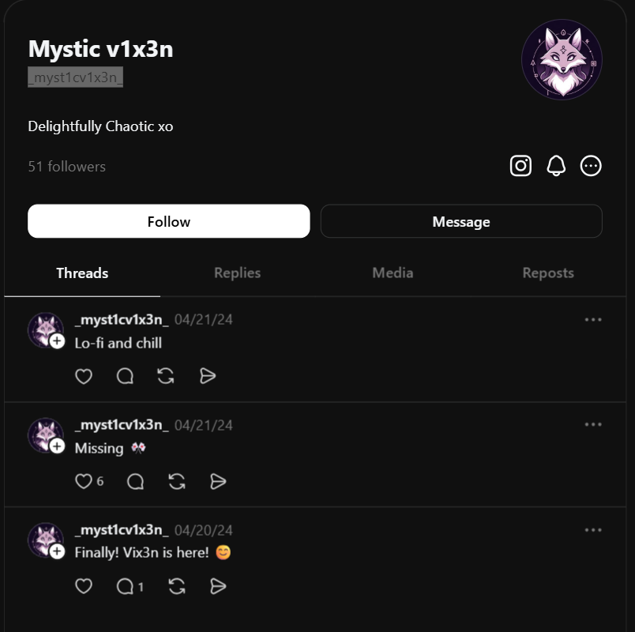

---

## Question 2

### What is the value of the flag?

```text
THM{s0cm1nt_00ps3c_f1ng3r_m1scl1ck}
```

### How the answer was found

The investigation continued by reviewing the Threads profile of `_myst1cv1x3n_`.

Initially, nothing useful appeared on the account, so I expanded the search to other social media platforms and located the operator's Instagram account.

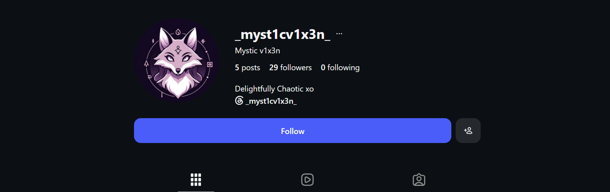

The account contained several posts, so I inspected each one individually along with all associated comments.

Some users had directly posted the room flag in the comments, likely spoiling the challenge for others. Rather than using those comments, I continued searching for the legitimate source of the flag.

Eventually, I discovered a post containing a link to a SoundCloud profile.

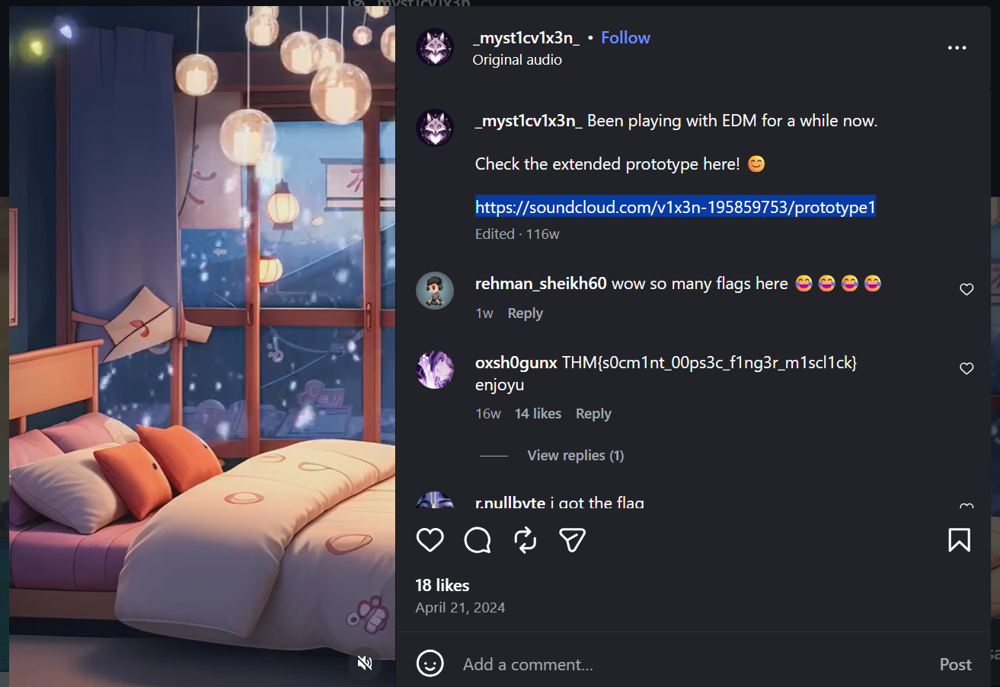

The link redirected to the operator's SoundCloud account.

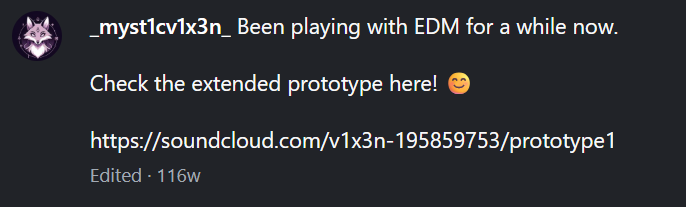

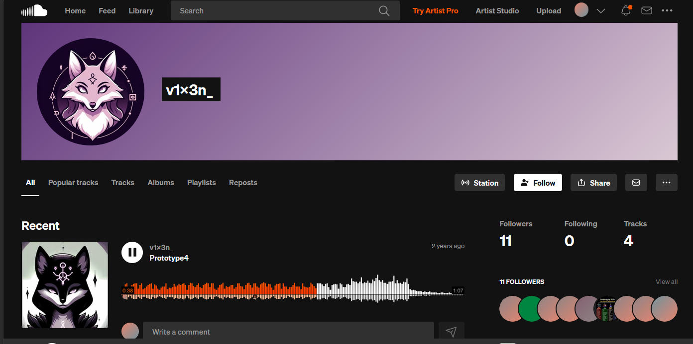

I reviewed the uploaded tracks and profile information and eventually found a Base64 string hidden within the description of one of the tracks.

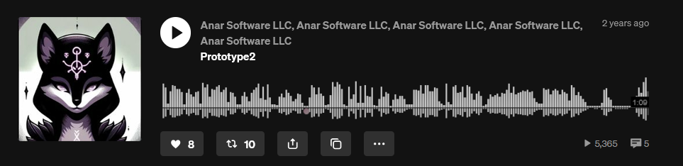

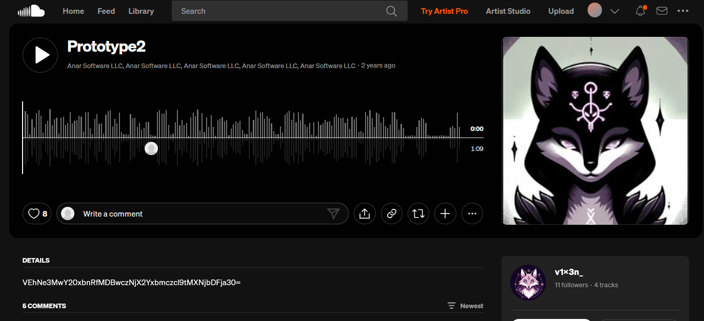

After decoding the value, the second flag was recovered.

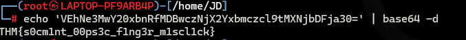

---

# Task 3: The Last Operator

## Objective

A new advertisement appeared online, and this time the goal was to identify the third operator and discover details about the attack infrastructure.

```text
FOR SALE

Advanced automation scripts for phishing and initial access!

Inclusions:
- Terraform scripts for a resilient phishing infrastructure
- Updated Google Phishlet (evilginx v3.0)
- GoPhish automation scripts
- Google MFA bypass script
- Google account enumerator
- Automated Google brute-forcing script
- Cobalt Strike aggressor scripts
- SentinelOne, CrowdStrike, Cortex XDR bypass payloads

PRICE: $1500
Accepting all types of crypto

Contact me on REDACTED@protonmail.com
```

Reconnaissance guidance:

* Identify secondary accounts through visible interactions.
* Extend reconnaissance into developer or technical platforms.
* Analyse repositories, commits, and activity history for embedded information.

---

## Question 1

### What is the handle of the third operator?

```text
sh4d0wF4NG
```

### How the answer was found

I returned to the SoundCloud profile discovered during Task 2 and investigated the followers and interactions associated with the account.


The profile had only a small number of followers, making manual review straightforward.

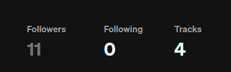

Among the followers, one profile immediately stood out:

```text
sh4d0wF4NG
```

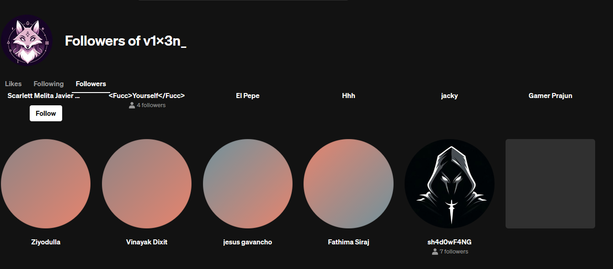

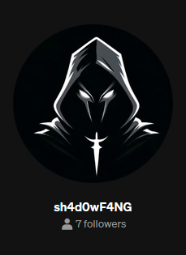

Based on the suspicious naming convention and connection to the previous operator, this appeared to be the third member of the group, which proved to be correct.

---

## Question 2

### What other platform does the third operator use? Answer in lowercase.

```text
github
```

### How the answer was found

With the username identified, I returned to the same methodology that worked previously and performed a Google search for `sh4d0wF4NG`.

The first indexed result was a GitHub profile associated with the username.

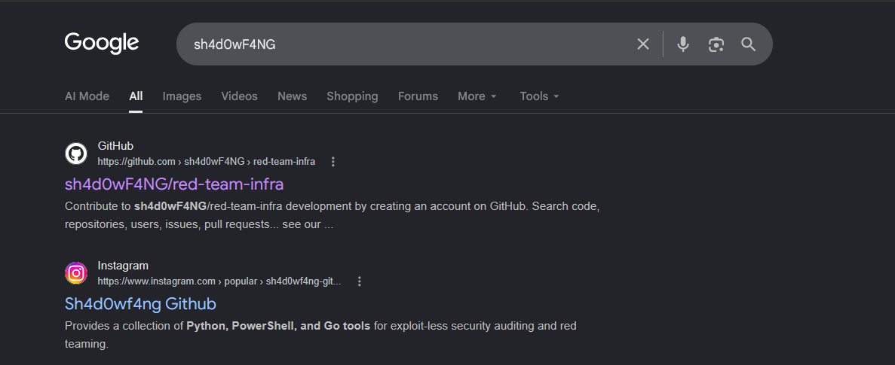

This provided the answer to the second question.

---

## Question 3

### What is the value of the flag?

```text
THM{sh4rp_f4ngz_l34k3d_bl00dy_pw}
```

### How the answer was found

The GitHub profile contained several repositories, so I began reviewing the repository contents and commit history.

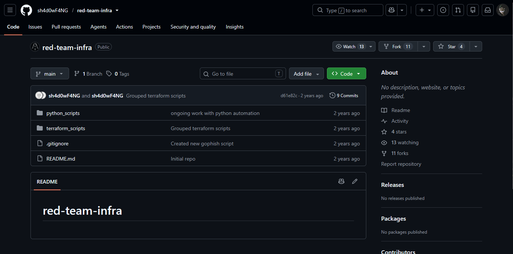

During commit analysis, I noticed modifications affecting several files.

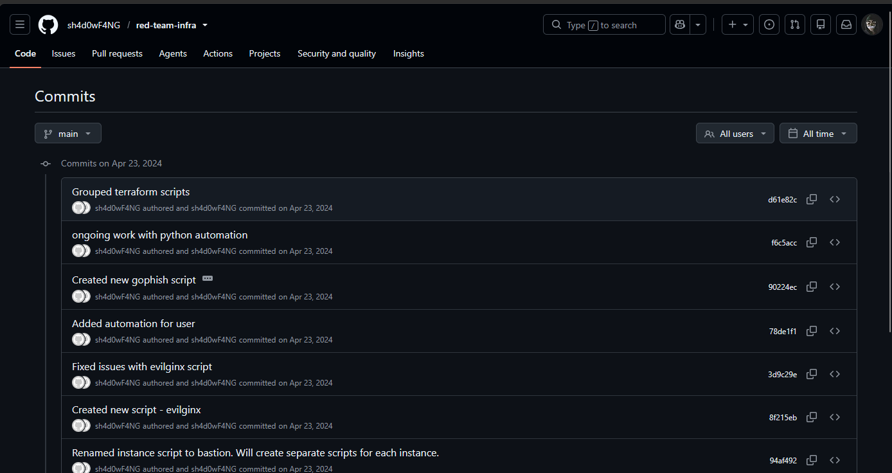

One file in particular, `iam.tf`, contained a previously removed value that appeared to be Base64 encoded.

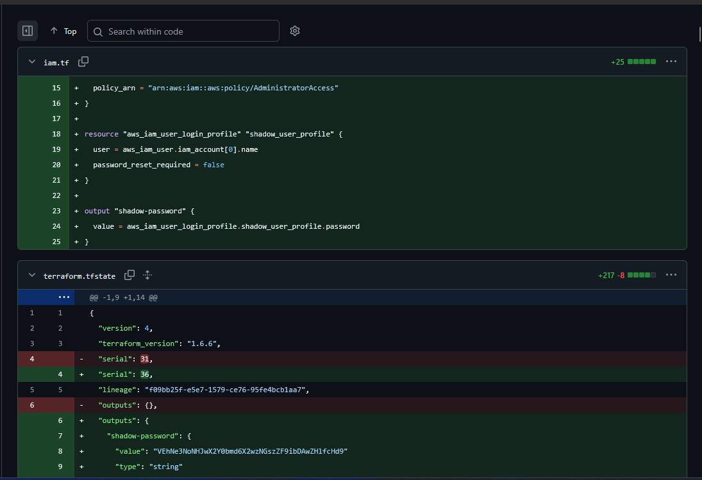

After decoding the value, the final flag was revealed.

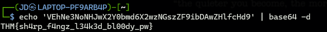

The investigation was complete and all three operators had been identified.

---

# What I Learned

This room provided excellent practice for several real-world OSINT techniques:

* Starting investigations with only a username and expanding outward.
* Correlating identities across multiple social media platforms.
* Following interactions and relationships between accounts.
* Recognising operational security mistakes made by threat actors.
* Using Base64 decoding during investigations.
* Investigating GitHub repositories and commit histories for leaked information.
* Understanding how publicly available information can expose infrastructure details and attacker identities.

---

# Conclusion

Operation Slither is an excellent beginner-friendly OSINT room that demonstrates how attackers can unintentionally reveal valuable information through poor operational security practices.

The room reinforces the importance of methodical investigation, profile correlation, and analysing digital footprints across multiple platforms. Even seemingly insignificant interactions, comments, or commits can lead to significant discoveries when viewed in the context of a larger investigation.

---

# Room Status

| Platform  | Room              | Status      |
| --------- | ----------------- | ----------- |
| TryHackMe | Operation Slither | ✅ Completed |

---

# Completion

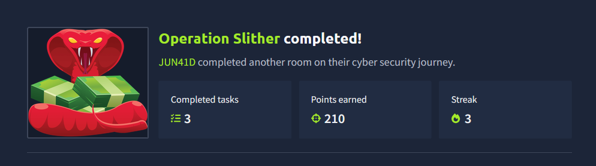
