# The Phishing Pond

> **Platform:** TryHackMe
> **Room:** The Phishing Pond
> **Difficulty:** Beginner
> **Status:** ✅ Completed

## Overview

Phishing is a type of social engineering attack in which attackers abuse a victim's trust to trick them into revealing sensitive information, such as passwords, personal details, financial information, or credentials.

Phishing messages are often designed to look legitimate and convincing. Rather than directly exploiting a technical vulnerability, attackers frequently target people by using familiar names, urgent requests, deceptive links, malicious attachments, or fake offers.

Some common phishing techniques include:

* **Urgency and scare tactics:** Messages such as "Immediate action required" pressure the recipient into acting without thinking.
* **Look-alike sender addresses:** Attackers may register domains that closely resemble legitimate ones, such as `rnicrosoft.com` instead of `microsoft.com`.
* **Display-name impersonation:** The sender's displayed name may look familiar even though the actual email address belongs to an unrelated or malicious domain.
* **Malicious attachments:** Documents such as DOC, XLS, or ZIP files may contain malware or instructions to enable macros.
* **Compromised accounts:** A legitimate account that has been compromised can be used to send convincing phishing messages.
* **Too-good-to-be-true offers:** Fake prizes, refunds, jobs, or other attractive offers may be used to collect personal or financial information.

In this room, the objective was to identify whether a series of realistic email scenarios were legitimate or phishing attempts.

I quickly connected to the TryHackMe VPN and started the lab. The room used a quiz-style interface with **10 email scenarios**. Each scenario had a **30-second time limit**, and I had **three lives** available to complete the challenge successfully.

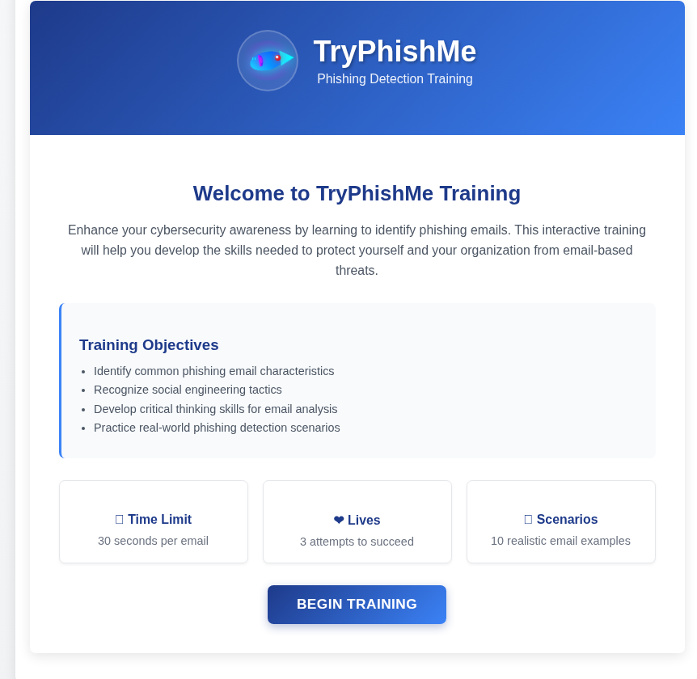

---

## Task 1 — Identify the Suspicious Sender

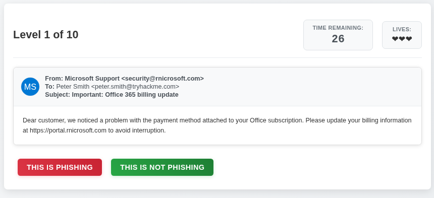

### Question

Is this email a phishing email?

### Answer

```text
Phishing
```

### Explanation

The sender address was:

```text
security@rnicrosoft.com
```

The domain `rnicrosoft.com` is suspicious because it closely resembles the legitimate Microsoft domain while using `rnicrosoft.com` instead.

This is a common phishing technique known as a **look-alike domain** or **typosquatting**. Attackers use visually similar domains to make fraudulent emails appear to come from a trusted organization.

Because the sender domain was suspicious, the email was identified as a phishing attempt.

---

## Task 2 — Benefits Enrollment Notification

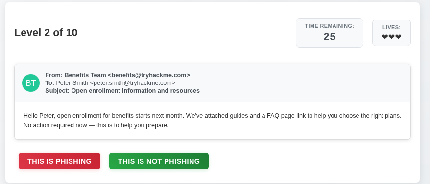

The email stated:

> Hello Peter, open enrollment for benefits starts next month. We've attached guides and a FAQ page link to help you choose the right plans.
> No action required now - this is to help you prepare.

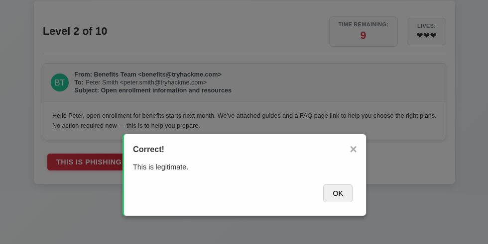

### Question

Is this email a phishing email?

### Answer

```text
Not Phishing
```

### Explanation

This email appeared to be a legitimate informational message about upcoming benefits enrollment.

The message did not create an urgent situation or demand immediate action. It explained that enrollment would begin the following month and stated that **no action was required at that time**.

Unlike common phishing emails, the scenario did not rely on obvious urgency, suspicious requests for sensitive information, or other clear indicators of malicious intent.

Therefore, the email was identified as **not phishing**.

---

## Task 3 — Urgent Executive Wire Transfer

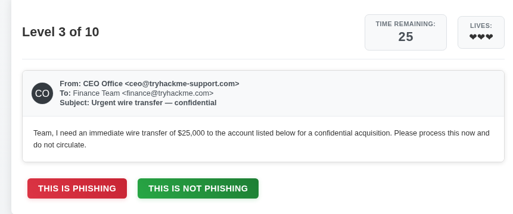

### Question

Is this email a phishing email?

### Answer

```text
Phishing
```

### Explanation

This email attempted to impersonate an executive and requested an **urgent wire transfer of $25,000**.

This is a classic example of **business email compromise (BEC)** or executive impersonation. Attackers may pretend to be a manager, director, or company executive and pressure employees into transferring money.

The combination of:

* Executive impersonation
* An urgent request
* A large financial transaction

made this email an obvious phishing attempt.

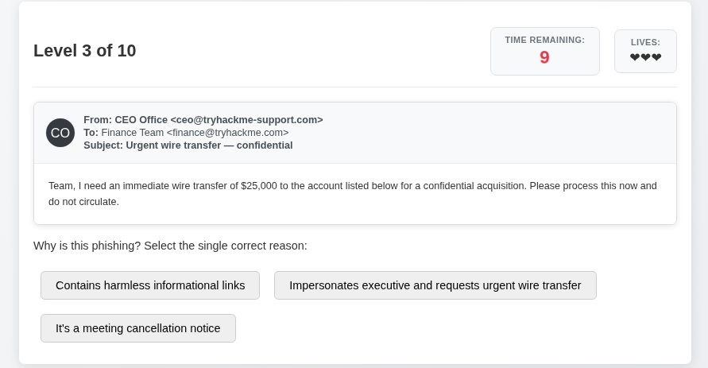

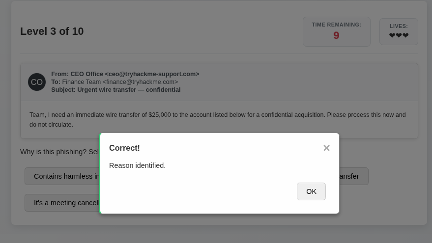

---

## Task 4 — Fake Job Opportunity

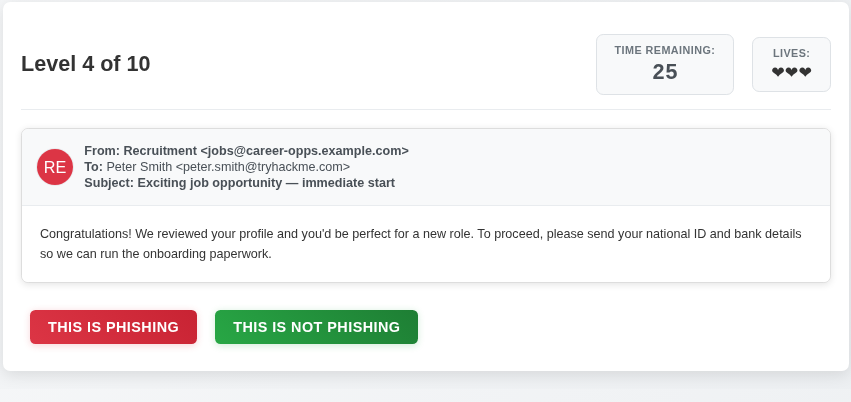

### Question

Is this email a phishing email?

### Answer

```text
Phishing
```

### Explanation

The email presented a job opportunity that appeared too good to be true and requested sensitive information, including:

* Bank details
* National ID information
* Personal information for supposed onboarding paperwork

Requesting sensitive financial and identity information during an unsolicited job offer is a significant warning sign.

This scenario demonstrates the **too-good-to-be-true** phishing technique, where attackers use attractive opportunities such as fake jobs to persuade victims to provide personal information.

Therefore, the email was identified as phishing.

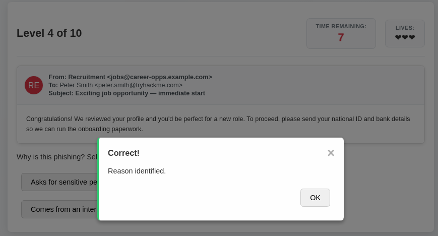

---

## Task 5 — Urgent Action Request

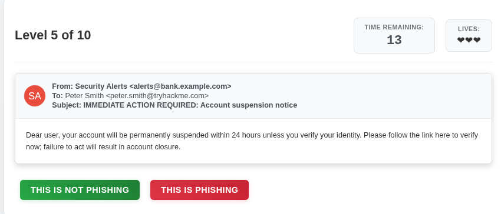

### Question

Is this email a phishing email?

### Answer

```text
Phishing
```

### Explanation

This email used **urgent and alarming language** to pressure the recipient into taking immediate action.

Urgency is one of the most common techniques used in phishing attacks. Attackers deliberately create a sense of pressure so that the recipient is less likely to stop and verify the request.

Because the message relied on urgent language to force the recipient to act, it was identified as a phishing email.

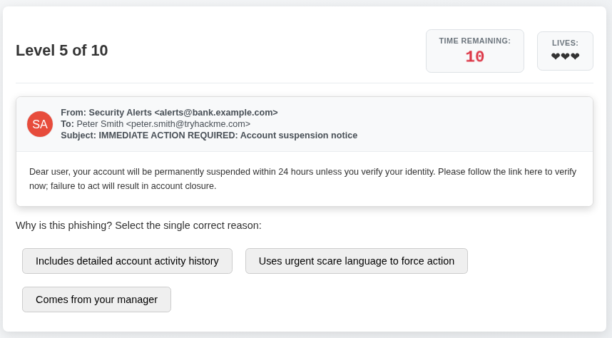

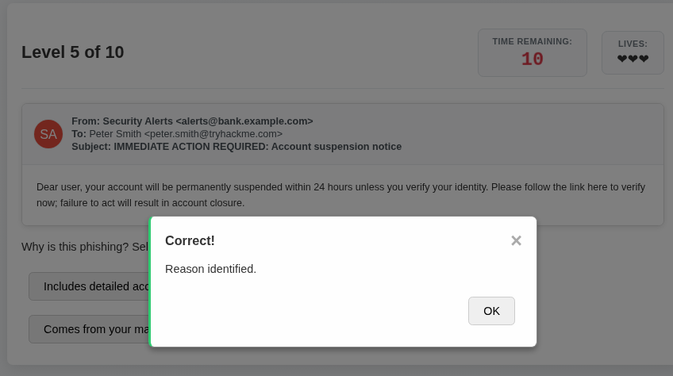

---

## Task 6 — Deceptive Payment Portal

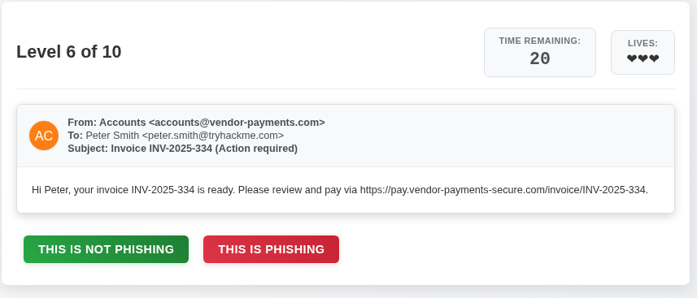

### Question

Is this email a phishing email?

### Answer

```text
Phishing
```

### Explanation

The email contained a link that used a **deceptive domain designed to mimic a legitimate payment portal**.

A link can appear trustworthy based on its visible text while actually directing the user to a different domain. For this reason, users should inspect the actual destination of links before entering payment or login information.

The deceptive domain was the key indicator that this was a phishing attempt.

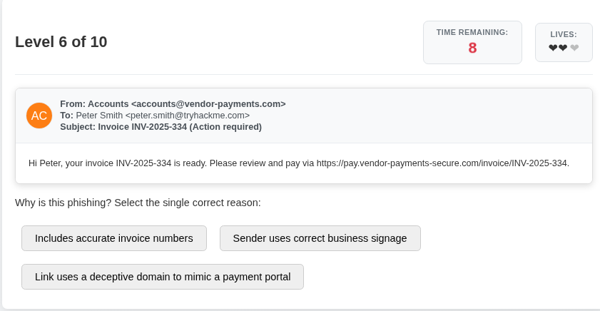

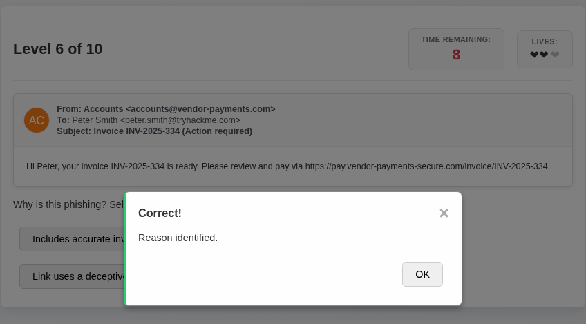

---

## Task 7 — Credential Collection Page

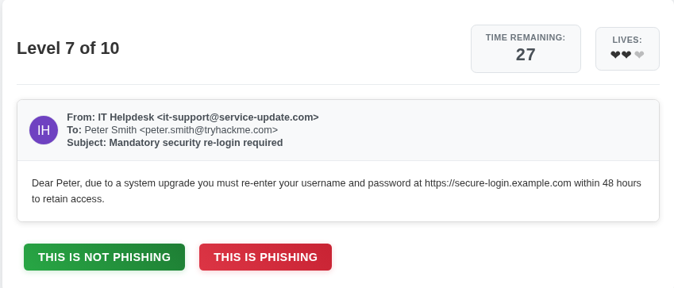

### Question

Is this email a phishing email?

### Answer

```text
Phishing
```

### Explanation

The email contained a link leading to a page intended to collect the user's credentials.

Credential harvesting is a common phishing technique. Attackers create fake login pages that resemble legitimate services and use them to capture usernames, passwords, or other authentication information.

Since the link directed the recipient toward a credential-collecting page, the email was identified as phishing.

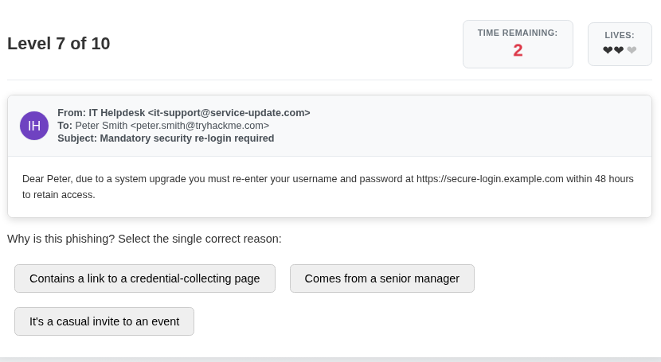

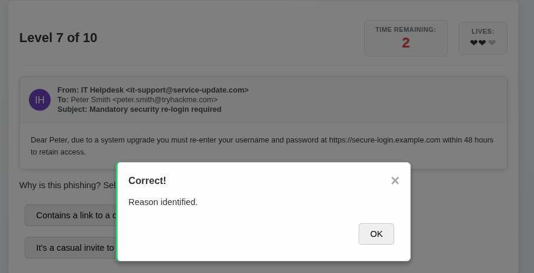

---

## Task 8 — Planned Service Maintenance

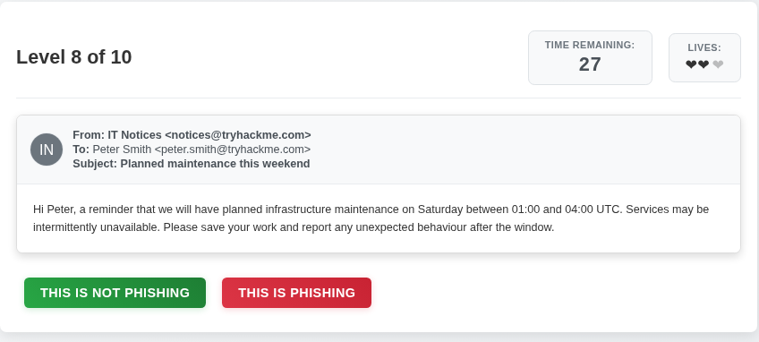

### Question

Is this email a phishing email?

### Answer

```text
Not Phishing
```

### Explanation

This email was an informational notification about planned maintenance that would make the service temporarily unavailable over the weekend.

The message did not appear to use the common phishing techniques seen in the previous scenarios. Its purpose was simply to inform users about scheduled service downtime.

Therefore, the email was identified as **not phishing**.

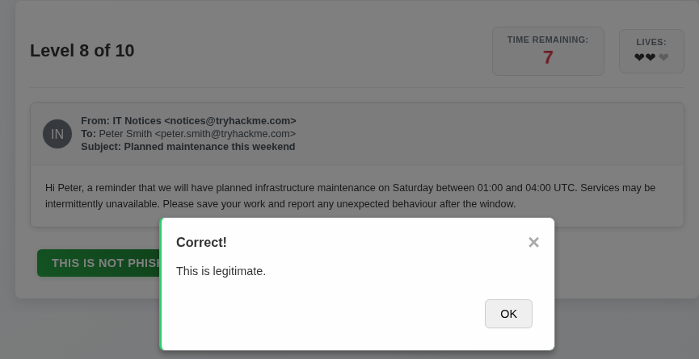

---

## Task 9 — Malicious Attachment and Macros

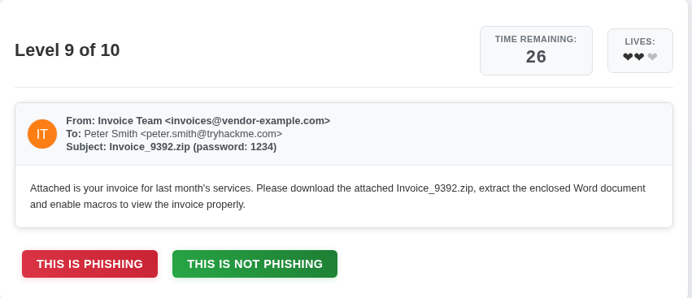

### Question

Is this email a phishing email?

### Answer

```text
Phishing
```

### Explanation

The email contained an attachment and instructed the recipient to **enable macros**.

This is a common warning sign because malicious Office documents can abuse macros to execute harmful actions when the recipient enables them.

An unexpected attachment combined with instructions to enable macros should be treated with caution. In a phishing scenario, this technique can be used to deliver malware to the victim.

Therefore, the email was identified as phishing.

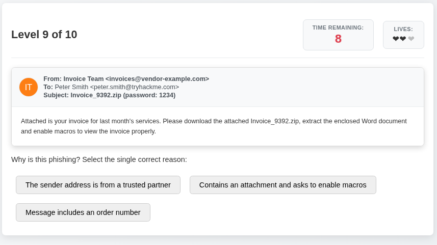

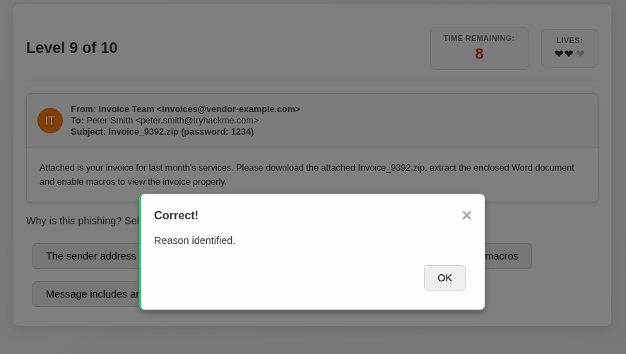

---

## Task 10 — Attachment Requesting Macros

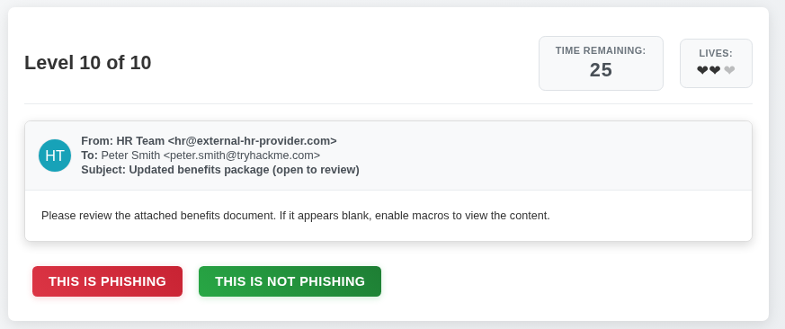

### Question

Is this email a phishing email?

### Answer

```text
Phishing
```

### Explanation

This email also instructed the recipient to **enable macros in the attached document**.

Enabling macros in an unexpected document can allow embedded code to execute. Attackers may use this technique to deliver malware through seemingly legitimate Office files.

The combination of an attachment and a request to enable macros was therefore treated as a strong phishing indicator.

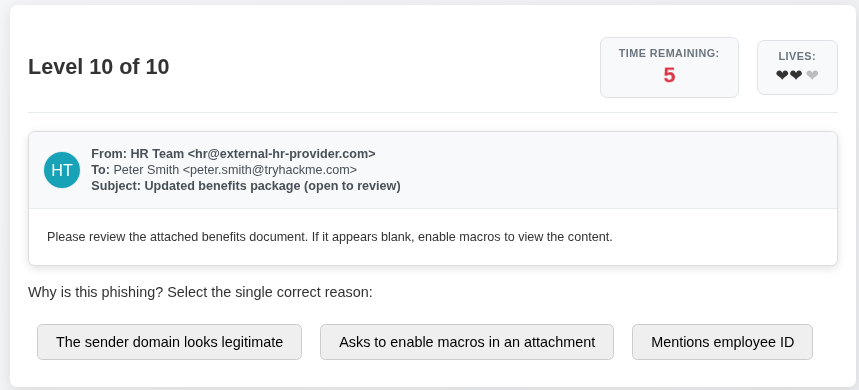

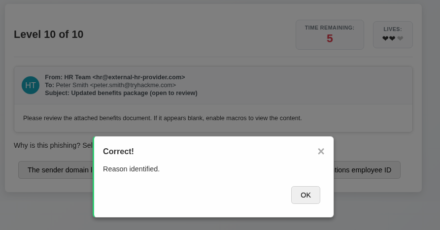

---

## Final Result

After completing all 10 scenarios, I successfully completed the room and obtained the flag.

I finished the challenge with **2 lives remaining**. I made mistakes on questions **6 and 7**, but was still able to complete the room successfully.

```text
THM{i_phish_you_not}
```

---

## What I Learned

This room provided practical experience in identifying phishing emails by examining their content and context rather than simply trusting the sender or message appearance.

Key takeaways include:

* Always inspect the **actual sender domain**, not just the display name.
* Be suspicious of **look-alike domains** and small changes in trusted domain names.
* Treat unexpected **urgent financial requests** with caution.
* Never provide sensitive information simply because an email requests it.
* Be careful with links that lead to **login or payment pages**.
* Inspect link destinations before entering credentials or payment information.
* Unexpected attachments can be dangerous, particularly when they ask the user to **enable macros**.
* Be cautious of **too-good-to-be-true job offers, prizes, refunds, or other opportunities**.
* Urgency and fear are commonly used to prevent users from thinking carefully before acting.
* A legitimate-looking email is not automatically trustworthy; the context and requested action should also be evaluated.

## Conclusion

**The Phishing Pond** was a beginner-friendly TryHackMe room that demonstrated how phishing attacks exploit human trust and urgency.

The 10 scenarios provided practical examples of common phishing indicators, including deceptive domains, executive impersonation, credential harvesting, malicious attachments, macro requests, and fraudulent job offers.

The room reinforced the importance of slowing down, inspecting email details carefully, and verifying suspicious requests before taking action.

---

## Room Status

| Platform  | Room              | Difficulty | Status      |
| --------- | ----------------- | ---------- | ----------- |
| TryHackMe | The Phishing Pond | Beginner   | ✅ Completed |

---

## Completion Screenshot


