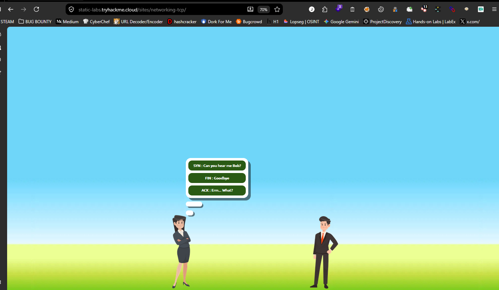
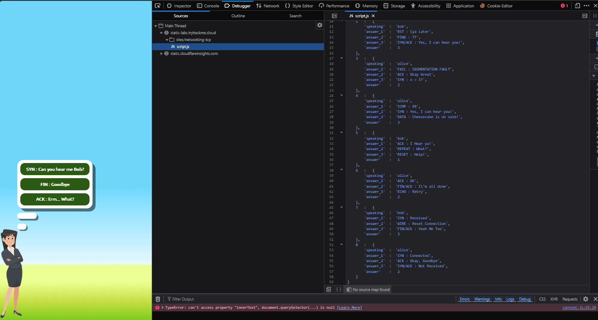
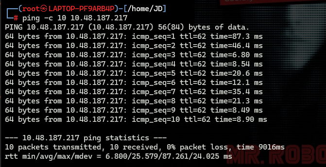
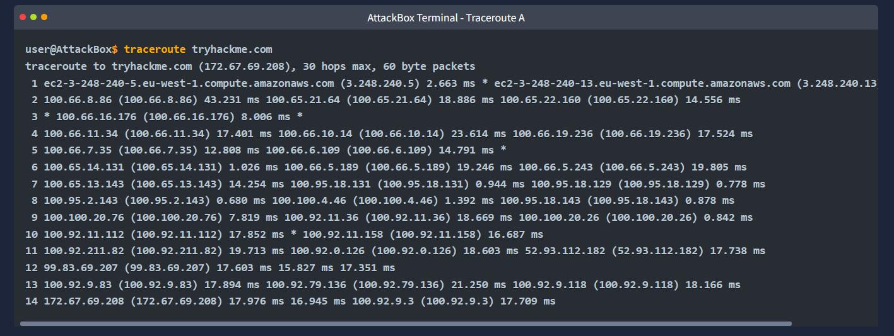
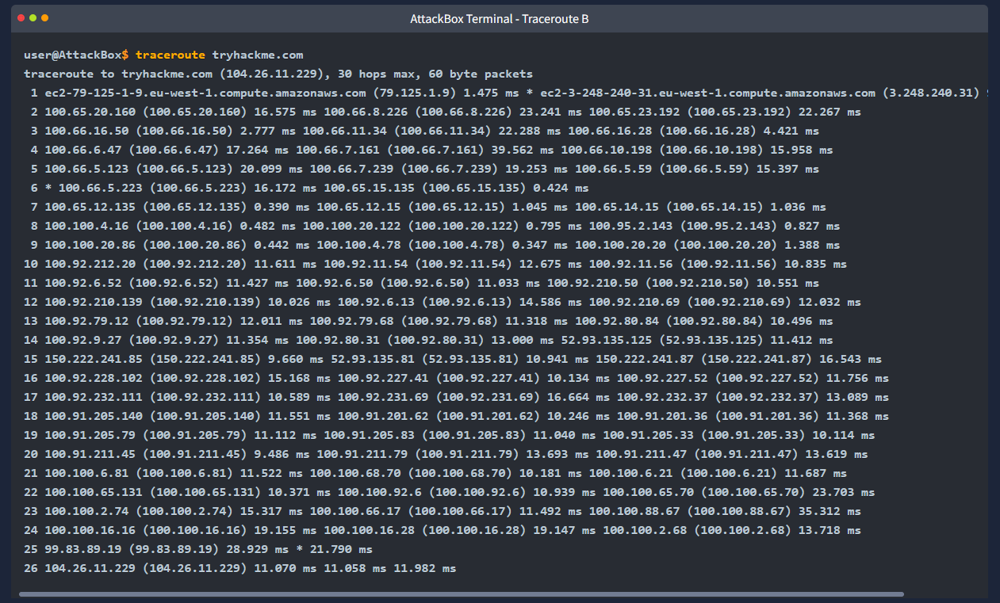
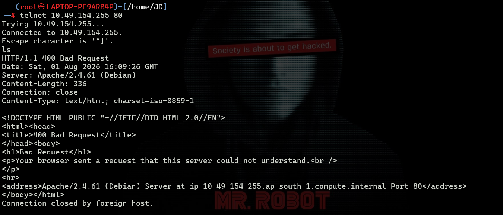
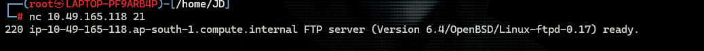

# Active Reconnaissance

> **Platform:** TryHackMe  
> **Room:** Active Reconnaissance  
> **Difficulty:** Beginner  
> **Status:** ✅ Completed

---

# Overview

Active reconnaissance is the process of directly interacting with a target system or network to gather information. Unlike passive reconnaissance, which collects publicly available information without touching the target, active reconnaissance involves sending packets, establishing network connections, and probing services.

Because active reconnaissance communicates directly with the target, it leaves evidence such as:

- Server log entries
- Firewall logs
- Intrusion Detection/Prevention System (IDS/IPS) alerts
- Web Application Firewall (WAF) detections

In this room, I learned how to actively gather information using a web browser, Developer Tools, `ping`, `traceroute`, `telnet`, and `netcat`. These tools help identify technologies, verify connectivity, map network paths, and retrieve service banners from remote systems.

---

# Task 1 - Introduction

## Summary

This introductory task explained the difference between **passive** and **active reconnaissance**.

- **Passive reconnaissance** gathers information without interacting with the target.
- **Active reconnaissance** directly communicates with the target, making it possible to discover live hosts, running services, network paths, and server information.

No questions were included in this task.

---

# Task 2 - Web Browser

Modern browsers include powerful **Developer Tools** that allow security researchers to inspect websites in detail.

## Developer Tools Overview

Developer Tools can be opened by pressing:

```text
Ctrl + Shift + I
```

Some of the most useful tabs include:

### Elements

Allows you to inspect and edit the HTML and CSS of a webpage.

Useful for:

- Viewing hidden content
- Understanding page structure
- Finding comments or hidden elements

---

### Network

Displays every request made by the browser.

Useful for:

- Finding API endpoints
- Viewing request and response headers
- Monitoring JavaScript, images, CSS, and other resources
- Measuring response times

---

### Console

Provides a JavaScript command-line interface.

Useful for:

- Running JavaScript manually
- Viewing website errors
- Testing browser functionality

---

### Sources (Debugger)

Shows all JavaScript files loaded by the website.

Useful for:

- Reading JavaScript source code
- Setting breakpoints
- Understanding client-side logic
- Finding hidden values, URLs, or answers during CTF challenges

---

### Application (Storage)

Displays data stored by the website, including:

- Cookies
- Local Storage
- Session Storage
- IndexedDB

Useful for examining stored authentication tokens or other client-side data.

---

### Security

Displays HTTPS and TLS information.

Useful for:

- Checking certificate validity
- Viewing encryption details
- Identifying mixed-content issues

---

## Browser Extensions

The room also introduced several useful browser extensions for reconnaissance:

### FoxyProxy

Allows quick switching between multiple proxies such as:

- Burp Suite
- SOCKS5
- Other HTTP proxies

Useful during web application testing.

---

### User-Agent Switcher and Manager

Changes the browser's User-Agent string to emulate:

- Different browsers
- Mobile devices
- Different operating systems

This can reveal mobile-specific content or browser-specific behavior.

---

### Wappalyzer

Automatically identifies technologies used by a website, including:

- Web servers
- Frameworks
- JavaScript libraries
- Analytics platforms
- Databases
- CDNs

It performs technology fingerprinting without actively attacking the target.

---

## Question

**Browse to the provided website and determine the total number of questions using Developer Tools.**

### Answer

```text
8
```

### Explanation

I opened the website and launched the browser's Developer Tools.

From the **Sources (Debugger)** tab, I navigated through the JavaScript files loaded by the page. The JavaScript source clearly contained the questions, allowing me to count them directly.

There were a total of **8 questions**.

### Screenshots





---

# Task 3 - Ping

The `ping` command checks whether a remote system is reachable by sending **ICMP Echo Request** packets and waiting for **ICMP Echo Reply** responses.

The name "ping" comes from sonar technology, where a signal is sent out and the returning echo confirms the presence of an object.

Since I already use `ping` regularly, this task served as a good refresher.

---

## Question

**Which option would you use to set the size of the data carried by the ICMP echo request?**

### Answer

```text
-s
```

### Explanation

The `-s` option specifies the payload size for ICMP Echo Request packets.

---

## Question

**What is the size of the ICMP header in bytes?**

### Answer

```text
8
```

### Explanation

The ICMP header is **8 bytes** long and contains fields such as:

- Type
- Code
- Checksum
- Identifier
- Sequence Number

---

## Question

**Does Microsoft Windows Firewall block ping by default?**

### Answer

```text
Y
```

### Explanation

By default, Microsoft Windows Firewall blocks incoming ICMP Echo Requests, preventing the system from responding to ping requests.

---

## Question

**Run the following command and determine how many replies were received.**

```bash
ping -c 10 <MACHINE_IP>
```

### Answer

```text
10
```

### Explanation

I sent **10 ICMP Echo Requests** to the target machine using:

```bash
ping -c 10 <MACHINE_IP>
```

All ten packets received successful replies, confirming that the target was reachable.

### Screenshot



---

# Task 4 - Traceroute

The `traceroute` command identifies the path packets take to reach a destination.

It works by gradually increasing the packet's **Time To Live (TTL)** value, allowing each router along the path to reveal itself.

Traceroute is useful for:

- Mapping network topology
- Counting network hops
- Identifying routing issues
- Finding where latency occurs

---

## Question

**In Traceroute A, what is the IP address of the last router before reaching tryhackme.com?**

### Answer

```text
172.67.69.208
```

### Explanation

After reviewing the traceroute output, the final router before the destination had the IP address:

```text
172.67.69.208
```

### Screenshot



---

## Question

**In Traceroute B, what is the IP address of the last router before reaching tryhackme.com?**

### Answer

```text
104.26.11.229
```

### Explanation

The final hop before reaching the destination was:

```text
104.26.11.229
```

### Screenshot



---

## Question

**In Traceroute B, how many routers are between the two systems?**

### Answer

```text
25
```

### Explanation

The traceroute output contained **25 routers** between the source and the destination.

---

## Practical Exercise

The room also asked me to run:

```bash
traceroute 10.48.187.217
```

Although no answer submission was required, I still completed the exercise.

My output showed:

- **12 responding routers**
- **30 maximum hops configured**

```text
traceroute to 10.48.187.217 (10.48.187.217), 30 hops max, 60 byte packets
 1  192.168.128.1 (192.168.128.1)  51.419 ms  51.358 ms  51.352 ms
 2  * * *
 3  * * *
 4  * * *
 5  * * *
 6  * * *
 7  * * *
 8  * * *
 9  * * *
10  * * *
11  * * *
12  10.48.187.217 (10.48.187.217)  5.312 ms * *
```

---

# Task 5 - Telnet

`Telnet` is a text-based protocol that connects to remote services over TCP, traditionally using port **23**.

Although Telnet is considered insecure because it transmits data in plain text, it remains useful for:

- Banner grabbing
- Testing open ports
- Interacting with text-based services

---

## Question

**Connect to the VM on port 80. What is the name of the running server?**

### Answer

```text
Apache
```

### Explanation

I connected to the web server using Telnet.

```bash
telnet <MACHINE_IP> 80
```

The HTTP banner identified the running server as **Apache**.

---

## Question

**What is the version of the running server?**

### Answer

```text
2.4.61
```

### Explanation

The HTTP response headers also revealed the server version:

```text
Apache/2.4.61
```

This demonstrates how banner grabbing can reveal valuable information about a target's services.

### Screenshot



---

# Task 6 - Netcat

`Netcat` (`nc`) is a versatile networking utility capable of acting as both a client and a server.

Common uses include:

- Banner grabbing
- Port testing
- File transfers
- Creating TCP or UDP connections
- Basic client-server communication

Compared to Telnet, modern versions of Netcat support additional features such as IPv6 and SSL.

---

## Question

**Connect to port 21 using Netcat. What is the version of the running FTP server?**

### Answer

```text
0.17
```

### Explanation

I connected to the FTP service using:

```bash
nc <MACHINE_IP> 21
```

The server immediately returned its banner:

```text
220 ip-10-49-165-118.ap-south-1.compute.internal FTP server (Version 6.4/OpenBSD/Linux-ftpd-0.17) ready
```

From the banner, I identified the FTP server version as:

```text
0.17
```

### Screenshot



---

# What I Learned

During this room, I learned how to perform several fundamental active reconnaissance techniques:

- The differences between passive and active reconnaissance.
- How browser Developer Tools can reveal hidden client-side information.
- How to use browser extensions like Wappalyzer, FoxyProxy, and User-Agent Switcher during reconnaissance.
- How `ping` verifies host availability using ICMP.
- How `traceroute` maps the network path between systems.
- How `telnet` can be used for banner grabbing and identifying web server software.
- How `netcat` can retrieve service banners and interact with network services.
- How service banners can disclose software names and versions, providing valuable information during enumeration.

---

# Conclusion

This room provided an excellent introduction to active reconnaissance techniques commonly used during penetration testing. By directly interacting with target systems using standard networking tools, I was able to identify live hosts, map network paths, inspect websites, and gather information about running services. These foundational skills are essential for the enumeration phase of any security assessment and prepare the way for more advanced reconnaissance and exploitation techniques.

---

# Room Status

| Platform | Room | Difficulty | Status |
|----------|------|------------|--------|
| TryHackMe | Active Reconnaissance | Beginner | ✅ Completed |

---

# Completion Screenshot

