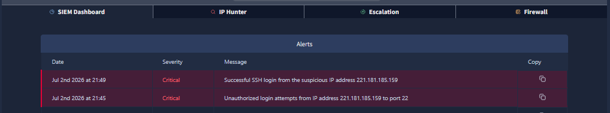
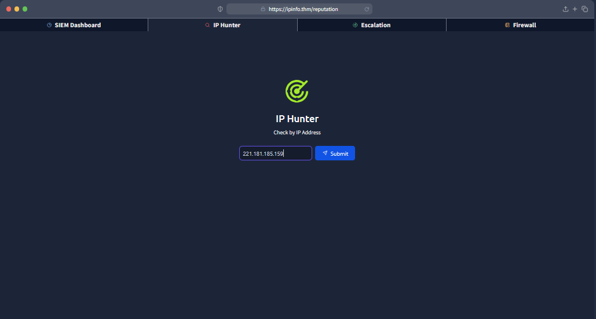
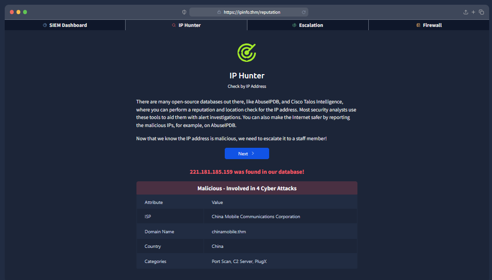
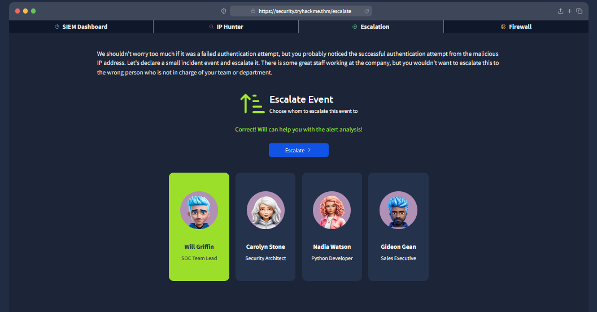
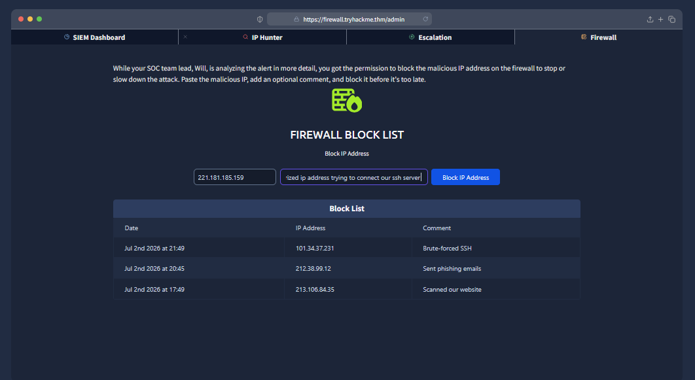
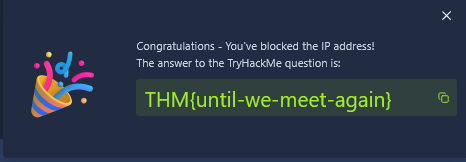
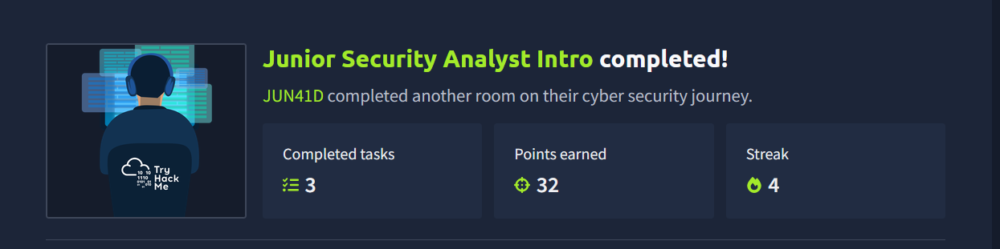

# Junior Security Analyst Intro

> **Platform:** TryHackMe
> **Room:** Junior Security Analyst Intro
> **Difficulty:** Beginner
> **Status:** ✅ Completed

---

# Overview

The **Junior Security Analyst Intro** room provides an introduction to the responsibilities of a Security Operations Center (SOC) analyst. It explains the role of a Junior Security Analyst, introduces the structure of a SOC team, and demonstrates how analysts investigate alerts, escalate incidents, and respond to potential threats.

As a Junior Security Analyst, your role is to monitor security events, investigate suspicious activity, and help protect your organization from cyber attacks before they become major security incidents.

This room includes a small hands-on lab that simulates a real SOC environment, allowing you to experience a typical workflow of investigating and responding to security alerts.

> **Note:** This write-up is intended for educational purposes and to document my learning journey on TryHackMe.

---

# Task 1: Junior Security Analyst Journey

### Question

**Which team do you work with as a Junior Security Analyst?**

**Answer**

```text
soc
```

As a Junior Security Analyst, you are part of the **Security Operations Center (SOC)** team, which is responsible for monitoring, detecting, investigating, and responding to security incidents.

---

# Task 2: Security Operations Center (SOC)

This section introduces the structure and responsibilities of a SOC.

Topics covered include:

* SOC responsibilities
* SOC analyst levels (L1, L2, L3)
* Incident Response (IR) Team
* SOC Manager
* SOC Engineer
* Senior SOC Analyst (L2)

> **Note:** There were no questions in this task.

---

# Task 3: A Day in the Life of a Security Analyst

This practical lab simulates the daily responsibilities of a Junior Security Analyst.

The objective is to investigate security alerts displayed in a SIEM dashboard, identify malicious activity, escalate the incident to the appropriate team member, and mitigate the threat by blocking the attacker's IP address.

---

## Question 1

### What was the malicious IP address in the alerts?

**Answer**

```text
221.181.185.159
```

While reviewing the SIEM dashboard, an alert indicated multiple **unauthorized SSH login attempts** originating from the IP address:

```text
221.181.185.159
```

This IP was identified as suspicious because it was repeatedly attempting to access the server.



---

To verify whether the IP was malicious, I copied it into the **IP Hunter** tool provided within the lab.



The lookup confirmed that the address had previously been associated with multiple cyber attacks and was classified as malicious.



---

## Question 2

### To whom did you escalate the alert with the malicious IP?

**Answer**

```text
Will Griffin
```

The escalation page listed several employees:

* **Will Griffin** — SOC Team Lead
* **Carolyn Stone** — Security Architect
* **Nadia Watson** — Python Developer
* **Gideon Green** — Sales Executive



Since the alert involved a security incident, the correct person to escalate it to was **Will Griffin**, the SOC Team Lead.

---

## Question 3

### What message did you receive after blocking the IP address on the firewall?

**Answer**

```text
THM{until-we-meet-again}
```

After escalating the incident, the next step was to block the malicious IP address using the firewall management section of the dashboard.

I entered the attacker's IP address, added an optional comment, and submitted the block request.



Once the IP was successfully blocked, the room displayed the completion flag:

```text
THM{until-we-meet-again}
```



---

# What I Learned

Throughout this room, I learned:

* The role of a Junior Security Analyst within a SOC.
* The responsibilities of different SOC team members.
* How to investigate alerts using a SIEM dashboard.
* How to verify suspicious IP addresses using threat intelligence.
* How to properly escalate security incidents.
* The importance of containing threats by blocking malicious IP addresses.
* The basic incident response workflow followed by SOC analysts.

---

# Conclusion

This room provides an excellent introduction to the day-to-day responsibilities of a Junior Security Analyst. Although the lab is beginner-friendly, it demonstrates the fundamental workflow used in real Security Operations Centers, including monitoring alerts, validating indicators of compromise (IOCs), escalating incidents, and mitigating threats.

It serves as a solid foundation for anyone beginning a career in defensive cybersecurity or SOC operations.

---

## Room Status

| Platform  | Room                          | Status      |
| --------- | ----------------------------- | ----------- |
| TryHackMe | Junior Security Analyst Intro |✅ Completed |

---

## Completion




