##  Learning Cyber Security

> **Platform:** TryHackMe
> **Room:** Learning Cyber Security
> **Difficulty:** Beginner
> **Status:** ✅ Completed

---

# Overview

This room introduces some of the fundamental areas of cybersecurity, focusing on **Web Application Security** and **Network Security**. The goal is to understand how websites work, why vulnerabilities exist, and how attackers can take advantage of weaknesses in both applications and networks.

Throughout this room, I explored a vulnerable web application scenario involving account takeover techniques and learned about a real-world data breach case involving Target.

---

# Task 1: Web Application Security

## Understanding Why Web Security Matters

Before attempting to identify or exploit vulnerabilities in web applications, it is important to understand how websites function internally.

Web application security is not based on "magic hacking techniques." Instead, successful testing depends on understanding how a particular feature works, identifying weaknesses in its design or implementation, and determining whether those weaknesses can be abused.

A **vulnerability** is a weakness in an application or system that can potentially be exploited by an attacker.

---

## Launching the Vulnerable Application

After clicking the **View Site** button, the room opened a vulnerable social media application called **BookFace**.

The application displayed the following instructions:

> You're an ethical hacker and it's your job to test for security vulnerabilities on BookFace. Let's look at taking over a user's account!

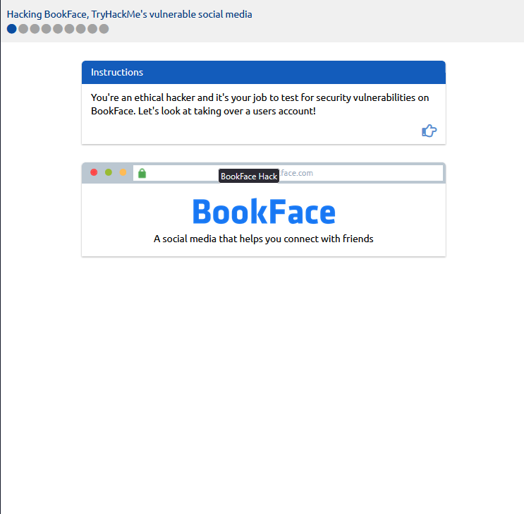

---

## Investigating the Target Account

The next page displayed the profile of a user named **Ben Spring**.

The username shown on the profile was:

```text
ben.spring
```

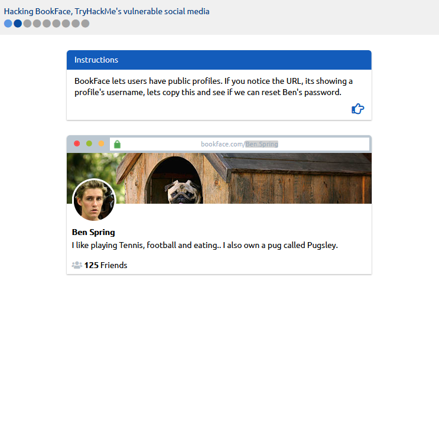

### Question

**What is the username of the BookFace account you will be taking over?**

```text
ben.spring
```

### How the Answer Was Found

The username was visible directly on the target user's public profile page after opening the BookFace website.

---

## Password Reset Process

The next step involved attempting to reset the password for the target account.

After entering the username, the application requested a verification code that had supposedly been sent to Ben's email address.

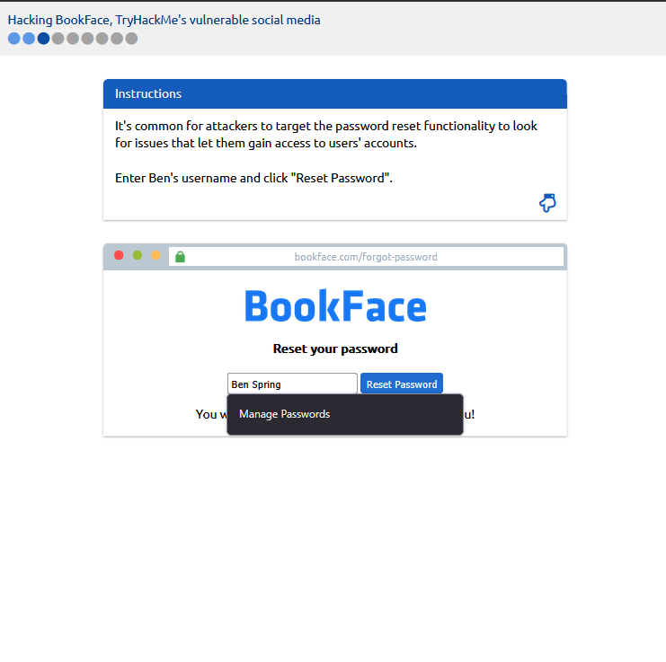

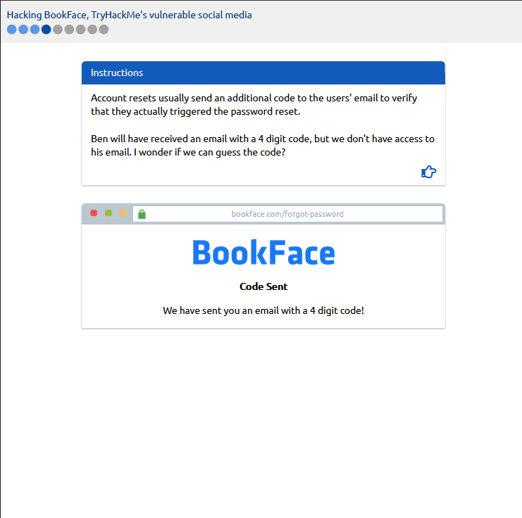

Since we did not have access to the victim's email account, the room introduced the concept of **OTP brute forcing**.

---

## Understanding OTP Brute Forcing

The application explained that there were:

```text
10,000 possible combinations
```

for the reset code.

These ranged from:

```text
0000
```

to:

```text
9999
```

Trying every code manually would take an extremely long time.

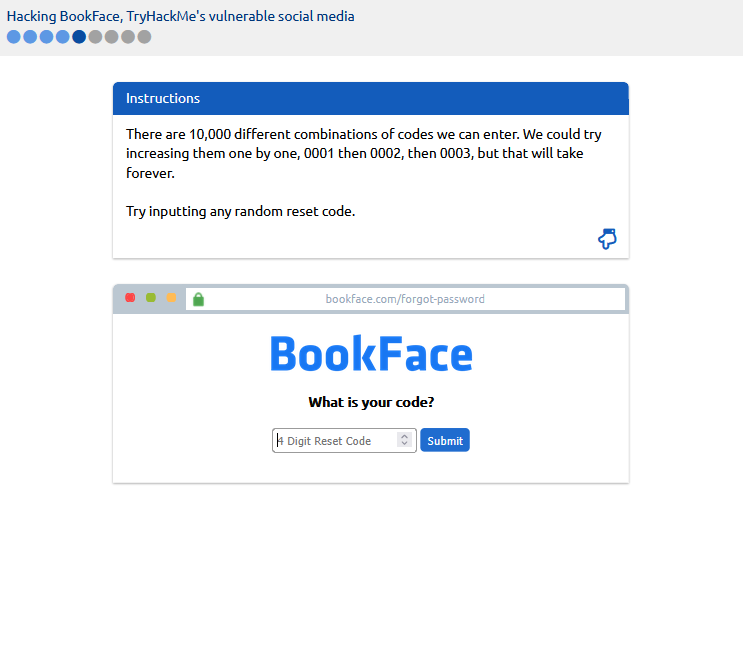

---

## Sending a Test Request

To observe how the application handled invalid reset codes, a random code was entered:

```text
0000
```

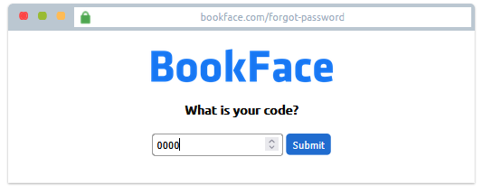

After submitting the request, the underlying web request became visible.

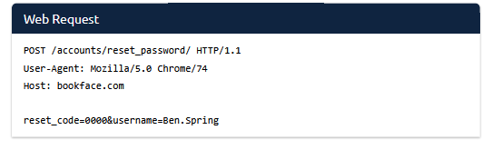

As expected, the reset code was rejected.

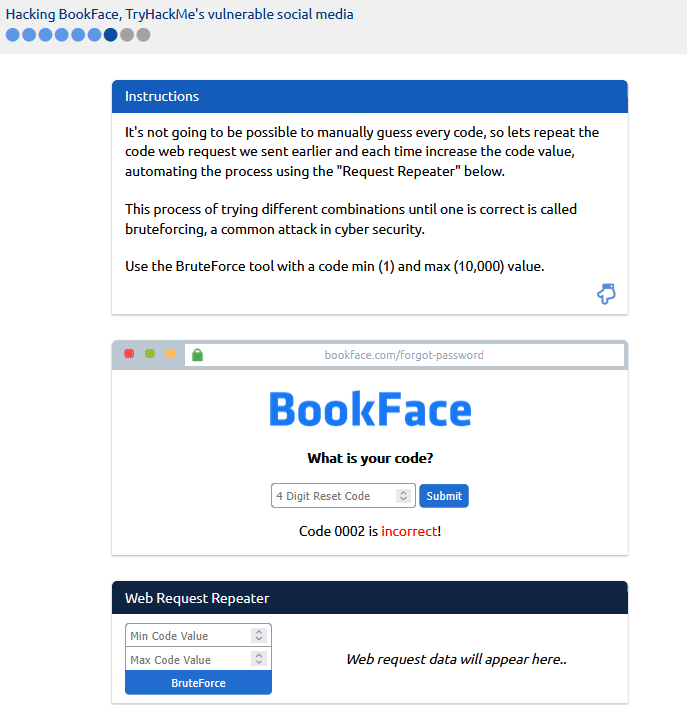

### Why This Step Was Important

Sending an invalid request allowed us to observe:

* How the application processed reset codes.
* What the request looked like.
* Which parameter contained the OTP value.

Understanding the request structure is essential before attempting automation or brute forcing.

---

## Brute Forcing the OTP

The next step involved using a web request repeater/brute force tool to automatically try every possible OTP value.

The configured range was:

```text
Minimum Value: 1
Maximum Value: 10000
```

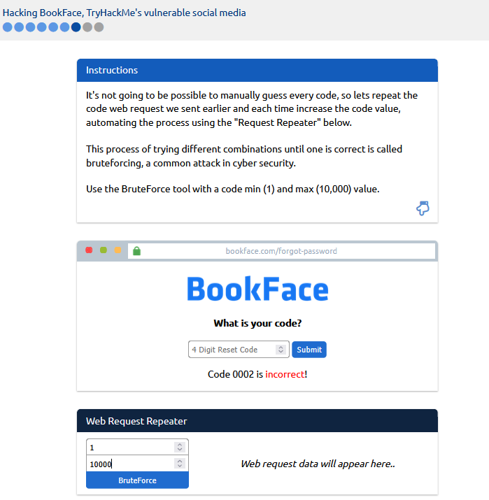

After the brute force process completed, the correct OTP was discovered:

```text
0187
```

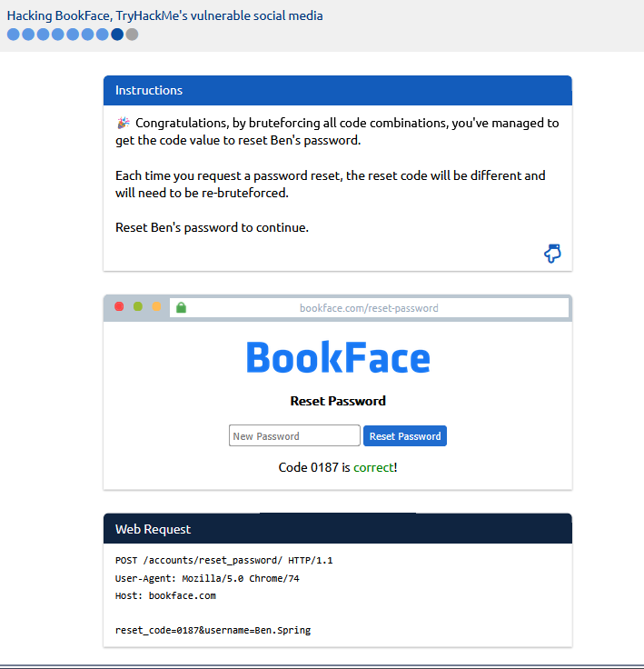

### Why This Worked

The application accepted unlimited password reset attempts and did not implement protections such as:

* Rate limiting
* Account lockouts
* CAPTCHA verification
* Request throttling

Because of these missing security controls, it was possible to automate thousands of requests until the correct OTP was found.

---

## Resetting the Password

Using the discovered OTP allowed the password reset process to continue successfully.

After resetting the password, the room revealed the flag.

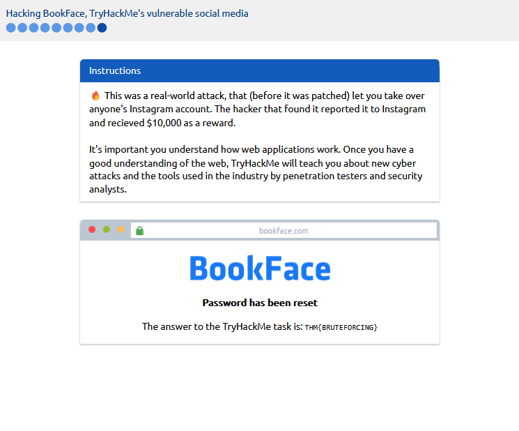

### Question

**Hack the BookFace account to reveal this task's answer!**

```text
THM{BRUTEFORCING}
```

### How the Answer Was Found

The answer was revealed after successfully brute forcing the OTP and completing the password reset process for the target account.

---

# Task 2: Network Security

## Understanding Why Networking Matters

Networking knowledge is essential in cybersecurity.

Security professionals regularly perform tasks such as:

* Discovering devices on a network
* Monitoring network activity
* Reviewing logs
* Tracking user behavior
* Investigating incidents

Understanding how networks operate forms the foundation for many areas of cybersecurity, including penetration testing, incident response, and security monitoring.

---

## Exploring the Target Data Breach Case Study

After clicking the **View Site** button, a page opened explaining how **Target**, a major retail company, suffered one of the largest data breaches in history.

The page explained that in 2013, attackers stole payment card information belonging to over **110 million customers**.

Interestingly, the compromise began through a third-party HVAC (air conditioning) vendor, demonstrating how supply chain weaknesses can impact large organizations.

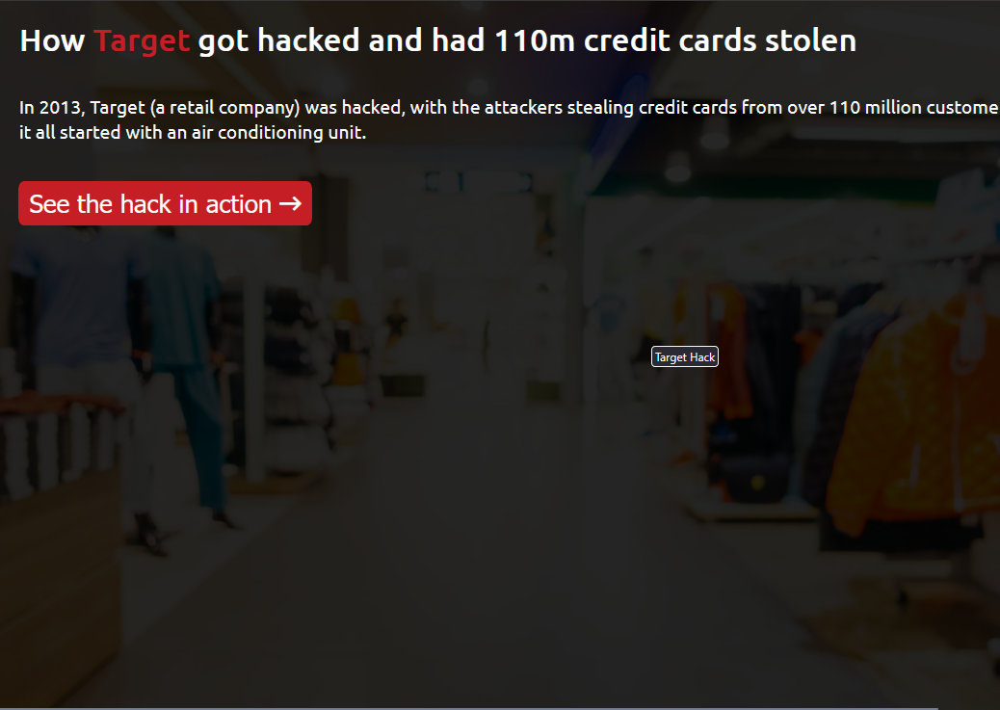

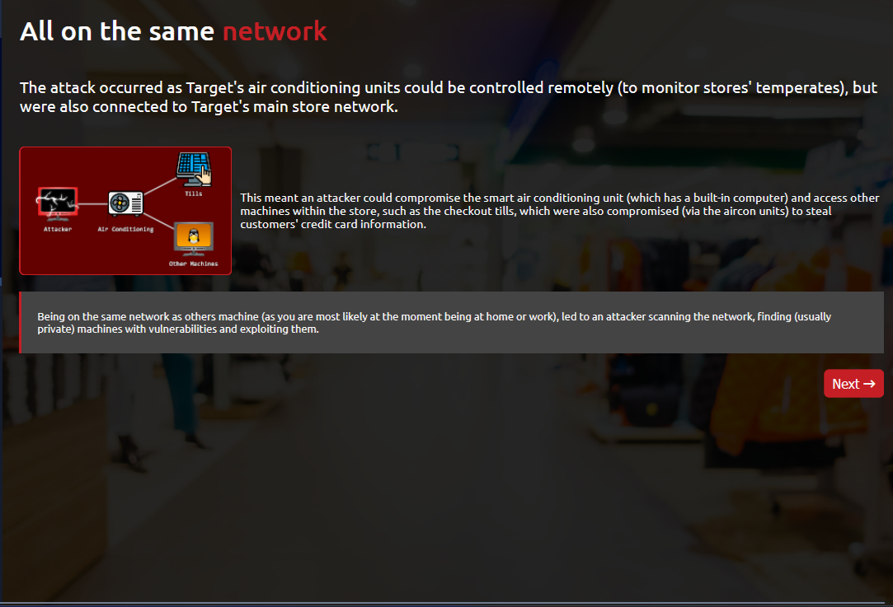

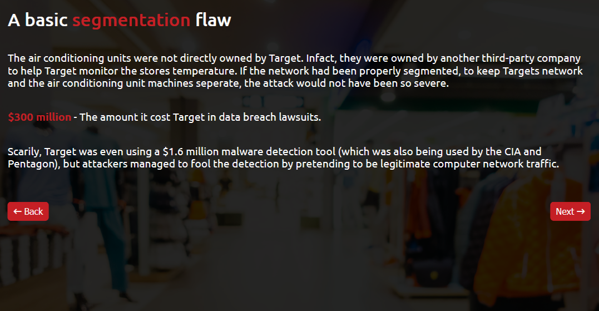

---

### Question

**How much did the data breach cost Target?**

```text
$300 million
```

### How the Answer Was Found

The answer was provided directly within the interactive case study explaining the Target breach and its financial impact.

---

## Roadmap Section

The final section of the room provided guidance on cybersecurity learning paths and future topics to explore.

This section did not contain any questions and served as an introduction to the broader TryHackMe learning journey.

---

# What I Learned

During this room, I learned:

* Why understanding how websites work is essential for web application security testing.
* What vulnerabilities are and how attackers exploit them.
* How password reset mechanisms can become vulnerable to brute force attacks.
* The importance of security controls such as rate limiting and account lockouts.
* Why networking knowledge is fundamental in cybersecurity.
* How third-party vendors can become entry points during large-scale breaches.
* The real-world financial impact of major cyber incidents.

---

# Conclusion

The **Learning Cyber Security** room provides an excellent introduction to two major cybersecurity domains: **Web Application Security** and **Network Security**.

The BookFace exercise demonstrated how weak password reset implementations can lead to account compromise, while the Target breach case study highlighted the importance of supply chain security and proper network defenses.

Overall, this room serves as a strong starting point for beginners beginning their cybersecurity journey.

---

# Room Status

| Platform  | Room                    | Status      |
| --------- | ----------------------- | ----------- |
| TryHackMe | Learning Cyber Security | ✅ Completed |

---

# Completion

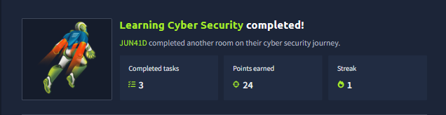

