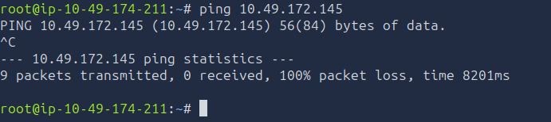
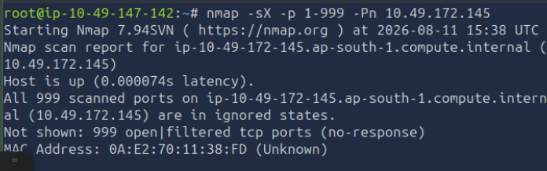
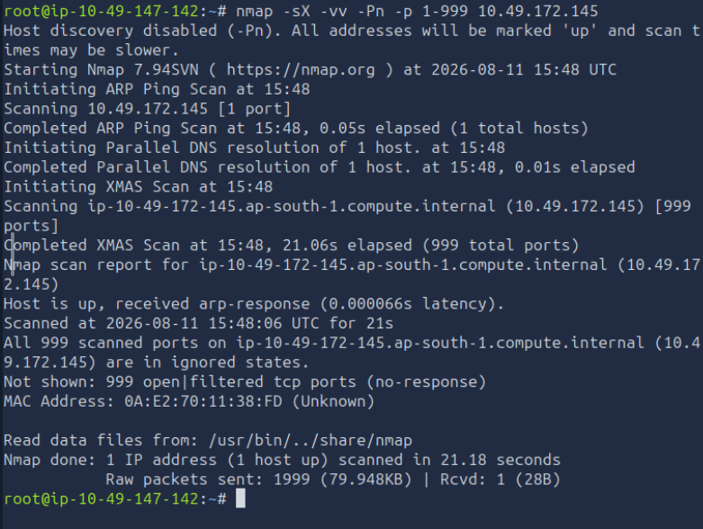
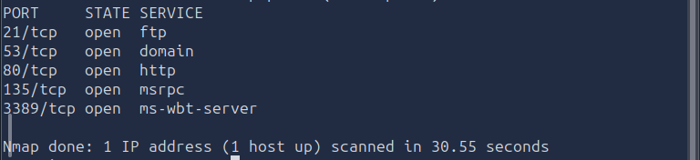

# NMAP

> **Platform:** TryHackMe
> **Room:** NMAP
> **Difficulty:** Beginner
> **Status:** ✅ Completed

## Overview

This room provides a beginner-friendly introduction to **Nmap**, a widely used network scanning and enumeration tool. The room covers Nmap's command-line switches, common scan types, UDP and TCP scanning, firewall evasion techniques, ICMP host discovery, the Nmap Scripting Engine (NSE), and practical scanning techniques.

The practical section applies these concepts against a target system to determine its network accessibility and identify exposed ports.

---

## Task 2: Introduction

This task introduced **Nmap** and its purpose as a network discovery and security auditing tool.

Nmap can be used to identify live hosts, discover open ports, determine running services and versions, identify operating systems, and perform additional enumeration through NSE scripts.

---

## Task 3: Nmap Switches

This task introduced commonly used Nmap switches for controlling scan types, output, timing, port selection, service detection, operating system detection, and scripting.

### What is the first switch listed in the help menu for a "SYN Scan"?

**Answer:**

```text
-sS
```

The `-sS` option performs a **TCP SYN scan**. It sends SYN packets to determine whether ports are open without completing the full TCP connection in the usual way.

### Which switch would you use for a UDP scan?

**Answer:**

```text
-sU
```

The `-sU` option performs a **UDP scan**. UDP scanning is useful when looking for services that communicate over UDP rather than TCP.

### Which switch detects the operating system running on the target?

**Answer:**

```text
-O
```

The `-O` option enables **operating system detection**. Nmap analyzes characteristics of the target's network responses and attempts to determine which operating system is being used.

### Which switch detects the versions of services running on the target?

**Answer:**

```text
-sV
```

The `-sV` option enables **service and version detection**. Instead of only reporting that a port is open, Nmap attempts to determine the service running on that port and, when possible, its version.

### How would you increase Nmap's verbosity?

**Answer:**

```text
-v
```

The `-v` option enables **verbosity level one**, causing Nmap to provide more information while the scan is running.

### How would you set the verbosity level to two?

**Answer:**

```text
-vv
```

Using `-vv` increases the verbosity to **level two**, providing more detailed information than a single `-v`.

Higher verbosity is useful when performing reconnaissance because it provides additional context about what Nmap is discovering during the scan.

### What switch saves Nmap results in three major formats?

**Answer:**

```text
-oA
```

The `-oA` option saves the scan output in Nmap's three major output formats using the specified filename as the base name. Saving scan results is useful because it avoids having to repeat scans unnecessarily and provides evidence that can later be reviewed or used in reports.

### What switch saves results in normal format?

**Answer:**

```text
-oN
```

The `-oN` option saves the results in Nmap's standard, human-readable **normal output** format.

### How would you save results in grepable format?

**Answer:**

```text
-oG
```

The `-oG` option saves results in **grepable output**. This format is useful when extracting specific information from scan results with command-line tools.

### How would you activate aggressive mode?

**Answer:**

```text
-A
```

The `-A` option enables **aggressive scanning features**. It combines several useful capabilities, including service detection, operating system detection, script scanning, and traceroute.

Because aggressive scanning generates more traffic, it should be used carefully, particularly when stealth or minimal network impact is important.

### How would you set the timing template to level 5?

**Answer:**

```text
-T5
```

Nmap provides timing templates from `-T0` through `-T5`. `-T5` is the fastest template and can generate significantly more network traffic and potentially produce less reliable results on slower or unstable networks.

### How would you scan only port 80?

**Answer:**

```text
-p 80
```

The `-p` option allows specific ports to be selected. Here, Nmap is instructed to scan only port `80`.

### How would you scan ports 1000–1500?

**Answer:**

```text
-p 1000-1500
```

A port range can be specified using a hyphen. This scans every port from `1000` through `1500`.

### How would you scan all ports?

**Answer:**

```text
-p-
```

The `-p-` option tells Nmap to scan **all TCP ports**, rather than only its default set of commonly used ports.

### How would you activate an NSE script?

**Answer:**

```text
--script
```

The `--script` option is used to run scripts from the **Nmap Scripting Engine (NSE)**.

### How would you activate all scripts in the `vuln` category?

**Answer:**

```text
--script vuln
```

The `vuln` category contains scripts designed to identify known vulnerabilities and weaknesses. Running vulnerability-detection scripts should be done only against systems where scanning is authorized.

---

## Task 4: Scan Types — Overview

This task introduced the different types of scans available in Nmap and explained that different scanning techniques can produce different results depending on the target, network configuration, and filtering mechanisms.

The main concepts covered included TCP-based scans, UDP scans, stealth-oriented scans, and host discovery.

No questions were required for this task.

---

## Task 5: TCP Connect Scans

This task introduced the **TCP Connect scan**, which establishes a complete TCP connection to determine whether a port is available.

### Which RFC defines the appropriate behaviour for the TCP protocol?

**Answer:**

```text
RFC 9293
```

**RFC 9293** defines the current TCP specification and describes the protocol's expected behaviour.

### If a port is closed, which flag should the server send back to indicate this?

**Answer:**

```text
RST
```

A closed TCP port conventionally responds with a TCP **RST (Reset)** packet. Nmap can use this response to determine that a TCP port is closed.

---

## Task 6: SYN Scans

A **SYN scan** is one of Nmap's most commonly used TCP scanning techniques. It sends a SYN packet to the target and analyzes the response without completing the normal TCP connection.

### What are the two other names for a SYN scan?

**Answer:**

```text
half-open
stealth
```

A SYN scan is commonly called a **half-open scan** because the TCP connection is not fully established. It is also commonly referred to as a **stealth scan**.

### Can Nmap use a SYN scan without sudo permissions?

**Answer:**

```text
N
```

A SYN scan normally requires the ability to craft and send raw packets, which generally requires elevated privileges. Therefore, on the TryHackMe environment, the scan requires `sudo` privileges.

---

## Task 7: UDP Scans

UDP behaves differently from TCP because it does not establish a connection before transmitting application data. As a result, determining the state of a UDP port can require additional interpretation.

### If a UDP port does not respond to an Nmap scan, what will it be marked as?

**Answer:**

```text
open|filtered
```

When Nmap receives no response from a UDP port, it cannot always determine whether the port is open or whether a firewall is filtering the traffic. It therefore reports the state as `open|filtered`.

### When a UDP port is closed, which protocol is used to indicate this?

**Answer:**

```text
ICMP
```

A closed UDP port can cause the target to return an **ICMP Port Unreachable** message. Nmap can use this response as evidence that the UDP port is closed.

---

## Task 8: NULL, FIN and XMAS Scans

This task introduced several TCP scan techniques that manipulate TCP flags differently from a normal connection attempt.

### Which of the three scan types uses the URG flag?

**Answer:**

```text
XMAS
```

An **XMAS scan** sets multiple TCP flags, including the `URG` flag. The name comes from the packet having multiple flags set, giving it the appearance of being "lit up" like a Christmas tree.

### Why are NULL, FIN and XMAS scans generally used?

**Answer:**

```text
firewall evasion
```

NULL, FIN, and XMAS scans can sometimes be useful for **firewall evasion** because they use unusual combinations of TCP flags. Their effectiveness depends on the target operating system and the behaviour of firewalls or packet filters.

### Which common operating system may respond to a NULL, FIN or XMAS scan with an RST for every port?

**Answer:**

```text
Microsoft Windows
```

Microsoft Windows systems may respond to these unusual TCP scans with RST packets regardless of whether the ports are open or closed. This can make these scan types less useful for accurately distinguishing port states on Windows targets.

---

## Task 9: ICMP Network Scanning / Ping Scan

A ping sweep can be used to discover which hosts are reachable within a network range without performing a full port scan.

### How would you perform a ping sweep on the `172.16.x.x` network with a netmask of `255.255.0.0`?

**Answer:**

```bash
nmap -sn 172.16.0.0/16
```

The `255.255.0.0` netmask corresponds to a `/16` CIDR prefix. Therefore, the network is represented as `172.16.0.0/16`.

The `-sn` option performs **host discovery without a port scan**, allowing Nmap to identify responding hosts across the specified network.

---

## Task 10: NSE Scripts — Overview

The **Nmap Scripting Engine (NSE)** extends Nmap beyond basic port scanning. NSE scripts can perform additional discovery, enumeration, vulnerability detection, authentication testing, and other security-related tasks.

### What language are NSE scripts written in?

**Answer:**

```text
Lua
```

NSE scripts are written in the **Lua** programming language.

### Which category of scripts would be a very bad idea to run in a production environment?

**Answer:**

```text
intrusive
```

The `intrusive` category contains scripts that may interact aggressively with target services and can potentially cause undesirable effects. Such scripts should not be run against production systems unless they are explicitly authorized and their impact is understood.

---

## Task 11: NSE Scripts — Working with NSE Scripts

This task explored how individual NSE scripts can accept optional arguments.

### What optional argument can the `ftp-anon.nse` script take?

**Answer:**

```text
maxlist
```

The `ftp-anon.nse` script can use the `maxlist` argument to control the maximum number of directory entries that are listed when checking for anonymous FTP access.

---

## Task 12: NSE Scripts — Searching for Scripts

NSE scripts are stored in the Nmap scripts directory. Searching this directory makes it possible to identify scripts relevant to a particular service or protocol.

The notes used:

```bash
/usr/share/nmap/scripts/
```

### What is the filename of the script that determines the underlying OS of the SMB server?

**Answer:**

```text
smb-os-discovery.nse
```

The `smb-os-discovery.nse` script is designed to gather information about the operating system and other details exposed by an SMB server.

The script can be located by searching the Nmap scripts directory for SMB-related scripts.

### What does `smb-os-discovery.nse` depend on?

**Answer:**

```text
smb-brute
```

The script's dependency information identifies `smb-brute` as a dependency.

---

## Task 13: Firewall Evasion

This task introduced techniques that can help when standard host discovery is blocked by a firewall.

### Which simple and frequently relied-upon protocol is often blocked, requiring the use of the `-Pn` switch?

**Answer:**

```text
ICMP
```

ICMP is commonly used for host discovery, but firewalls may block ICMP traffic. When a target does not respond to the normal host-discovery probes, Nmap may incorrectly assume that the host is unavailable.

The `-Pn` option tells Nmap to **skip host discovery** and treat the target as being online, allowing the port scan to proceed.

### Which Nmap switch allows arbitrary-length random data to be appended to packets?

**Answer:**

```text
--data-length
```

The `--data-length` option allows additional data of the specified length to be appended to packets. This can be useful in certain packet-manipulation and firewall-evasion scenarios.

---

## Task 14: Practical

The practical section applied the scanning techniques covered throughout the room against the provided target.

### Does the target IP respond to ICMP echo (ping) requests?

**Answer:**

```text
N
```

A ping scan was performed against the target, but no response was received to the ICMP echo request.



This demonstrated why relying exclusively on ICMP-based host discovery can be problematic. A host can be online while still blocking ICMP traffic.

### Perform an XMAS scan on the first 999 ports. How many ports are shown to be open or filtered?

**Answer:**

```text
999
```

An XMAS scan was performed against ports `1` through `999` using the `-sX` option.

A representative command is:

```bash
nmap -sX -p 1-999 -Pn <TARGET_IP>
```


The scan reported all **999 ports** as `open|filtered`.

The `-vv` option was also used to increase the amount of information displayed during the scan:

```bash
nmap -vv -sX -p 1-999 <TARGET_IP>

```


### There is a reason given for this -- what is it?

Note: The answer will be in your scan results. Think carefully about which switches to use -- and read the hint before asking for help!

**Answer:**

```text
No response
```

The scan results indicated **"No response"**.

For an XMAS scan, the absence of a response can cause Nmap to classify a port as `open|filtered`, because it cannot determine whether the port is actually open or whether traffic is being filtered.

This is an important limitation of NULL, FIN, and XMAS scans: the result depends heavily on how the target operating system and network filtering devices handle unusual TCP packets.

### Perform a TCP SYN scan on the first 5000 ports. How many ports are shown to be open?

**Answer:**

```text
5
```

After running a **TCP SYN scan** against the first 5,000 ports of the target, the scan results showed that **5 ports were open**.



---

## What I Learned

* How Nmap is used for network discovery, enumeration, and security testing.
* The difference between common Nmap scan types such as TCP Connect, SYN, UDP, NULL, FIN, and XMAS scans.
* How to use `-sS`, `-sT`, `-sU`, `-sV`, and `-O` for different scanning and detection requirements.
* How verbosity levels such as `-v` and `-vv` provide additional scan information.
* How to save Nmap results using formats such as normal, grepable, and combined output.
* How timing templates affect scan speed and network noise.
* How to select individual ports, port ranges, or all ports with the `-p` option.
* How NSE scripts extend Nmap's capabilities beyond basic port scanning.
* How to search for and run NSE scripts.
* Why intrusive NSE scripts should be used carefully, especially against production systems.
* How ICMP filtering can prevent normal host discovery.
* How `-Pn` can be used when ICMP or other host-discovery probes are blocked.
* How XMAS scans can produce `open|filtered` results when there is no response.
* Why different operating systems can respond differently to unusual TCP flag combinations.
* Why scan results should be saved so they can be reviewed later without unnecessarily repeating scans.

---

## Conclusion

The **Nmap** room provided a practical introduction to one of the most important tools used for network reconnaissance and security testing.

The exercises demonstrated how different Nmap switches change the way a target is scanned, how operating systems and services can be identified, how NSE scripts extend Nmap's functionality, and how network filtering can affect scan results.

The practical tasks reinforced an important lesson: **Nmap results must be interpreted in the context of the scan technique and the target's network behaviour**. A lack of response does not necessarily mean that a port or host is unavailable; firewalls, filtering, and operating-system behaviour can significantly influence the results.

---

## Room Status

| Platform  | Room | Difficulty | Status      |
| --------- | ---- | ---------- | ----------- |
| TryHackMe | NMAP | Beginner   | ✅ Completed |

---

## Completion Screenshot.

