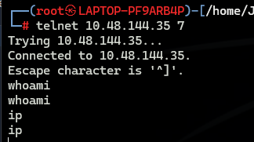
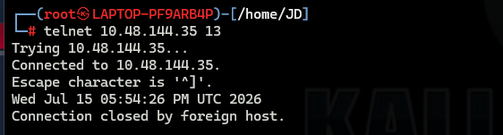
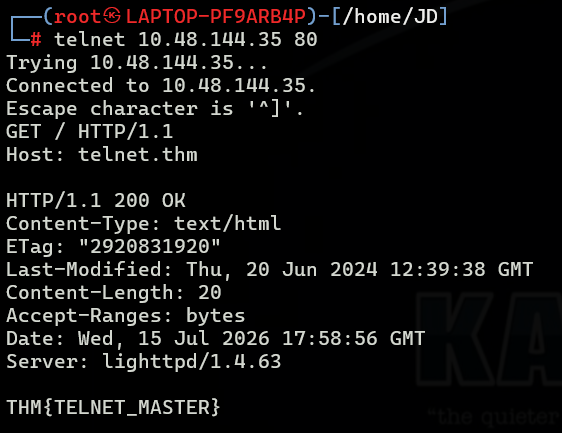
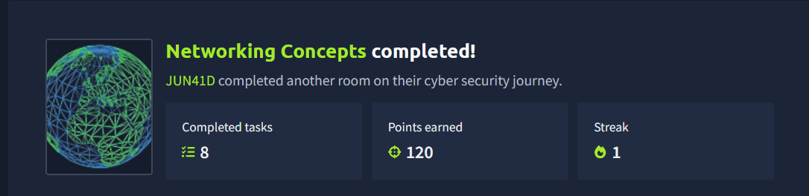

# Networking Concepts

> **Platform:** TryHackMe
> **Room:** Networking Concepts
> **Difficulty:** Beginner
> **Status:** ✅ Completed

---

# Overview

This room introduces the fundamental concepts of computer networking and provides a practical understanding of how devices communicate across networks.

Topics covered include:

* The ISO OSI Model
* The TCP/IP Model
* IP Addresses and Subnets
* TCP and UDP Protocols
* Encapsulation
* Port Numbers
* Connecting to services using Telnet

The room combines theoretical concepts with practical exercises to build a strong foundation for future networking and cybersecurity learning.

---

# Task 1: Introduction

This task introduced the topics that would be covered throughout the room.

The learning objectives included:

* Understanding the ISO OSI model
* Learning about IP addresses, subnets, and routing
* Understanding TCP, UDP, and port numbers
* Connecting to open ports using command-line tools

No questions were included in this task.

---

# Task 2: OSI Model

The **OSI (Open Systems Interconnection) Model** is a conceptual framework developed by the **International Organization for Standardization (ISO)** to describe how communication occurs within computer networks.

The model consists of seven layers:

1. Physical Layer
2. Data Link Layer
3. Network Layer
4. Transport Layer
5. Session Layer
6. Presentation Layer
7. Application Layer

Understanding the OSI model is important because it provides a structured way to troubleshoot networks and understand where different technologies operate.

---

## Question

Which layer is responsible for end-to-end communication between running applications?

```text
4
```

### Explanation

The correct answer is the **Transport Layer (Layer 4)**.

This layer is responsible for communication between applications running on different hosts and provides features such as:

* Segmentation
* Reliability
* Error recovery
* Flow control

Protocols such as **TCP** and **UDP** operate at this layer.

---

## Question

Which layer is responsible for routing packets to the proper network?

```text
3
```

### Explanation

The **Network Layer (Layer 3)** handles logical addressing and routing.

Routers operate at this layer and determine the best path for packets to reach their destination network.

---

## Question

In the OSI model, which layer is responsible for encoding the application data?

```text
6
```

### Explanation

The **Presentation Layer (Layer 6)** is responsible for formatting, encoding, compressing, and encrypting data before it reaches the application.

This ensures that data can be correctly interpreted by the receiving system.

---

## Question

Which layer is responsible for transferring data between hosts on the same network segment?

```text
2
```

### Explanation

The **Data Link Layer (Layer 2)** is responsible for communication within the same local network segment.

Switches primarily operate at this layer using MAC addresses to forward frames to their destinations.

---

# Task 3: TCP/IP Model

After learning the theoretical OSI model, this task introduced the practical **TCP/IP Model**, which forms the foundation of the modern Internet.

TCP/IP stands for:

```text
Transmission Control Protocol / Internet Protocol
```

The model was originally developed by the **United States Department of Defense (DoD)** during the 1970s.

One of its major design goals was resilience. Even if parts of the network became unavailable, communication could continue by dynamically routing traffic through alternative paths.

The TCP/IP model consists of four layers:

1. Application Layer
2. Transport Layer
3. Internet Layer
4. Link Layer

---

## Question

To which layer does HTTP belong in the TCP/IP model?

```text
Application Layer
```

### Explanation

HTTP is an application protocol used by web browsers and web servers to exchange web pages and other resources.

Because applications directly use HTTP for communication, it belongs to the **Application Layer**.

---

## Question

How many layers of the OSI model does the Application Layer in the TCP/IP model cover?

```text
3
```

### Explanation

The TCP/IP Application Layer combines the following OSI layers:

* Session Layer (Layer 5)
* Presentation Layer (Layer 6)
* Application Layer (Layer 7)

Therefore, it covers **three OSI layers**.

---

# Task 4: IP Addresses and Subnets

This task introduced IP addressing and the difference between public and private IP addresses.

Private IP ranges include:

```text
10.0.0.0/8
172.16.0.0 - 172.31.255.255
192.168.0.0/16
```

Addresses outside these ranges are generally public IP addresses.

---

## Question

Which of the following IP addresses is not a private IP address?

* 192.168.250.125
* 10.20.141.132
* 49.69.147.197
* 172.23.182.251

```text
49.69.147.197
```

### Explanation

The address `49.69.147.197` does not belong to any private IP range, making it a public IP address.

---

## Question

Which of the following IP addresses is not a valid IP address?

* 192.168.250.15
* 192.168.254.17
* 192.168.305.19
* 192.168.199.13

```text
192.168.305.19
```

### Explanation

IPv4 octets can only contain values between:

```text
0 - 255
```

The value `305` exceeds the maximum allowed value, making the address invalid.

---

# Task 5: UDP and TCP

This task introduced the two major transport layer protocols:

* TCP (Transmission Control Protocol)
* UDP (User Datagram Protocol)

TCP focuses on reliability and ordered delivery, while UDP prioritizes speed and low overhead.

---

## Question

Which protocol requires a three-way handshake?

```text
TCP
```

### Explanation

TCP establishes a connection using the **three-way handshake**:

```text
SYN
SYN-ACK
ACK
```

This process ensures that both systems are ready to communicate before data transmission begins.

UDP does not perform this process because it is connectionless.

---

## Question

What is the approximate number of port numbers (in thousands)?

```text
65
```

### Explanation

Port numbers range from:

```text
0 - 65535
```

This gives approximately:

```text
65 thousand ports
```

These ports allow multiple services to operate simultaneously on a single system.

---

# Task 6: Encapsulation

This task introduced **encapsulation**, the process of wrapping data with protocol-specific information as it moves down the networking stack.

Each layer adds its own header before passing the data to the next layer.

---

## Question

On a WiFi network, within what will an IP packet be encapsulated?

```text
Frame
```

### Explanation

At Layer 2, IP packets are encapsulated inside **frames** before being transmitted across the network.

For wireless networks, these are specifically WiFi frames.

---

## Question

What do you call the UDP data unit that encapsulates the application data?

```text
Datagram
```

### Explanation

The Protocol Data Unit (PDU) for UDP is called a **datagram**.

UDP adds minimal overhead, making it suitable for applications where speed is more important than reliability.

---

## Question

What do you call the data unit that encapsulates application data sent over TCP?

```text
Segment
```

### Explanation

TCP divides application data into **segments**.

These segments include sequencing and acknowledgment information to ensure reliable communication.

---

# Task 7: Telnet

This task provided practical experience using **Telnet** to connect to services running on different TCP ports.

Although Telnet was historically used for remote administration, it can also be used to manually interact with services listening on TCP ports.

Three services were available on the target machine:

* Echo Server (Port 7)
* Daytime Server (Port 13)
* HTTP Server (Port 80)

---

## Echo Server — Port 7

The first service tested was the **Echo Server** running on TCP port **7**.

Anything typed into the connection was immediately sent back by the server.

This demonstrated how a simple TCP service receives and returns data to the client.



---

## Daytime Server — Port 13

The second service tested was the **Daytime Server** running on TCP port **13**.

After connecting, the server displayed the current date and time before automatically closing the connection.

The client then displayed the message:

```text
Connection closed by foreign host.
```

This behavior demonstrated how some services provide a response and immediately terminate the session.



---

## HTTP Server — Port 80

The final service tested was an HTTP server listening on TCP port **80**.

A Telnet connection was established to the web server, and an HTTP request was manually sent.

The request used was:

```http
GET / HTTP/1.1
Host: telnet.thm
```

The server responded with:

* An HTTP `200 OK` response
* The web server name and version
* A challenge flag



This exercise demonstrated that HTTP is fundamentally a text-based protocol that can be manually interacted with using simple tools such as Telnet.

---

## Question

Use telnet to connect to the web server on `10.48.144.35`. What is the name and version of the HTTP server?

```text
lighttpd/1.4.63
```

### Explanation

After sending the HTTP request, the server headers revealed the web server software and version being used.

The `Server` header contained:

```text
lighttpd/1.4.63
```

---

## Question

What flag did you get when you viewed the page?

```text
THM{TELNET_MASTER}
```

### Explanation

The flag was displayed in the HTTP response body returned by the web server after successfully sending the request.

---

# Task 8: Conclusion

This final task concluded the room and required no additional answers.

The room was successfully completed.

---

# What I Learned

Throughout this room, I learned:

* The purpose and structure of the OSI Model.
* How the TCP/IP model maps to the OSI model.
* The difference between private and public IP addresses.
* How TCP differs from UDP.
* The concept of encapsulation and protocol data units.
* How services listen on specific port numbers.
* How to manually interact with network services using Telnet.
* That HTTP is a text-based protocol that can be communicated with directly from the command line.

---

# Conclusion

The Networking Concepts room provided a strong introduction to the fundamentals of computer networking and demonstrated how theoretical concepts map to real-world implementations.

The practical Telnet exercises were especially valuable because they showed how network services behave behind the scenes and how clients communicate directly with servers over TCP connections.

This room serves as an excellent foundation for future studies in networking, penetration testing, and cybersecurity.

---

# Room Status

| Platform  | Room                | Status      |
| --------- | ------------------- | ----------- |
| TryHackMe | Networking Concepts | ✅ Completed |

---

# Completion




