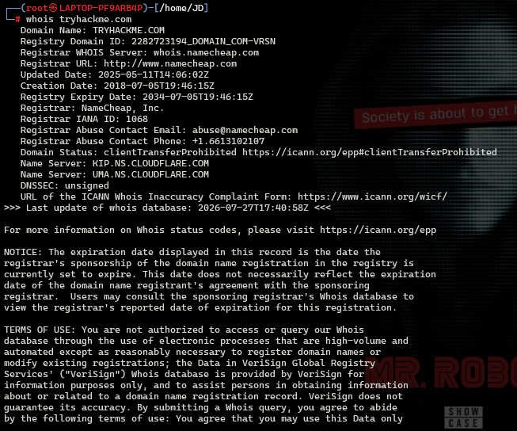
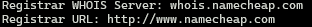
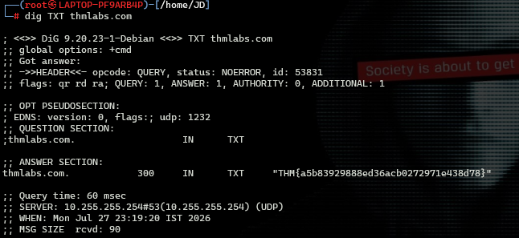
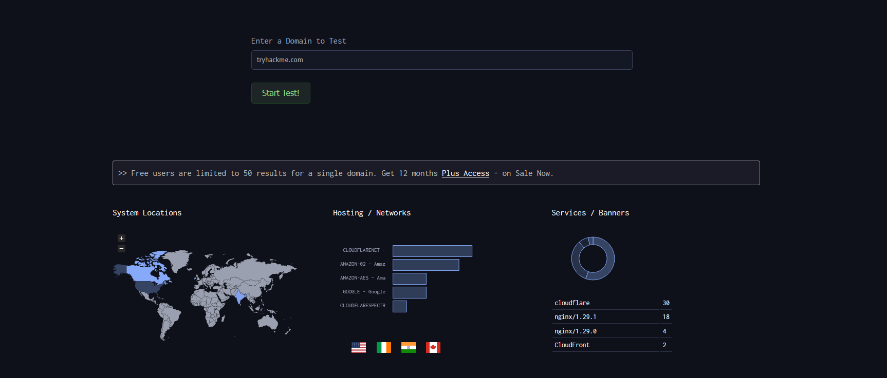
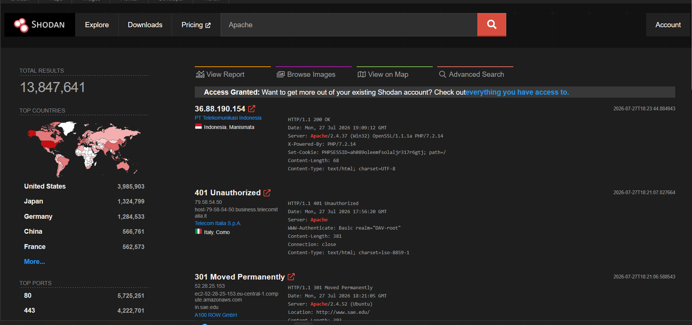
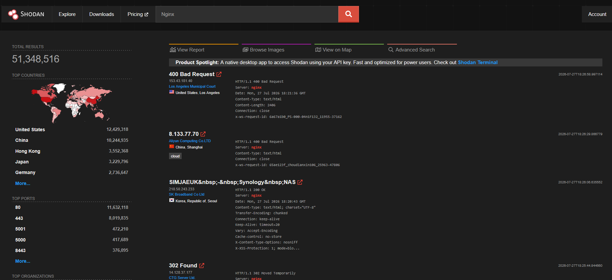
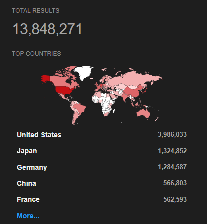
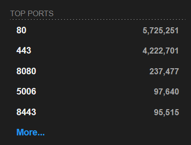
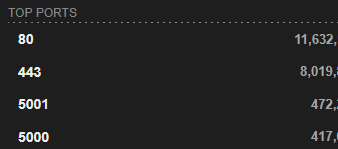
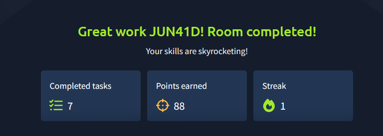

# Passive Reconnaissance

> **Platform:** TryHackMe  
> **Room:** Passive Reconnaissance  
> **Difficulty:** Beginner  
> **Status:** ✅ Completed

---

# Overview

The **Passive Reconnaissance** room is the starting point of TryHackMe's **Network Security** module. It introduces the concept of gathering intelligence about a target **without directly interacting with it**.

Passive reconnaissance is one of the safest and most valuable phases of a penetration test because it allows security professionals to collect useful information from publicly available sources without alerting the target. Throughout this room, I learned how to gather domain registration information, inspect DNS records, discover subdomains, and identify publicly exposed services using several common reconnaissance tools.

## Objectives

By the end of this room, I learned how to:

- Query domain registration information using **WHOIS**
- Retrieve DNS records using **dig** and **nslookup**
- Understand why querying public WHOIS and DNS servers is considered passive reconnaissance
- Discover subdomains using **DNSDumpster** and **Certificate Transparency Logs**
- Gather intelligence on internet-facing devices using **Shodan**

---

# Task 1 - Introduction

This room does not require a target machine. Instead, all reconnaissance is performed against publicly available information related to **TryHackMe-owned domains**.

The AttackBox was started in preparation for the upcoming tasks where command-line tools such as `whois` and `dig` were used.

**Questions:** None

---

# Task 2 - Passive vs Active Reconnaissance

## Summary

This task explains the difference between **passive** and **active** reconnaissance.

### Passive Reconnaissance

Passive reconnaissance gathers information from publicly available sources without sending traffic to the target. Since there is no direct interaction, the target generally cannot detect the activity.

Examples include:

- Searching social media
- Looking up WHOIS information
- Reading public documentation
- Viewing Certificate Transparency logs

### Active Reconnaissance

Active reconnaissance involves directly communicating with the target. Because packets are sent to the target system, these actions may be logged, detected, or blocked.

Examples include:

- Pinging a server
- Port scanning
- Banner grabbing
- Directory enumeration

---

## Question 1

**You visit the Facebook page of the target company, hoping to get some of their employee names. What kind of reconnaissance activity is this? (A for active, P for passive)**

### Answer

```text
P
```

### Explanation

Viewing publicly available social media pages does not interact with the company's infrastructure, making it a **passive reconnaissance** activity.

---

## Question 2

**You ping the IP address of the company web server to check if ICMP traffic is blocked. What kind of reconnaissance activity is this? (A for active, P for passive)**

### Answer

```text
A
```

### Explanation

Sending ICMP packets directly to the target system is considered **active reconnaissance** because the target can detect and log the request.

---

## Question 3

**You happen to meet the IT administrator of the target company at a party. You try to use social engineering to get more information about their systems and network infrastructure. What kind of reconnaissance activity is this? (A for active, P for passive)**

### Answer

```text
A
```

### Explanation

Social engineering involves directly interacting with someone associated with the target organization. Since information is being actively obtained from the target, it is considered **active reconnaissance**.

---

# Task 3 - WHOIS

## Summary

WHOIS is a protocol used to retrieve registration information about domain names. It communicates with public WHOIS servers (typically over **TCP port 43**) to provide details such as:

- Domain registrar
- Registration date
- Expiration date
- Last update date
- Name servers
- Domain status
- Registrar abuse contact information

Since WHOIS queries are sent to public WHOIS servers rather than directly to the target organization, they are considered **passive reconnaissance**.

To gather the required information, I ran:

```bash
whois tryhackme.com
```

This returned the domain registration information shown below.



---

## Question 1

**When was TryHackMe.com registered?**

### Answer

```text
20180705
```

### Explanation

The registration date was found in the **Creation Date** field of the WHOIS output.


---

## Question 2

**What is the registrar of TryHackMe.com?**

### Answer

```text
namecheap.com
```

### Explanation

The **Registrar** field in the WHOIS output identifies the company responsible for registering the domain.



---

## Question 3

**Which company is TryHackMe.com using for name servers?**

### Explanation

The WHOIS output also lists the authoritative **Name Servers** responsible for handling DNS requests for the domain.

These name servers belong to **Cloudflare**, indicating that TryHackMe uses Cloudflare for DNS services.


---

# Task 4 - NSLOOKUP and DIG

## Summary

This task introduced two command-line tools used for querying DNS records.

### nslookup

`nslookup` is a traditional DNS lookup utility that can retrieve different types of DNS records.

### dig

`dig` (Domain Information Groper) is a more powerful DNS lookup tool that provides detailed DNS query results and is commonly used by penetration testers and system administrators.

For this task, I chose to use `dig`.

To retrieve the TXT records for **thmlabs.com**, I ran:

```bash
dig TXT thmlabs.com
```

The command returned multiple TXT records, including the flag required to complete the challenge.



---

## Question

**Check the TXT records of thmlabs.com. What is the flag there?**

### Answer

```text
THM{a5b83929888ed36acb0272971e438d78}
```

### Explanation

The flag was stored inside one of the domain's TXT DNS records. Using `dig` made it easy to retrieve and inspect the TXT entries.

---

# Task 5 - DNSDumpster

## Summary

DNSDumpster is a free passive reconnaissance tool that aggregates publicly available DNS information.

It collects information from sources such as:

- Public DNS records
- Search engine caches
- Certificate Transparency logs
- Historical DNS data

DNSDumpster can reveal:

- Subdomains
- IP addresses
- MX records
- TXT records
- CNAME records
- DNS relationships
- Service banners

I searched for **tryhackme.com** using DNSDumpster and reviewed the generated report.

The report included DNS information, discovered subdomains, and service banners.



---

## Question

**Lookup tryhackme.com on DNSDumpster. Under Services / Banners, which one has the highest count?**

### Answer

```text
Cloudflare
```

### Explanation

The **Services / Banners** section showed that **Cloudflare** appeared most frequently, indicating that many of TryHackMe's services are protected or delivered through Cloudflare.

---

# Task 6 - Shodan.io

## Summary

Shodan is a search engine that indexes internet-connected devices instead of web pages.

Unlike traditional search engines, Shodan continuously scans the public internet and records information about devices such as:

- Web servers
- Routers
- Firewalls
- Cameras
- Industrial control systems
- Databases
- IoT devices

For this task, I searched for **Apache** and **NGINX** to analyze publicly exposed servers and identify usage statistics.

Searching for **Apache** provided the information needed for the first two questions.



Searching for **NGINX** provided the answer for the final question.



---

## Question 1

**According to Shodan.io, what is the first country in the world in terms of the number of publicly accessible Apache servers?**

### Answer

```text
United States
```

### Explanation

The Apache statistics page showed that the **United States** had the highest number of publicly accessible Apache servers.



---

## Question 2

**Based on Shodan.io, what is the 3rd most common port used for Apache?**

### Answer

```text
8080
```

### Explanation

The Shodan statistics page listed the most common ports used by Apache servers. The third most common port was **8080**.



---

## Question 3

**Based on Shodan.io, what is the most common port used for nginx?**

### Answer

```text
80
```

### Explanation

The NGINX statistics page showed that **port 80** is the most commonly used port for publicly accessible NGINX servers.



---

# Task 7 - Summary

This final task reviewed the concepts covered throughout the room.

Topics included:

- Passive vs Active Reconnaissance
- WHOIS lookups
- DNS record enumeration
- Using `dig` and `nslookup`
- DNSDumpster
- Shodan

No questions were required for this task.

---

# What I Learned

During this room, I learned:

- The difference between passive and active reconnaissance.
- How WHOIS can reveal publicly available domain registration information.
- How to query DNS records using `dig` and `nslookup`.
- How TXT records can contain useful information during reconnaissance.
- How DNSDumpster helps discover subdomains and DNS infrastructure without actively interacting with the target.
- How Shodan indexes internet-facing devices and provides valuable intelligence about exposed services.
- Why passive reconnaissance is a critical first step before performing any active security assessment.

---

# Conclusion

This room provided a solid introduction to passive reconnaissance techniques used during penetration testing. By relying solely on publicly available information, I was able to gather valuable intelligence about a target's infrastructure without directly interacting with its systems. The tools introduced in this room—**WHOIS**, **dig**, **DNSDumpster**, and **Shodan**—are essential resources for security professionals and form the foundation for more advanced reconnaissance techniques covered later in the Network Security learning path.

---

# Room Status

- **Platform:** TryHackMe
- **Room:** Passive Reconnaissance
- **Difficulty:** Beginner
- **Status:** ✅ Completed

---

# Completion Screenshot

