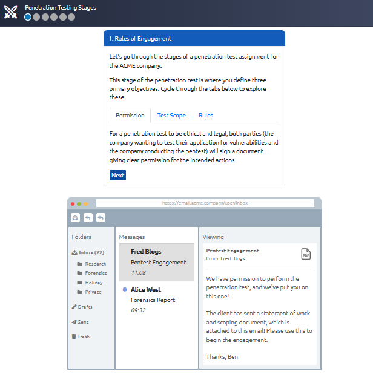
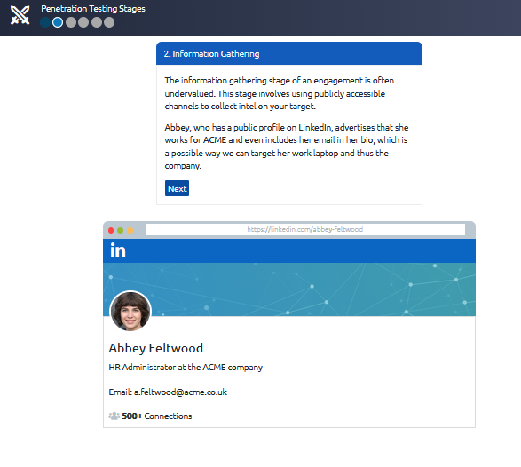
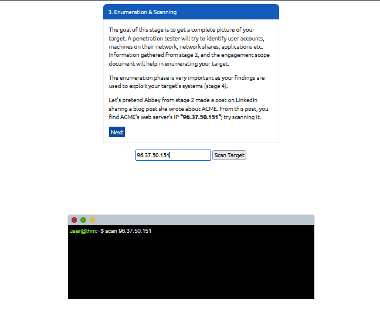
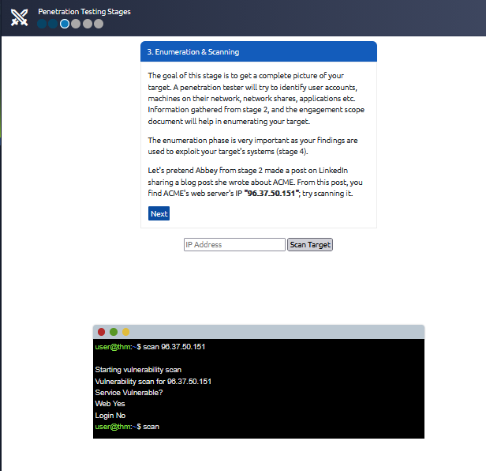
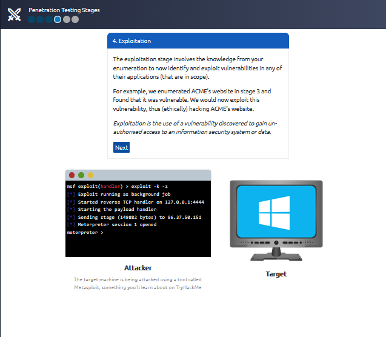
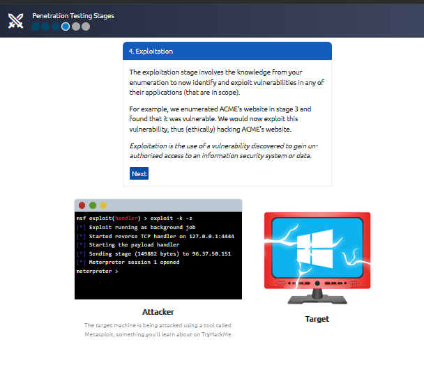
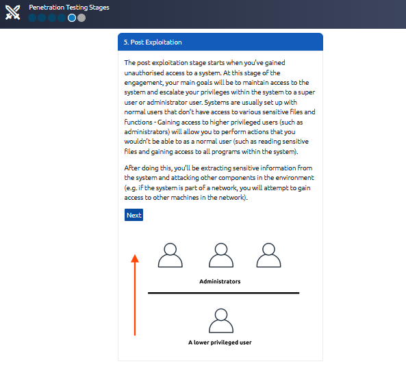
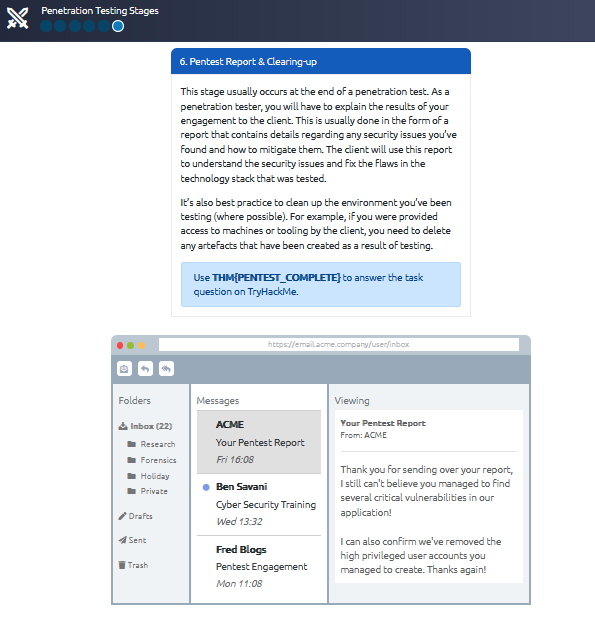

# Pentesting Fundamentals

> **Platform:** TryHackMe  
> **Room:** Pentesting Fundamentals  
> **Difficulty:** Beginner  
> **Status:** ✅ Completed

---

# Overview

This room introduces the fundamentals of penetration testing, including its purpose, ethics, methodologies, testing approaches, and the complete penetration testing lifecycle.

The room explains how penetration testers simulate real-world attacks in an authorized and controlled manner to identify security weaknesses before malicious attackers can exploit them. It also covers the legal and ethical responsibilities of penetration testers, common penetration testing frameworks, different testing methodologies, and provides a practical walkthrough of a simulated penetration testing engagement against ACME's infrastructure.

---

# Task 1: What is Penetration Testing?

## Summary

Penetration testing (or **pentesting**) is an authorized security assessment performed to evaluate the security of systems, networks, or applications.

Rather than simply reviewing configurations, penetration testers actively attempt to exploit vulnerabilities using the same tools, techniques, and methodologies that real attackers use. The objective is to discover weaknesses before malicious actors can abuse them.

A penetration test is always performed with explicit authorization and should never be confused with illegal hacking.

Some key points covered in this task:

- Cybersecurity is increasingly important for both individuals and organizations.
- Penetration testing is an ethical and authorized activity.
- It helps identify weaknesses before attackers do.
- Pentesters use attacker techniques to improve security.
- According to Security Magazine, thousands of cyberattacks occur every day, highlighting the importance of proactive security testing.

**No questions were included in this task.**

---

# Task 2: Penetration Testing Ethics

Ethics are one of the most important aspects of penetration testing. A penetration tester must always operate within legal boundaries and only perform testing after receiving proper authorization.

This task introduced three hacker categories based on their ethics and intentions.

| Hat | Description |
|------|-------------|
| White Hat | Ethical hackers who operate legally and help improve security. |
| Grey Hat | Hackers who may have good intentions but do not always follow laws or ethical standards. |
| Black Hat | Malicious attackers who perform illegal activities for personal or financial gain. |

---

## Rules of Engagement (RoE)

Before any penetration test begins, both the client and the penetration testing team agree on a **Rules of Engagement (RoE)** document.

The RoE defines exactly how the engagement will be performed and protects both parties legally.

The document typically includes:

- Permission to perform the assessment
- Scope of the assessment
- Allowed and prohibited attack techniques

Without a Rules of Engagement document, penetration testing could be considered unauthorized and illegal.

---

## Question 1

**You are given permission to perform a security audit on an organisation; what type of hacker would you be?**

### Answer

```text
White Hat
```

### Explanation

Because the assessment is officially authorized, the tester is acting legally and ethically, making them a **White Hat hacker**.

---

## Question 2

**You attack an organisation and steal their data, what type of hacker would you be?**

### Answer

```text
Black Hat
```

### Explanation

Stealing data without permission is illegal and malicious. This behavior classifies the attacker as a **Black Hat hacker**.

---

## Question 3

**What document defines how a penetration testing engagement should be carried out?**

### Answer

```text
Rules of Engagement
```

### Explanation

The **Rules of Engagement (RoE)** outlines the legal authorization, scope, objectives, limitations, and permitted techniques for the penetration test. It serves as the official agreement between the client and the penetration testing team.

---

# Task 3: Penetration Testing Methodologies

Every penetration test follows a structured methodology.

Although different engagements require different approaches, most industry-standard methodologies follow a similar sequence of stages.

---

## Penetration Testing Lifecycle

### 1. Information Gathering

The first phase focuses on collecting publicly available information about the target.

Examples include:

- Employee information
- Email addresses
- Public websites
- Social media profiles
- DNS records

No direct interaction with the target systems occurs during this stage.

---

### 2. Enumeration & Scanning

This phase identifies:

- Open ports
- Running services
- Operating systems
- Applications
- Potential attack surface

Common tools include:

- Nmap
- Masscan
- Nikto

---

### 3. Exploitation

After discovering vulnerabilities, the tester attempts to exploit them to gain access to the target.

This may involve:

- Public exploits
- Misconfigurations
- Application vulnerabilities
- Authentication weaknesses

---

### 4. Privilege Escalation

Once initial access has been obtained, the tester attempts to increase their privileges.

Two common types include:

- **Horizontal Privilege Escalation** – Accessing another account with similar privileges.
- **Vertical Privilege Escalation** – Gaining higher privileges such as Administrator or Root.

---

### 5. Post-Exploitation

After obtaining elevated access, the tester evaluates the impact by:

- Pivoting to other systems
- Collecting additional information
- Demonstrating business impact
- Cleaning up evidence
- Preparing the final report

---

## Common Penetration Testing Frameworks

The room also introduced several industry-standard frameworks.

| Framework | Purpose |
|-----------|----------|
| OSSTMM | Telecommunications and general security testing methodology |
| OWASP | Web application security testing |
| NIST | Security standards and risk management guidance |
| NCSC CAF | Cyber Assessment Framework used by the UK's National Cyber Security Centre |

---

## Question 1

**What stage of penetration testing involves using publicly available information?**

### Answer

```text
Information Gathering
```

### Explanation

Information Gathering focuses on collecting intelligence from publicly accessible sources before interacting directly with the target systems.

---

## Question 2

**If you wanted to use a framework for pentesting telecommunications, what framework would you use?**

### Answer

```text
OSSTMM
```

### Explanation

The **Open Source Security Testing Methodology Manual (OSSTMM)** provides methodologies for testing operational security, including telecommunications infrastructure.

---

## Question 3

**What framework focuses on the testing of web applications?**

### Answer

```text
OWASP
```

### Explanation

The **Open Worldwide Application Security Project (OWASP)** develops standards, methodologies, and resources specifically for web application security testing.

---

# Task 4: Black Box, Grey Box, and White Box Testing

Penetration tests can be performed with different levels of prior knowledge depending on the client's objectives.

---

## Black Box Testing

The tester has **no knowledge** of the internal application.

Characteristics:

- No source code
- No architecture documentation
- Simulates an external attacker
- Requires extensive reconnaissance

---

## Grey Box Testing

The tester has **limited knowledge** of the application.

Characteristics:

- Partial documentation
- Some credentials
- Partial architecture knowledge

Grey Box testing combines realistic attacker behavior with limited insider knowledge, making it one of the most common approaches used during penetration testing.

---

## White Box Testing

The tester has **complete knowledge** of the application.

This may include:

- Source code
- Architecture
- Documentation
- Credentials
- Design documents

Because everything is available, the tester can validate the entire attack surface more thoroughly.

---

## Question 1

**You are asked to test an application but are not given access to its source code. What testing process is this?**

### Answer

```text
Black Box
```

### Explanation

Without source code or internal information, the tester approaches the application as an external attacker would, making it a **Black Box** assessment.

---

## Question 2

**You are asked to test a website and are given access to the source code. What testing process is this?**

### Answer

```text
White Box
```

### Explanation

Access to the application's source code allows complete visibility into its internal logic, making this a **White Box** assessment.

---

# Task 5: Practical ACME Penetration Test

The final task demonstrates a simplified penetration testing engagement against ACME's infrastructure.

The objective is to follow the complete penetration testing lifecycle from authorization through reporting.

---

## Step 1 — Rules of Engagement

Before beginning the assessment, the Rules of Engagement and authorization were reviewed.

This confirms that the engagement is legal and clearly defines the scope of testing.



---

## Step 2 — Information Gathering

The first technical phase involved collecting publicly available information.

A LinkedIn profile belonging to **Abbey Feltwood** revealed useful information, including her company email address.

This demonstrates how publicly available information can assist attackers or penetration testers during reconnaissance.



---

## Step 3 — Enumeration & Scanning

Using information obtained during reconnaissance, an IP address was identified from Abbey's public post.

The target was scanned to identify running services and potential vulnerabilities.


After the scan completed, a vulnerable web service was discovered.





---

## Step 4 — Exploitation

The discovered vulnerability was exploited using the Metasploit Framework.

The exploit successfully established access to the target system.





---

## Step 5 — Post-Exploitation

After gaining access, privilege escalation and post-exploitation activities were performed to demonstrate the potential impact of the compromise.

This phase also includes preparing findings for the final report and cleaning up any changes made during the engagement.



---

## Step 6 — Reporting & Cleanup

The final stage completed the engagement by documenting the findings and performing cleanup.

The room concluded by awarding the completion flag.



---

## Question

**Complete the penetration test engagement against ACME's infrastructure.**

### Answer

```text
THM{PENTEST_COMPLETE}
```

### Explanation

After successfully completing every stage of the penetration testing lifecycle—from authorization and reconnaissance to exploitation, post-exploitation, and reporting—the room provided the completion flag.

---

# What I Learned

During this room, I learned:

- The purpose of penetration testing.
- The ethical and legal responsibilities of penetration testers.
- The differences between White Hat, Grey Hat, and Black Hat hackers.
- The importance of the Rules of Engagement.
- The five major phases of a penetration test.
- The purpose of common penetration testing frameworks such as OSSTMM, OWASP, NIST, and NCSC CAF.
- The differences between Black Box, Grey Box, and White Box testing.
- How a complete penetration testing engagement progresses from reconnaissance through reporting.

---

# Conclusion

This room provided an excellent introduction to professional penetration testing. Rather than focusing on technical exploitation alone, it emphasized the structured methodology, legal requirements, and ethical responsibilities that guide every penetration testing engagement. The practical ACME exercise demonstrated how each stage of the penetration testing lifecycle fits together to form a complete security assessment.

---

# Room Status

- **Platform:** TryHackMe
- **Room:** Pentesting Fundamentals
- **Difficulty:** Beginner
- **Status:** ✅ Completed
- **Flag:**

```text
THM{PENTEST_COMPLETE}
```

---

# Completion Screenshot


