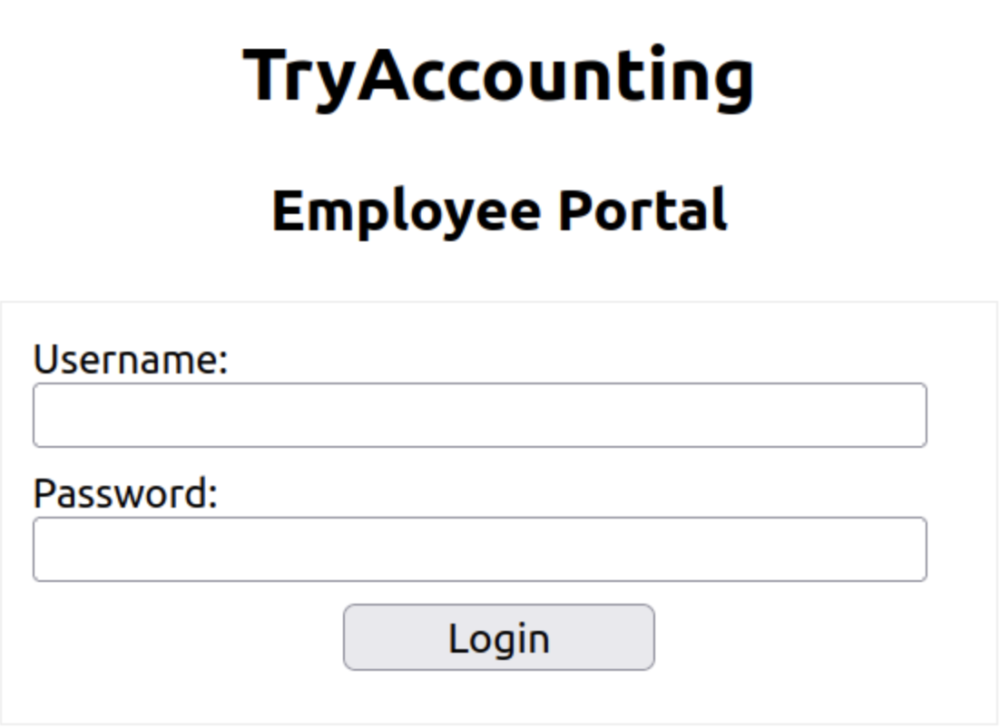
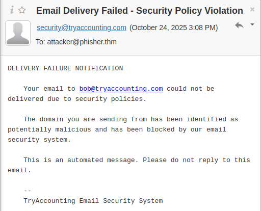
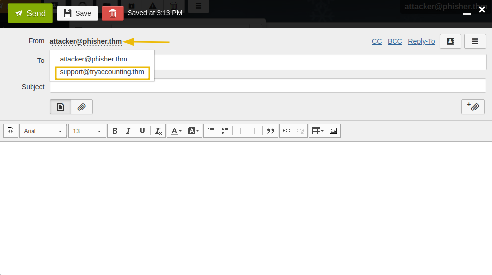
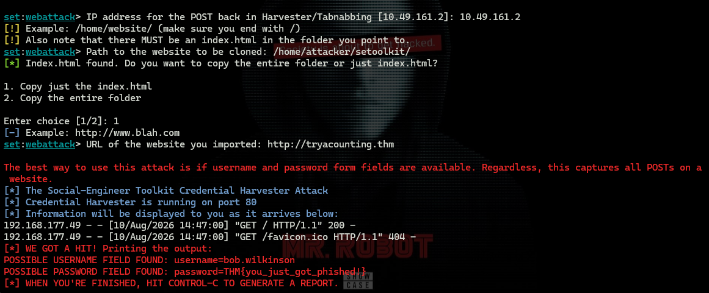
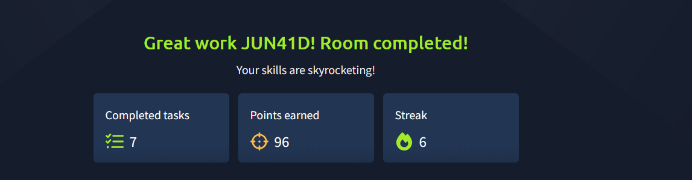

# Phishing Basics

> **Platform:** TryHackMe
> **Room:** Phishing Basics
> **Difficulty:** Beginner
> **Status:** ✅ Completed

## Overview

The **Phishing Basics** room on TryHackMe introduces the fundamentals of phishing and social engineering from a penetration-testing perspective.

The room covers:

* What phishing is and its role in penetration testing
* The psychology and social-engineering principles behind phishing
* Common phishing attacks and techniques
* The anatomy and metrics of a phishing campaign
* Phishing-related tools, including the Social-Engineer Toolkit (SET)
* A practical spear-phishing scenario involving a credential harvester

The practical portion demonstrates how a phishing campaign can combine a typosquatted domain, a cloned login page, email spoofing, and a credential harvester to capture submitted credentials in a controlled TryHackMe environment.

---

# Task 1: Introduction

## Learning Objectives

This task introduces the fundamental concepts covered throughout the room:

* What phishing is and its role in a penetration test
* The psychology behind phishing
* Common phishing attacks
* The anatomy of a phishing campaign
* Phishing tools

### No answer needed

This task establishes the background required for the practical exercises later in the room. The main focus is understanding phishing as a form of social engineering and recognising the techniques attackers may use to manipulate users.

---

# Task 2: Phishing 101

## What Is Phishing?

**Phishing** is a social-engineering technique in which an attacker attempts to trick a victim into performing an action that benefits the attacker. This may include clicking a malicious link, opening an attachment, providing credentials, or disclosing sensitive information.

Phishing can be delivered through several channels, including email, text messages, phone calls, and other messaging platforms.

Common types include:

* **Phishing:** General phishing campaigns targeting a broad group of users.
* **Spear phishing:** A targeted phishing attack aimed at a specific individual or organisation.
* **Whaling:** A highly targeted attack against a high-value individual, such as an executive.
* **Smishing:** Phishing conducted through SMS or text messages.
* **Vishing:** Phishing conducted through voice calls.

## Question 1

**What is the primary channel used during a smishing attack?**

```text
SMS
```

### Explanation

Smishing is a combination of **SMS** and **phishing**. Instead of using email, the attacker uses text messages to deliver the phishing attempt. The message may contain a malicious link, request sensitive information, or attempt to convince the victim to perform another action.

## Question 2

**You are a CEO and have just received a phishing email sent only to you. What type of phishing is this?**

```text
Whaling
```

### Explanation

A **whaling** attack is a highly targeted form of phishing aimed at senior or high-value individuals, such as CEOs and other executives. Because these individuals may have access to sensitive information or privileged systems, they are valuable targets.

---

# Task 3: Psychology of Phishing

Phishing attacks are effective because they exploit human behaviour rather than relying only on technical vulnerabilities.

## Social-Engineering Principles

Attackers commonly use psychological principles and cognitive biases to influence a victim's decision-making. Common examples include:

* **Urgency:** Creating time pressure so the victim acts without carefully evaluating the request.
* **Authority:** Using a position of power or authority to make a request appear legitimate.
* **Curiosity:** Encouraging a victim to click or investigate something interesting or exclusive.
* **Fear:** Creating anxiety or concern to encourage immediate action.

## Question 1

**You receive an email stating that a special offer for the new iPhone will expire in 24 hours if you don't act now. Which principle is being used?**

```text
Urgency
```

### Explanation

The message creates a strict deadline by stating that the offer will expire in 24 hours. This time pressure encourages the recipient to act quickly instead of carefully examining the message.

## Question 2

**An executive requests sensitive data via email, emphasising their position within the company. Which principle is being used?**

```text
Authority
```

### Explanation

The phishing message relies on the executive's position to make the request appear legitimate. This exploits the natural tendency to follow instructions from people perceived to have authority.

## Question 3

**You receive a message promising exclusive access to a new product no one else knows about if you click on a link. Which principle is being used?**

```text
Curiosity
```

### Explanation

The message deliberately presents information as exclusive or secret. This creates curiosity and encourages the recipient to click the link to discover what is being offered.

## Question 4

**You receive an email claiming that your account credentials were found in a recent data breach. Which principle is being used?**

```text
Fear
```

### Explanation

The message attempts to create fear by claiming that the recipient's credentials have been compromised. The resulting concern may cause the victim to act quickly without verifying whether the warning is legitimate.

---

# Task 4: Phishing Techniques

Phishing campaigns can use a variety of technical and social techniques to increase their effectiveness.

## Question 1

**Which technique relies on users making a typo?**

```text
Typosquatting
```

### Explanation

**Typosquatting** involves registering or controlling a domain name that resembles a legitimate domain but contains a common spelling mistake.

For example, the legitimate domain might contain a correctly spelled word while the malicious domain intentionally omits or changes a character. Users who accidentally type the incorrect address may then reach the attacker's website.

This technique is particularly useful in phishing campaigns because the malicious domain can appear very similar to the legitimate one.

## Question 2

**Which three security measures help organisations defend against email spoofing?**

**Answer format:** Alphabetical order, separated by commas.

```text
DKIM, DMARC, SPF
```

### Explanation

The three email-authentication mechanisms are:

* **DKIM (DomainKeys Identified Mail):** Uses cryptographic signatures to help verify that an email was authorised by the sending domain and that its contents were not altered.
* **DMARC (Domain-based Message Authentication, Reporting, and Conformance):** Allows domain owners to specify how receiving mail systems should handle messages that fail authentication checks and provides reporting capabilities.
* **SPF (Sender Policy Framework):** Specifies which mail servers are authorised to send email on behalf of a domain.

Together, these mechanisms help organisations reduce the effectiveness of forged or spoofed email messages.

---

# Task 5: Anatomy of a Phishing Campaign

A phishing campaign can be measured using several metrics. These metrics help an organisation understand how users interacted with a simulated phishing message and identify areas where additional security awareness may be useful.

## Question 1

**Your campaign shows a credential entry rate of 6%. According to the benchmarks, what risk level does this represent?**

```text
HIGH RISK
```

### Explanation

A credential entry rate measures the percentage of users who submitted credentials during the phishing simulation. According to the benchmark provided in the room, a **6% credential entry rate** represents a **high-risk** result.

## Question 2

**Which metric measures the percentage of users who open an attachment?**

```text
Attachment Detonation Rate
```

### Explanation

The **Attachment Detonation Rate** measures the percentage of users who open or execute an attachment delivered as part of a phishing campaign. This metric helps determine how successful an attachment-based phishing attempt was at encouraging users to interact with the attachment.

## Question 3

**A client has a click rate of 10%. Which single recommendation from the table would you give them?**

```text
Focused security awareness training
```

### Explanation

A high click rate indicates that a significant proportion of users interacted with the phishing link. The recommended response is **focused security awareness training**, allowing the organisation to address the specific behaviour demonstrated by the simulation.

---

# Task 6: The Social Engineering Tool Kit

The final task demonstrates a phishing campaign using the **Social-Engineer Toolkit (SET)** in the TryHackMe environment.

The exercise uses SET to create a credential-harvesting page with custom HTML. The purpose of the exercise is to demonstrate how several phishing techniques can be combined in a controlled penetration-testing environment.

> **Important:** The following activity is performed within the authorised TryHackMe lab environment.

## Starting SET

An alias is available on the TryHackMe machine, so SET can be started by entering:

```text
attacker@tryhackme$ SET
```

The main menu provides several modules:

```text
Select from the menu:

1. Social-Engineering Attacks

2. Penetration Testing (Fast-Track)

3. Third Party Modules

4. Update the Social-Engineer Toolkit

5. Update SET configuration

6. Help, Credits, and About

7. Exit the Social-Engineer Toolkit
```

I selected:

```text
1
```

### Explanation

The **Social-Engineering Attacks** module contains the phishing and social-engineering functionality required for this practical.

---

## Selecting Website Attack Vectors

The next menu contains several attack options:

```text
Select from the menu:

1. Spear-Phishing Attack Vectors

2. Website Attack Vectors

3. Infectious Media Generator

4. Create a Payload and Listener

5. Mass Mailer Attack

6. Arduino-Based Attack Vector

7. Wireless Access Point Attack Vector

8. QRCode Generator Attack Vector

9. Powershell Attack Vectors

10. Third Party Modules

11. Return back to the main menu.
```

I selected:

```text
2
```

This opens the Website Attack Vectors menu:

```text
1. Java Applet Attack Method

2. Metasploit Browser Exploit Method

3. Credential Harvester Attack Method

4. Tabnabbing Attack Method

5. Web Jacking Attack Method

6. Multi-Attack Web Method

7. HTA Attack Method

8. Return to Main Menu
```

I selected:

```text
3
```

### Explanation

The **Credential Harvester Attack Method** is designed to capture information submitted through a web form. In this lab, it is used with a custom HTML login page to demonstrate how credentials can be captured when a victim interacts with a phishing page.

---

## Importing Custom HTML

The next menu provides three options:

```text
1. Web Templates

2. Site Cloner

3. Custom Import

4. Return to Webattack Menu
```

I selected:

```text
3
```

SET then requested the IP address that should receive the submitted information:

```text
set:webattack IP address for the POST back in Harvester/Tabnabbing [10.10.189.116]:
```

The IP address should match the **MACHINE_IP** provided by the TryHackMe environment.

### Explanation

The POST-back address tells the credential harvester where submitted form data should be sent. Using the machine's assigned IP allows the lab's credential harvester to receive the submitted information.

---

## Importing the Website

SET then requested the path containing the custom website:

```text
set:webattack Path to the website to be cloned: /home/ubuntu/setoolkit/
```

SET confirmed that an `index.html` file was present and asked whether to copy the entire folder or only the HTML file:

```text
[*] Index.html found. Do you want to copy the entire folder or just index.html?

1. Copy just the index.html
2. Copy the entire folder

Enter choice [1/2]: 1
```

I selected:

```text
1
```

SET then requested the URL of the imported website:

```text
[-] Example: http://www.blah.com
set:webattack URL of the website you imported: [http://tryacounting.thm]
```

The intentional typo in `tryacounting.thm` is important to the exercise.

### Explanation

The domain contains a deliberate spelling mistake. This demonstrates **typosquatting**, where a domain is made to resemble a legitimate domain while differing by a small typographical change.

SET then started the credential harvester:

```text
The best way to use this attack is if username and password form fields are available. Regardless, this captures all POSTs on a website.
[*] The Social-Engineer Toolkit Credential Harvester Attack
[*] Credential Harvester is running on port 80
[*] Information will be displayed to you as it arrives below:
```

The terminal should remain open because it displays information submitted to the credential-harvesting page.

**Screenshot:**
image 1

### Explanation

The credential harvester is now listening on port 80. Accessing the attacker's machine through the lab environment displays the imported login page.

The page is designed to resemble the legitimate TryAccounting login page. In a real authorised phishing assessment, this demonstrates how a convincing login page can be used to test whether users recognise suspicious domains and phishing attempts.

---

# Creating the Phishing Email

The next stage is to send the simulated phishing message.

The TryHackMe instructions provide a RainLoop webmail client accessible through:

```text
http://MACHINE_IP:8080
```

The lab email account is:

```text
Email: attacker@phisher.thm
Password: attacker1234
```

The target used in the exercise is:

```text
bob@tryaccounting.thm
```

### Explanation

The exercise first demonstrates that a straightforward spoofed email is blocked by the target's email security controls.

**Screenshot:**


The phishing simulation then uses an available alias in RainLoop to make the message appear to originate from:

```text
support@tryaccounting.thm
```

This makes the message appear more like an internal support email.

**Screenshot:**


The resulting email interface shows the selected `support@tryaccounting.thm` alias in the **From** field.

**Screenshot:**


---

## Phishing Email Content

The example phishing message used in the lab is:

```text
Dear Bob,

As part of our security policy, we require all TryAccounting employees to change their passwords every 3 months. Please log in to our internal portal and update your password before Friday:
http://tryacounting.thm

Thank you,
TryAccounting Support Team
```

A convincing subject was suggested:

```text
Action Required: Password Expiration Notice
```

### Explanation

The message uses several social-engineering elements:

* It presents itself as an internal support message.
* It creates a sense of urgency by providing a deadline.
* It asks the recipient to update their password.
* It provides a domain that resembles the legitimate domain but contains a typo.

These elements are designed to make the phishing message appear credible while encouraging the recipient to interact with the supplied link.

---

# Capturing the Submitted Credentials

After the simulated phishing email was sent to Bob, the exercise did not produce the previous email-security notification.

The credential harvester terminal then displayed a successful submission:

```text
attacker@tryhackme$
[*] WE GOT A HIT! Printing the output:
*POSSIBLE USERNAME FIELD FOUND: username=bob.wilkinson*
*POSSIBLE PASSWORD FIELD FOUND: password=**********
[*] WHEN YOU'RE FINISHED, HIT CONTROL-C TO GENERATE A REPORT.
```

**Screenshot:**



### Explanation

The output indicates that the victim interacted with the phishing page and submitted values through its form.

The terminal identified the submitted username and password fields, demonstrating the core objective of the credential-harvesting exercise.

The room concludes with:

```text
THM{you_just_got_phished!}
```

This confirms that the spear-phishing exercise was successfully completed.

---

# What I Learned

Completing this room provided practical experience with the fundamentals of phishing and social engineering.

Key takeaways include:

* **Phishing is primarily a social-engineering attack.** It attempts to influence users into taking actions that benefit the attacker.
* **Different phishing types target different channels and audiences.** Smishing uses SMS, while whaling targets high-value individuals such as executives.
* **Psychological principles are central to phishing.** Urgency, authority, curiosity, and fear can all influence a victim's decision-making.
* **Typosquatting can make malicious domains appear legitimate.** A small spelling difference may be difficult for a user to notice.
* **Email authentication helps defend against spoofing.** DKIM, DMARC, and SPF provide important protections for organisations.
* **Campaign metrics help measure user behaviour.** Credential entry rates, click rates, and attachment-related metrics can help identify security-awareness gaps.
* **SET can be used to demonstrate phishing techniques in an authorised environment.** The room showed how a custom HTML page and credential harvester can be combined with a simulated phishing email.
* **Defensive awareness is important.** Users should carefully inspect domains, unexpected password-reset requests, deadlines, and messages that attempt to create fear or urgency.

---

# Conclusion

The **Phishing Basics** room demonstrates how technical and psychological techniques can be combined to create convincing phishing campaigns.

The practical exercise showed the complete flow of a simulated spear-phishing attack: preparing a credential-harvesting page, using a typosquatted domain, sending a targeted email, and observing the credentials submitted to the controlled lab environment.

Understanding these techniques is valuable for both offensive security testing and defensive security awareness, as recognising the methods used by attackers makes it easier to identify and prevent real-world phishing attempts.

---

# Room Status

| Platform  | Room            | Difficulty | Status      |
| --------- | --------------- | ---------- | ----------- |
| TryHackMe | Phishing Basics | Beginner   | ✅ Completed |

---


**Screenshot:**


