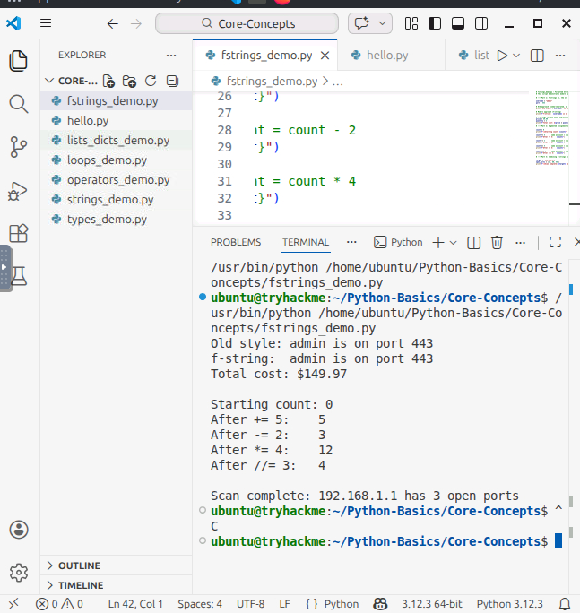
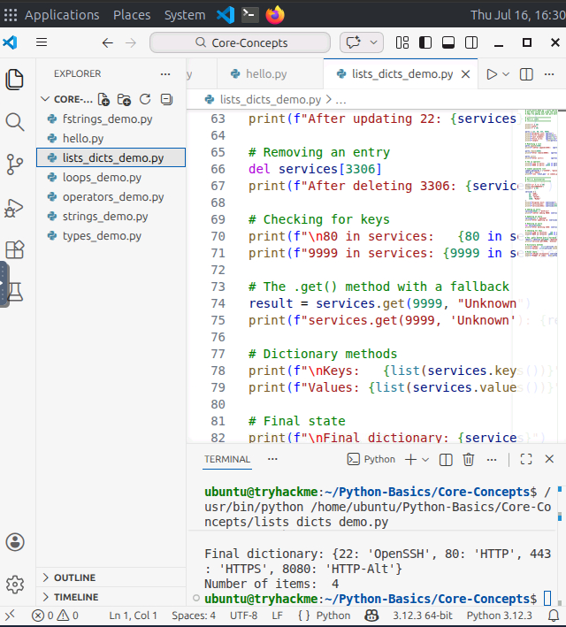
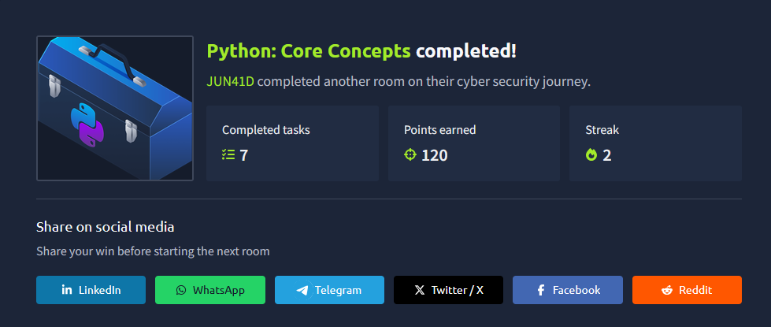

# Python: Core Concepts

> **Platform:** TryHackMe
> **Room:** Python: Core Concepts
> **Difficulty:** Beginner
> **Status:** ✅ Completed

---

# Overview

The **Python: Core Concepts** room builds upon the foundations introduced in the **Python: Simple Demo** room, where variables, conditional statements, and while loops were used to create a simple "Guess the Number" game.

This room expands those fundamentals by introducing additional concepts required for writing practical automation scripts commonly used in cybersecurity and penetration testing environments.

For example, a penetration tester may need to process thousands of usernames discovered during reconnaissance, test them against default credentials, identify weak passwords, and generate reports. Performing such tasks manually would take an enormous amount of time, whereas a Python script can complete them in seconds.

To build these types of scripts, it is necessary to understand:

* Data types and type conversion
* Strings and string manipulation
* Lists and dictionaries
* Arithmetic, logical, and membership operators
* `for` loops and `while` loops
* Loop control using `break` and `continue`

This room serves as the foundation for the follow-up room, **Python: Building Scripts**, where these concepts are applied to real-world scripting tasks.

---

# Task 1: Introduction

This section introduced the purpose of the room and explained why Python is heavily used in cybersecurity, automation, and penetration testing.

The room focused on expanding beyond variables and conditional statements and introduced more advanced concepts required for writing useful scripts.

Topics covered included:

* Python data types
* Type conversion
* Formatted strings
* String methods
* Lists and dictionaries
* Operators
* Looping constructs
* Loop control statements

### Answer

No answer was required for this task.

---

# Task 2: Quick Review, Hello World, Variables and Conditions

This section reviewed concepts introduced in the previous room and reinforced understanding of variables, user input, formatted strings, and basic data types.

---

## Question 1

**What built-in function reveals the data type of a value?**

```python
type()
```

### Explanation

Python provides the built-in `type()` function to determine the data type of a variable or value.

Example:

```python
x = 5
print(type(x))
```

Output:

```text
<class 'int'>
```

This is useful when debugging scripts and validating user input.

---

## Question 2

**If a user types `3.14` at an `input()` prompt, what data type does Python store it as before any conversion?**

```python
str
```

### Explanation

The `input()` function always returns user input as a string (`str`), regardless of what the user enters.

Example:

```python
value = input("Enter a number: ")
print(type(value))
```

Even if the user enters:

```text
3.14
```

The output will be:

```text
<class 'str'>
```

To use the value as a floating-point number, it must first be converted:

```python
value = float(value)
```

---

## Question 3

**On the attached VM, open and run `fstrings_demo.py`. What is the last line printed to the terminal?**

```text
Scan complete: 192.168.1.1 has 3 open ports
```

### Explanation

To solve this task, the attached TryHackMe virtual machine was used.

The file was located in:

```text
/home/ubuntu/python-core/
```

The script was executed from Visual Studio Code, and the final line displayed in the terminal output was recorded as the answer.



---

# Task 3: Working with Strings

This section introduced string manipulation techniques such as indexing, slicing, and using built-in string methods.

Strings are one of the most frequently used data types in cybersecurity scripts because they are used to process usernames, passwords, URLs, IP addresses, log entries, and command output.

---

## Question 1

**What function returns the number of characters in a string?**

```python
len()
```

### Explanation

The `len()` function returns the total number of characters stored inside a string.

Example:

```python
word = "TryHackMe"
print(len(word))
```

Output:

```text
9
```

---

## Question 2

**Given `word = "TryHackMe"`, what does `word[3:7]` return?**

```text
Hack
```

### Explanation

Python uses slicing to extract portions of strings.

Example:

```python
word = "TryHackMe"
print(word[3:7])
```

Output:

```text
Hack
```

Python includes the starting index and excludes the ending index.

---

## Question 3

**What string method converts `"ADMIN"` to `"admin"`?**

```python
.lower()
```

### Explanation

The `.lower()` method converts all uppercase characters into lowercase characters.

Example:

```python
username = "ADMIN"
print(username.lower())
```

Output:

```text
admin
```

This is especially useful when performing case-insensitive comparisons in scripts.

---

# Task 4: Lists and Dictionaries

This section introduced Python collections and explained how lists and dictionaries can store and retrieve data efficiently.

Lists are commonly used to store collections of items, while dictionaries provide key-value mappings that allow fast lookups.

---

## Question 1

**What method adds an element to the end of a list?**

```python
.append()
```

### Explanation

The `.append()` method inserts a new item at the end of a list.

Example:

```python
ports = [22, 80]
ports.append(443)
```

Result:

```python
[22, 80, 443]
```

---

## Question 2

**Given `services = {22: "SSH", 80: "HTTP"}`, what does `services[80]` return?**

```text
HTTP
```

### Explanation

Dictionaries store information using key-value pairs.

Example:

```python
services = {
    22: "SSH",
    80: "HTTP"
}

print(services[80])
```

Output:

```text
HTTP
```

The answer for this task was obtained by running the provided file on the TryHackMe virtual machine using Visual Studio Code and observing the program output.



---

## Question 3

**What dictionary method lets you retrieve a value with a safe fallback if the key does not exist?**

```python
.get()
```

### Explanation

The `.get()` method retrieves a value from a dictionary without causing an error if the key does not exist.

Example:

```python
services.get(443, "Unknown")
```

Output:

```text
Unknown
```

This is useful when processing data that may contain missing entries.

---

# Task 5: Arithmetic and Membership Operators

This section introduced mathematical operators used in calculations and data processing.

These operators are frequently used in scripting, automation, and data analysis tasks.

---

## Question 1

**What operator returns the remainder of a division?**

```python
%
```

### Explanation

The modulus operator `%` returns the remainder after division.

Example:

```python
10 % 3
```

Output:

```text
1
```

---

## Question 2

**What does `10 // 3` evaluate to?**

```python
3
```

### Explanation

The `//` operator performs floor division and returns only the whole-number portion of the result.

Example:

```python
10 // 3
```

Output:

```text
3
```

---

## Question 3

**What does `2 ** 10` evaluate to?**

```python
1024
```

### Explanation

The `**` operator performs exponentiation.

Example:

```python
2 ** 10
```

Output:

```text
1024
```

---

# Task 6: Loops — For and While

This section introduced Python looping constructs and demonstrated how repetitive tasks can be automated.

Loops are essential in cybersecurity automation because they allow scripts to process large amounts of data efficiently.

---

## Question 1

**What type of loop is best suited for iterating over each item in a list?**

```python
for
```

### Explanation

`for` loops are designed for iterating through collections such as lists, tuples, and dictionaries.

Example:

```python
ports = [22, 80, 443]

for port in ports:
    print(port)
```

---

## Question 2

**What does `range(3)` produce?**

```text
0, 1, 2
```

### Explanation

The `range()` function generates a sequence of numbers beginning at zero and stopping before the specified value.

Example:

```python
for i in range(3):
    print(i)
```

Output:

```text
0
1
2
```

---

## Question 3

**What keyword immediately exits a loop?**

```python
break
```

### Explanation

The `break` statement terminates the current loop immediately.

Example:

```python
for number in range(10):
    if number == 5:
        break
```

The loop stops execution as soon as the condition is met.

---

# Task 7: Conclusion

This section summarized all concepts covered throughout the room.

Topics reviewed included:

* Python data types and type conversion
* Formatted strings using f-strings
* String manipulation techniques
* Lists and dictionaries
* Arithmetic, comparison, logical, and membership operators
* `for` loops and `while` loops
* Loop control using `break` and `continue`

These concepts provide the foundation required for building more advanced automation and cybersecurity scripts.

---

# What I Learned

After completing this room, I learned how to:

* Identify and work with Python data types.
* Convert values between strings, integers, floating-point numbers, and booleans.
* Use formatted strings for cleaner output.
* Manipulate strings using indexing, slicing, and built-in methods.
* Store and retrieve data using lists and dictionaries.
* Perform arithmetic and logical operations.
* Use `for` loops and `while` loops to automate repetitive tasks.
* Control loop execution using `break` and `continue`.

---

# Conclusion

The **Python: Core Concepts** room provides the foundational knowledge required for writing practical Python scripts used in cybersecurity and automation tasks.

Understanding how data is stored, manipulated, and processed is essential before moving on to more advanced topics such as functions, file handling, error management, and external libraries.

This room serves as an excellent bridge between beginner Python programming and real-world scripting applications.

---

# Room Status

| Platform  | Room                  | Status      |
| --------- | --------------------- | ----------- |
| TryHackMe | Python: Core Concepts | ✅ Completed |

---

# Completion



