# Senior Security Analyst Intro

> **Platform:** TryHackMe
> **Room:** Senior Security Analyst Intro
> **Difficulty:** Beginner
> **Status:** ✅ Completed

---

# Overview

The **Senior Security Analyst Intro** room introduces the responsibilities and mindset required to progress from a **SOC Level 1 (L1) Analyst** to a **SOC Level 2 (L2) Analyst**. Rather than focusing only on technical skills, the room emphasizes incident response, SIEM rule development, collaboration with other teams, and the importance of soft skills in handling security incidents.

Throughout the room, I learned how Level 2 analysts investigate escalated alerts, improve detection capabilities, reduce false positives, and communicate effectively with other departments during security incidents.

---

# Task 1: Journey to Senior

This introductory task explains the transition from a SOC Level 1 analyst to a SOC Level 2 analyst.

The room covers:

* How SOC Level 2 responsibilities differ from SOC Level 1.
* The technical and soft skills required for promotion.
* What a typical workday looks like as a SOC Level 2 analyst.
* How developing the right mindset prepares analysts for more advanced security roles.

---

# Task 2: New Role, New Duties

This task introduces the expanded responsibilities of a SOC Level 2 analyst.

Unlike Level 1 analysts, who primarily monitor alerts and escalate suspicious activity, Level 2 analysts are expected to:

* Perform deeper investigations.
* Handle incident response.
* Improve detection rules.
* Collaborate with other teams.
* Continue developing both technical and communication skills.

### SOC Level 2 Definition

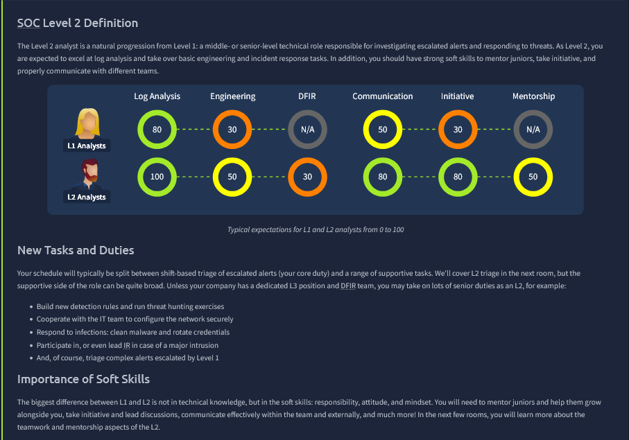

---

## Question

**Should you improve tech, soft, or both skills to become L2?**

```text
both
```

### Explanation

The correct answer is **both**.

A successful SOC Level 2 analyst requires a balance of:

* **Technical skills**, such as malware analysis, SIEM tuning, threat hunting, and incident response.
* **Soft skills**, including communication, documentation, teamwork, and decision-making.

Technical expertise alone is not enough because Level 2 analysts frequently coordinate with IT teams, management, and other departments during investigations.

---

# Task 3: Fun of Being SOC L2

This task highlights the variety of work performed by SOC Level 2 analysts beyond simply responding to alerts.

Topics covered include:

* Incident handling
* Engineering tasks
* Detection rule development
* Security improvements
* Exposure to multiple security domains

### Fun of Being SOC L2

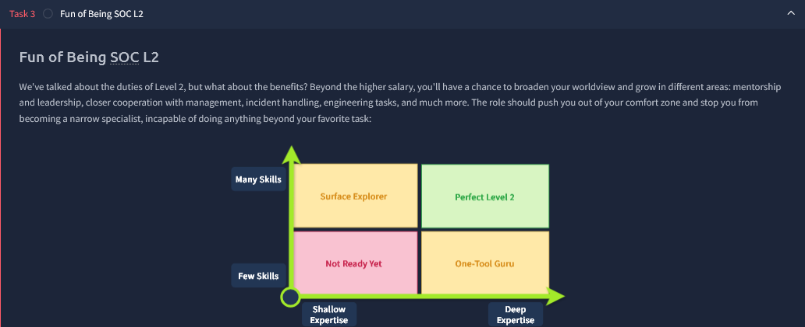

### Incident Handling

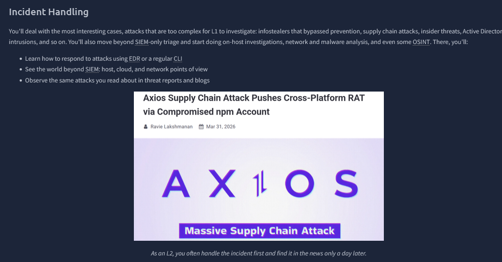

### Engineering Tasks

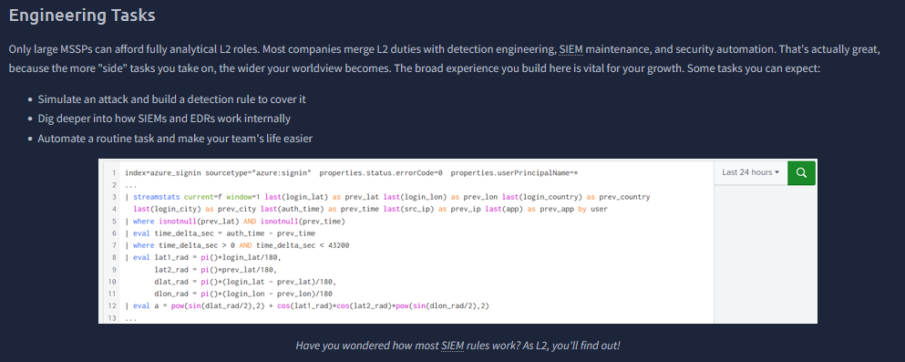

### General Security Tasks

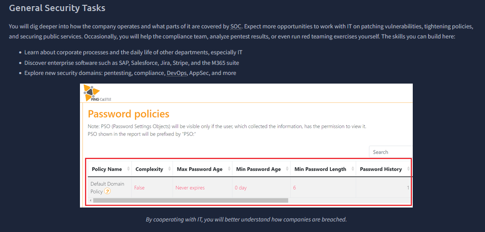

---

## Question

**Does exploring new security areas help you grow? (Yea/Nay)**

```text
yea
```

### Explanation

The correct answer is **Yea**.

Working across different areas of cybersecurity provides valuable exposure to new technologies, attack techniques, and defensive strategies.

Instead of repeatedly performing the same alert triage tasks, Level 2 analysts often work on:

* Incident response
* Detection engineering
* Threat intelligence
* Security automation
* Cross-team collaboration

This broader experience helps analysts continuously improve their skills and prepares them for more advanced security roles.

---

# Task 4: L1 vs L2 Mindset

This task focuses on developing the mindset expected from a senior analyst.

A Level 2 analyst should move beyond simply responding to alerts and begin thinking proactively about how attackers operate, how incidents evolve, and how future attacks can be prevented.

### Sense of Responsibility

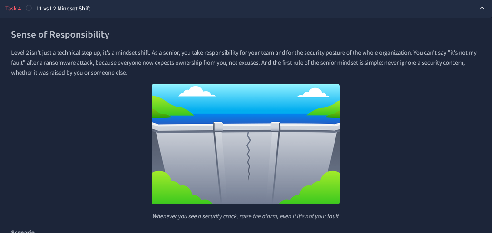

---

## Question

**What mindset helps you see and predict how incidents unfold?**

```text
Attacker Mindset
```

### Explanation

The correct answer is **Attacker Mindset**.

Thinking like an attacker helps defenders understand:

* How attackers gain initial access.
* How they move laterally across systems.
* What techniques they are likely to use next.
* How security controls can be improved before future attacks occur.

By understanding offensive techniques, defenders can build stronger detection rules, improve security controls, and better protect their organization.

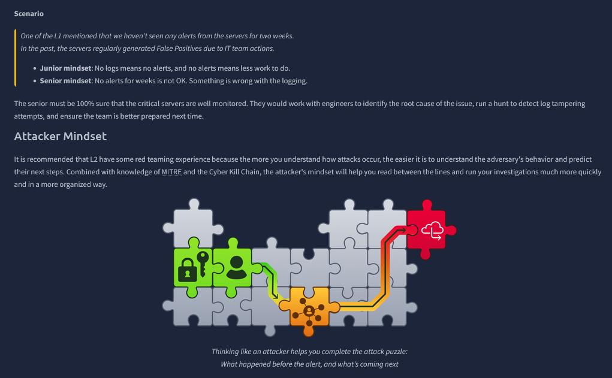

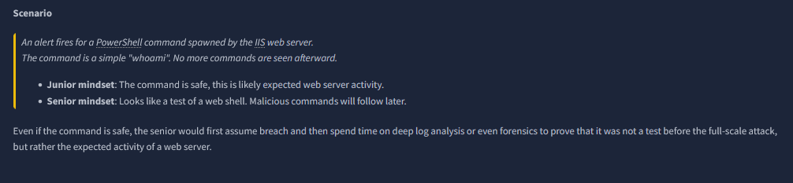

---

# Task 5: Your Day as Level 2

This challenge simulates the daily responsibilities of a SOC Level 2 analyst using a SIEM dashboard.

The objective is to investigate alerts, make incident response decisions, improve detection rules, reduce false positives, communicate with other departments, and ultimately obtain the room flag.

---

## Initial Investigation

After clicking **View Site**, a simulated SIEM dashboard opens where I role-play as a SOC Level 2 analyst.

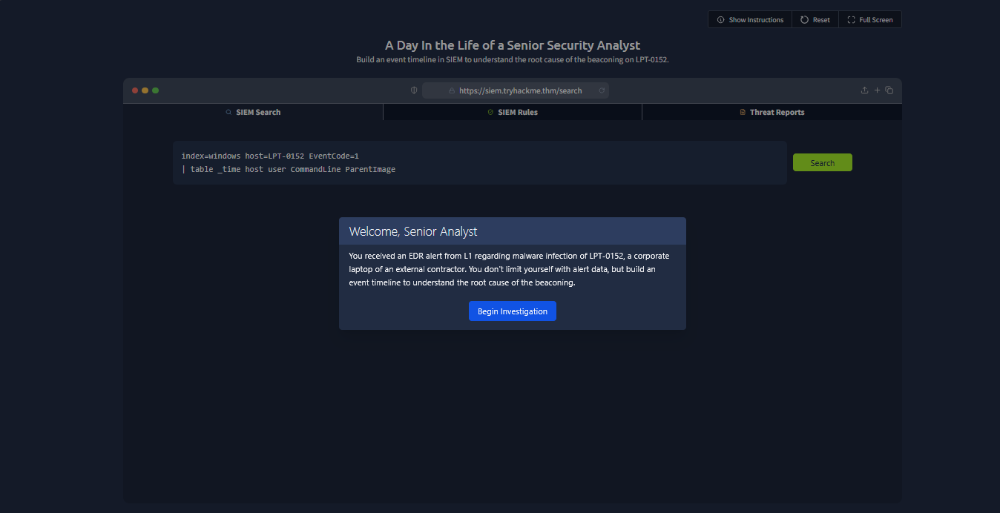

The first step is to search the SIEM logs for suspicious events.

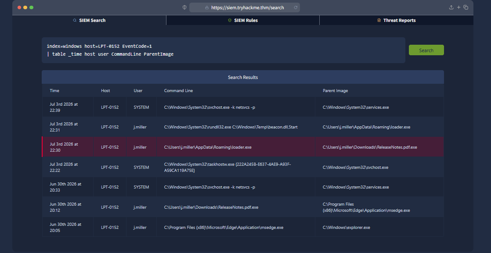

During the investigation, I discovered that **loader.exe** was launched from a file named:

```text
ReleaseNotes.pdf.exe
```

The double-extension filename is a common technique attackers use to disguise executable malware as a PDF document, making it highly suspicious.

---

## Incident Response Decision

After reviewing the evidence, I selected:

```text
Isolate LPT-0152, finish the analysis, and clean the host from malware.
```

This was the most appropriate response because it both contains the threat and allows a full investigation before remediation.

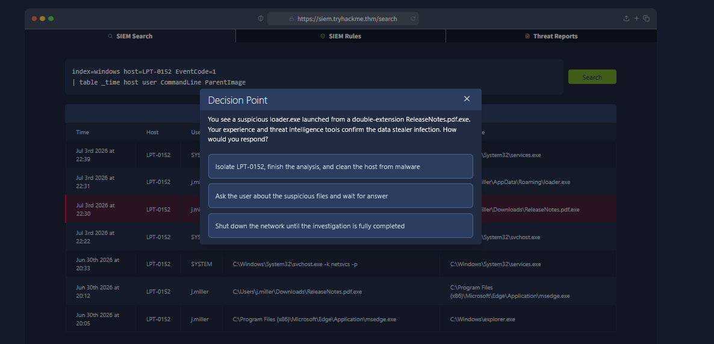

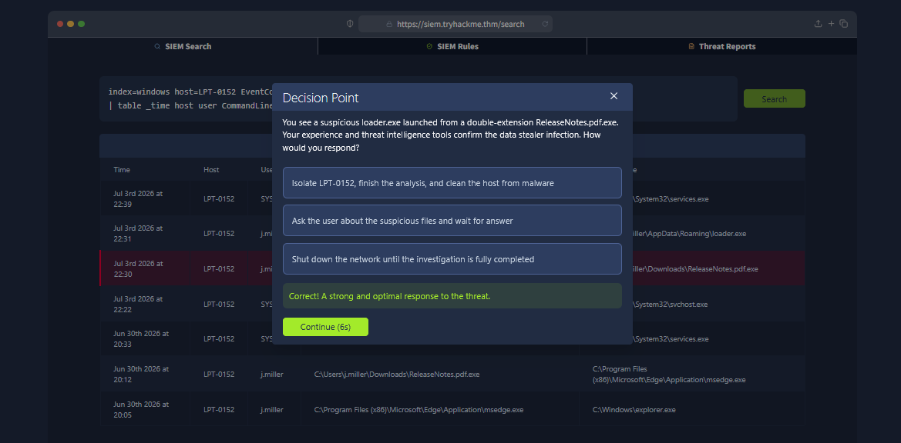

---

## Improving Detection

The investigation revealed that **ReleaseNotes.pdf.exe** had been downloaded using Microsoft Edge three days earlier.

Despite the malicious activity, no SIEM detection rule had generated an alert.

To address this detection gap, I selected:

```text
Build a detection rule covering double-extension downloads.
```

Creating a detection rule for suspicious double-extension filenames helps identify similar malware in the future before execution occurs.

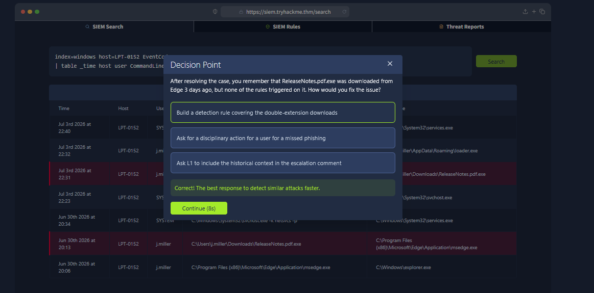

---

## Rule Testing and False Positives

After creating the detection rule, I tested it.

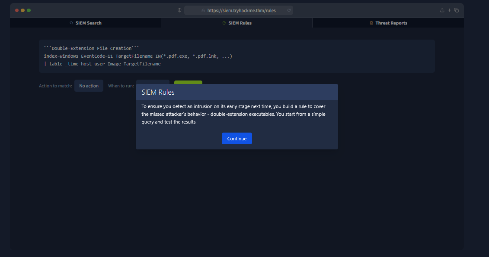

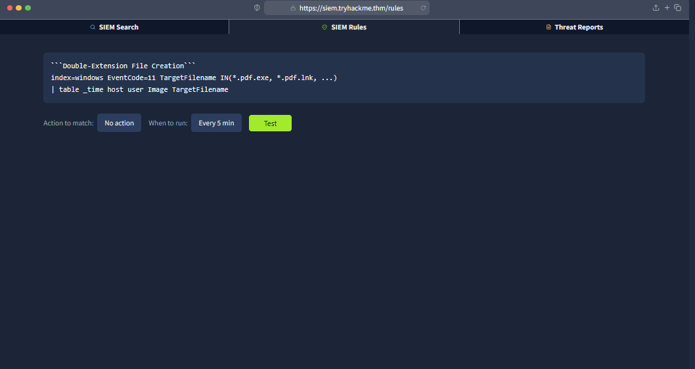

The search returned hundreds of false positives originating from the trusted directory:

```text
C:\Program Files\THMToolkit\
```

To reduce unnecessary alerts, I chose:

```text
Consult with your IT team and apply a folder exclusion to the rule.
```

This keeps legitimate software from triggering alerts while maintaining detection accuracy for suspicious activity elsewhere.

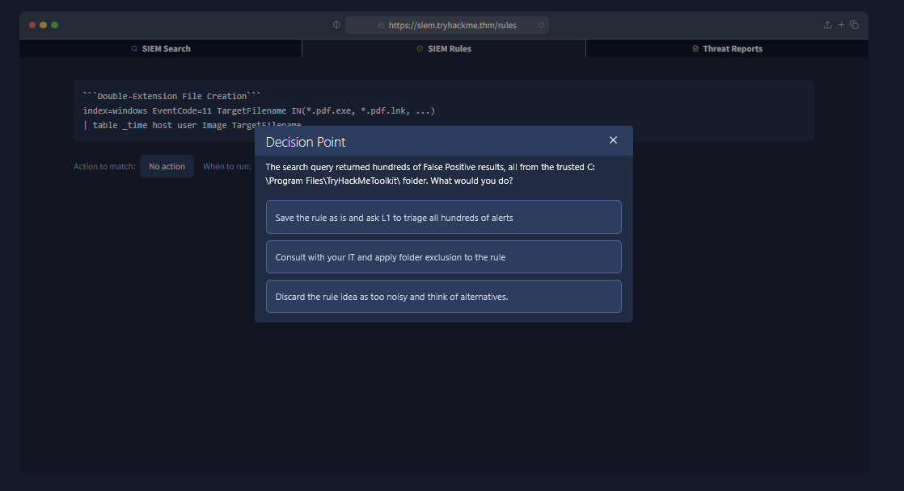

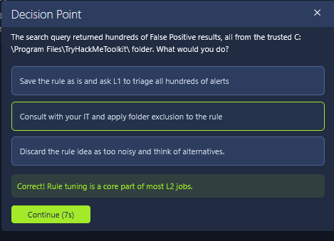

---

## Malware Response

The next step was determining the best action for the suspicious file.

I selected:

```text
Quarantine the file.
```

Quarantining isolates the malware, preventing further execution while preserving the file for additional forensic analysis if needed.

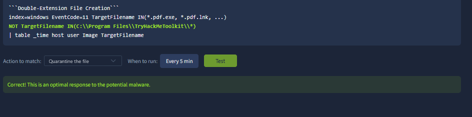

---

## Threat Report Review

After completing the detection engineering tasks, the final responsibility was reviewing a threat report and coordinating with other teams when necessary.

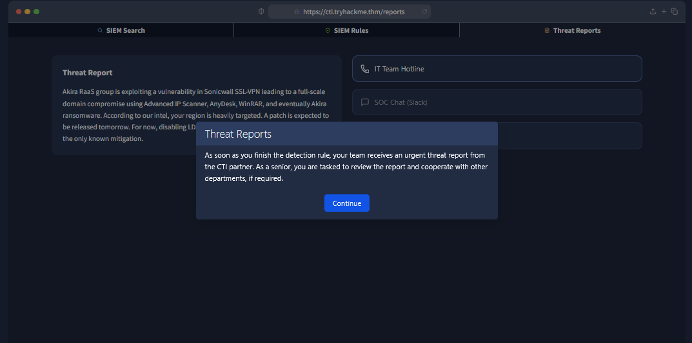

---

## IT Team Communication

### Question

**What should you tell the IT team?**

```text
Explain the high risks to them and help with the mitigation.
```

### Explanation

Effective communication is a critical responsibility for SOC Level 2 analysts.

Rather than simply reporting the incident, analysts should clearly explain:

* The identified risks.
* The potential business impact.
* Recommended mitigation steps.
* Any actions required from the IT team.

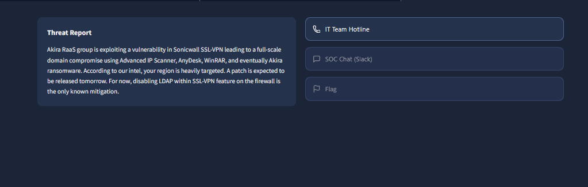

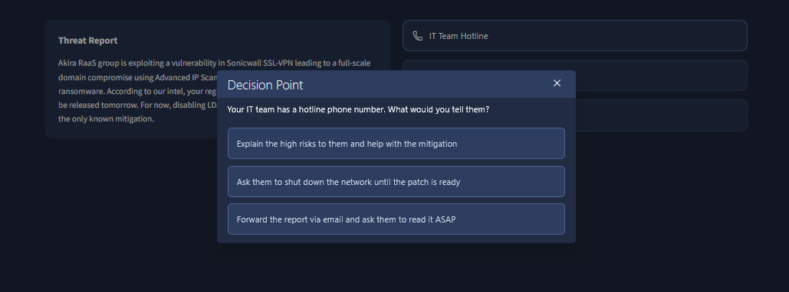

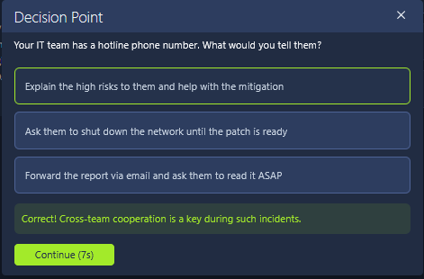

---

## SOC Team Communication

### Question

**Would you post anything to your SOC chat after reading the report?**

```text
Summarize the report, share indicators, and ask everyone to remain vigilant.
```

### Explanation

Keeping the SOC informed helps improve organizational awareness.

Sharing important indicators of compromise (IOCs), summarizing the threat, and encouraging analysts to watch for similar activity improves the team's overall defensive posture.

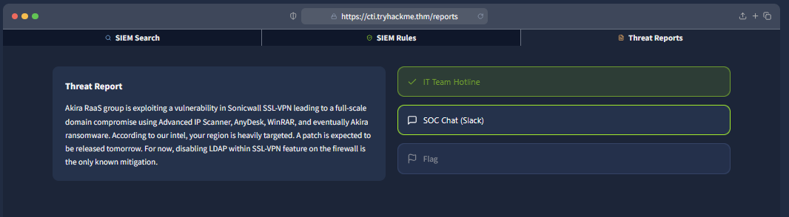

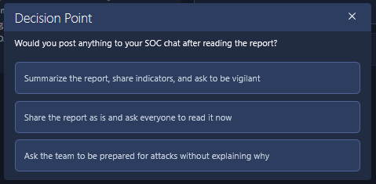

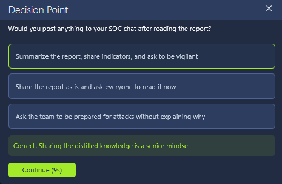

---

## Flag

After successfully completing every investigation and response task, the room awarded the final flag.

```text
THM{much_more_than_alert_triage}
```

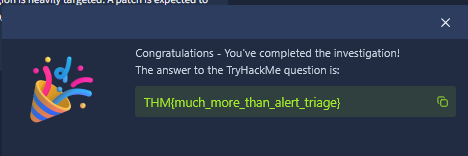

---

# What I Learned

From this room, I learned:

* The responsibilities of a SOC Level 2 analyst extend well beyond basic alert triage.
* Soft skills are just as important as technical knowledge for career progression.
* Thinking with an attacker mindset improves defensive decision-making.
* Effective incident response involves investigation, containment, remediation, and communication.
* Detection engineering is an important responsibility, including writing and tuning SIEM rules.
* Reducing false positives through proper exclusions improves the efficiency of security operations.
* Clear communication with IT teams and fellow analysts is essential during incident response.

---

# Conclusion

The **Senior Security Analyst Intro** room provides an excellent introduction to the responsibilities of a SOC Level 2 analyst. Instead of focusing solely on investigating alerts, the room demonstrates how senior analysts contribute to incident response, detection engineering, security improvements, and cross-team collaboration.

The interactive SIEM simulation provides practical experience with real-world SOC workflows, making this room an excellent stepping stone for anyone preparing to move beyond entry-level security operations.

---

# Room Status

| Platform  | Room                          | Status      |
| --------- | ----------------------------- | ----------- |
| TryHackMe | Senior Security Analyst Intro | ✅ Completed |

---

# Completion

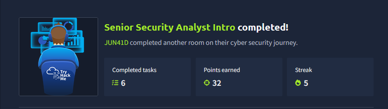
