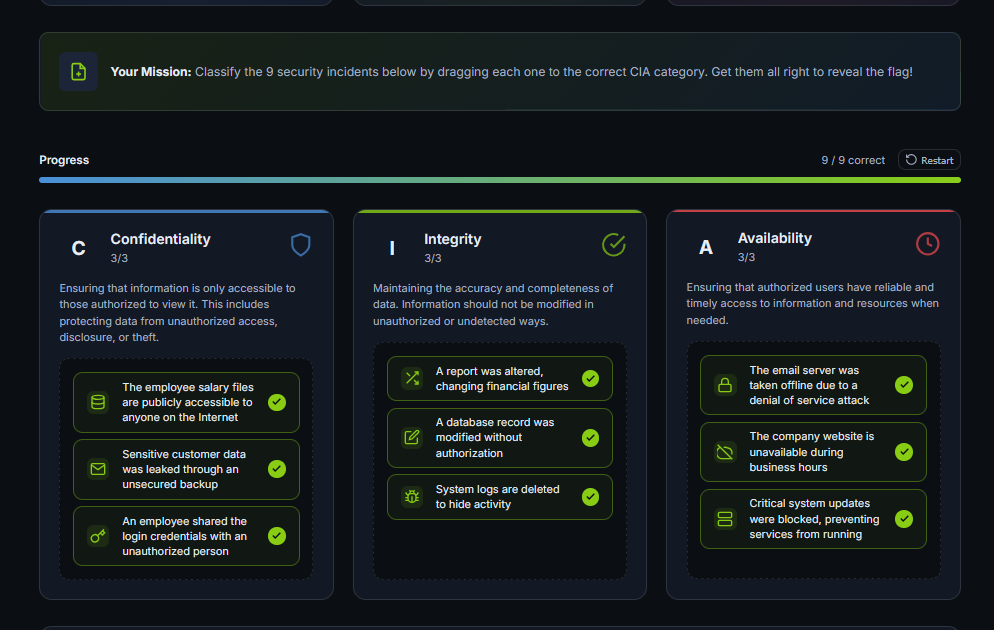
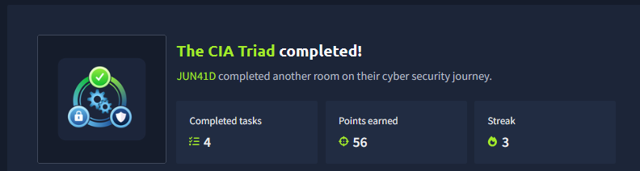

# TryHackMe Write-up: THE CIA TRIAD

> **Platform:** TryHackMe  
> **Room:** The CIA Triad  
> **Difficulty:** Beginner  
> **Status:** ✅ Completed

---

# Overview

The **CIA Triad** is one of the most fundamental concepts in cybersecurity. It represents the three core principles used to protect information systems:

- **Confidentiality** – Prevent unauthorized access to data.
- **Integrity** – Prevent unauthorized modification of data.
- **Availability** – Ensure data and services remain accessible when needed.

This room introduces these concepts and demonstrates how security professionals use the CIA Triad to analyze and respond to security incidents.

> **Note:** This write-up is intended for educational purposes and to document my learning journey on TryHackMe.

---

# Task 1: Introduction

No questions were asked in this task.

---

# Task 2: Understanding the CIA Triad

### Question 1

**Which pillar of the CIA focuses on preventing unauthorized modification of data?**

**Answer:**
```
Integrity
```

---

### Question 2

**Which pillar of the CIA focuses on preventing unauthorized access to data?**

**Answer:**
```
Confidentiality
```

---

### Question 3

**Which CIA pillar ensures data is available to users when needed?**

**Answer:**
```
Availability
```

---

### Question 4

**Which CIA pillar gets impacted if the data becomes untrustworthy?**

**Answer:**
```
Integrity
```

---

### Question 5

**What is the term used collectively for all these pillars?**

**Answer:**
```
CIA Triad
```

---

# Task 3: The Security Mindset

After learning the three pillars—**Confidentiality, Integrity, and Availability**—the room explains that the CIA Triad is more than just definitions. It is a **security mindset** used by cybersecurity professionals to evaluate incidents.

When responding to a security incident, analysts often ask questions such as:

- Was sensitive information exposed?
- Was data modified without authorization?
- Were systems or services unavailable?

Understanding which pillar has been affected helps determine the severity of the incident and the appropriate response.

## Hands-on Exercise

The room included an interactive exercise consisting of **nine security scenarios**.

The objective was to drag and drop each scenario into the correct CIA Triad category:

- Confidentiality
- Integrity
- Availability

After correctly classifying all nine scenarios, the following flag was revealed.

### Question

**What is the flag received after solving the exercise?**

**Answer:**
```
THM{CIA_IS_ABOUT_BALANCE}
```

> **Note:** There were nine security scenarios that had to be matched with the appropriate CIA Triad pillar. After placing all of them correctly, the flag above was displayed.

### Exercise Screenshot

```

```

---

### Question

**CIA Triad is not just a set of definitions; it's a mindset. What type of mindset is it?**

**Answer:**
```
Security mindset
```

---

# Task 4: Conclusion

The room concludes by revisiting the three fundamental principles of the CIA Triad.

## Key Terminology

### Confidentiality

Ensuring digital information is accessible only to authorized individuals.

### Integrity

Ensuring digital information is not modified without authorization.

### Availability

Ensuring digital information and services remain available whenever they are needed.

---

### Complete this room.

No answer required.


---

# Key Takeaways

- The **CIA Triad** is the foundation of information security.
- **Confidentiality** protects against unauthorized disclosure.
- **Integrity** protects against unauthorized modification.
- **Availability** ensures systems and data remain accessible.
- Security professionals use the CIA Triad to assess the impact of cyber incidents and prioritize their response.
- Understanding these principles is essential before progressing into penetration testing, red teaming, incident response, and other cybersecurity domains.

---

# Learning Outcome

After completing this room, I gained a solid understanding of:

- The three pillars of the CIA Triad
- Real-world security scenarios affecting each pillar
- How cybersecurity professionals apply the CIA Triad as a security mindset
- The importance of balancing confidentiality, integrity, and availability when protecting information systems

---

## Room Status

- **Platform:** TryHackMe
- **Room:** The CIA Triad
- **Difficulty:** Beginner
- **Completed:** ✅ Yes

---



**Happy Hacking! 🚀**
